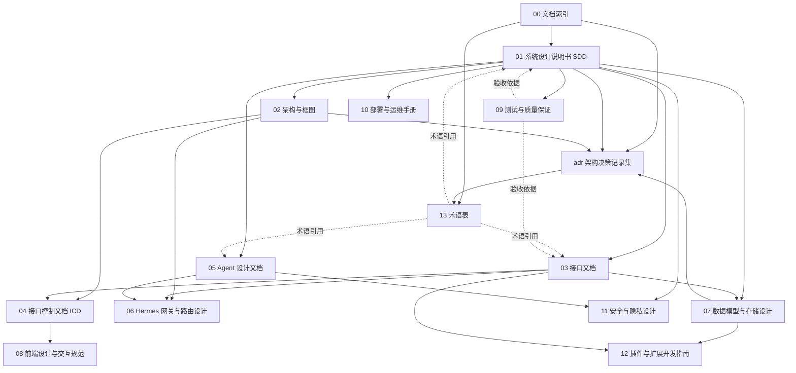

# 问心卦 · 文档索引

| 项目 | 内容 |
|---|---|
| 文档编号 | 00 |
| 标题 | 问心卦 · 文档索引 |
| 版本 | 1.0 |
| 状态 | 已发布 |
| 适用产品版本 | v1.1.0 |
| 最后更新 | 2026-10-03 |
| 读者 | 全体（新人、维护者、集成方、AI 工程师） |
| 关联文档 | [系统设计说明书](./01-系统设计说明书.md)、[架构与框图](./02-架构与框图.md)、[术语表](./13-术语表.md) |

---

## 一、这套文档是什么

本文档集是「问心卦」的工程文档。它与项目里已有的两份文本分工明确：

| 文本 | 面向 | 性质 |
|---|---|---|
| [README.md](../README.md) | 使用者 | 教程与功能介绍，回答「怎么用」 |
| [AGENTS.md](../AGENTS.md) | 编码 agent | 硬规矩与扩展点速查，回答「改代码不许违反什么」 |
| [docs/规范.md](./规范.md) | 写导入的、写脚本的、让 AI 录卦的 | 规范文本（normative），定义卦条 v1 与卦录 JSON |
| **本文档集（00–13 与 adr/）** | 工程师与维护者 | 设计、接口、数据、部署、安全、测试的完整工程说明 |

**规范强度**：数据格式的强制性约定以 [docs/规范.md](./规范.md) 与 `schema/*.json` 为准；本文档集里的设计描述如与源码冲突，**以源码为准**，并应当被视为文档缺陷提交修正。

---

## 二、文档地图



**这张图在说什么**：`00` 是入口，向下分出三条主线——**设计与架构**（01 → 02 → 04/06）、**契约与数据**（03 → 07 → 12）、**工程保障**（09 → 10 → 11）。`13 术语表` 与 `adr/` 是被多份文档反复引用的横切资产：术语表统一措辞，AD 记录不可逆的取舍。箭头方向表示「上游为下游提供依据」，不表示阅读顺序。

---

## 三、阅读路径

四条路径各给一条**推荐顺序**；括号里是读该文档的目的。

| 角色 | 推荐顺序 |
|---|---|
| **新人上手**（第一次接触本项目的工程师） | [13 术语表](./13-术语表.md)（先认词：卦录、卦条、体用、应期、唯一真源）→ [01 系统设计说明书](./01-系统设计说明书.md)（定位、需求编号、部署形态、附录 A 目录全表）→ [02 架构与框图](./02-架构与框图.md)（分层图、模块依赖图、数据流与五张时序图）→ [07 数据模型与存储设计](./07-数据模型与存储设计.md)（卦录 JSON 与「cast 是唯一真源」）→ [09 测试与质量保证](./09-测试与质量保证.md)（跑通 384 项自检，这是本项目的回归网）→ 回 [AGENTS.md](../AGENTS.md) 的「硬规矩」一节再动手改代码 |
| **维护者**（长期维护、升级 schema、扩断语） | [01 系统设计说明书](./01-系统设计说明书.md) 第 5 章与 [adr/](./adr/)（知道哪些决定不能随便翻）→ [07 数据模型与存储设计](./07-数据模型与存储设计.md)（迁移机制、备份、回收目录、重算语义）→ [02 架构与框图](./02-架构与框图.md) 的模块依赖图（改一个文件会牵动谁）→ [09 测试与质量保证](./09-测试与质量保证.md)（改完必须过哪几套）→ [10 部署与运维手册](./10-部署与运维手册.md)（打包、数据目录、备份与恢复）→ [11 安全与隐私设计](./11-安全与隐私设计.md)（密钥与本地数据的边界） |
| **集成方**（写手机端、写脚本、把问心卦接进自己的系统） | [03 接口文档](./03-接口文档.md)（REST 路由逐条说明）→ [04 接口控制文档 ICD](./04-接口控制文档-ICD.md)（字段级契约、枚举、错误码、版本兼容承诺）→ [07 数据模型与存储设计](./07-数据模型与存储设计.md)（卦录 JSON 与卦条文本的完整结构）→ [规范.md](./规范.md)（规范原文）→ [06 Hermes 网关与路由设计](./06-Hermes网关与路由设计.md)（模型侧集成方的协议适配）→ [10 部署与运维手册](./10-部署与运维手册.md)（三种形态的启动方式与数据目录） |
| **AI 工程师**（改 Agent、换模型、加工具） | [05 Agent 设计文档](./05-Agent设计文档.md)（工具注册表、循环、system prompt 硬约束）→ [06 Hermes 网关与路由设计](./06-Hermes网关与路由设计.md)（四类协议适配与协议推断）→ [04 接口控制文档 ICD](./04-接口控制文档-ICD.md)（工具的 JSON Schema 与 MCP 通道契约）→ [03 接口文档](./03-接口文档.md) 的 `/api/agent/*`（HTTP 侧入口）→ [11 安全与隐私设计](./11-安全与隐私设计.md)（API Key 存放与不外泄原则）→ [12 插件与扩展开发指南](./12-插件与扩展开发指南.md)（加一个新能力而不改内核） |

---

## 四、文档清单

| 编号 | 标题 | 状态 | 适用版本 | 一句话说明 |
|---|---|---|---|---|
| 00 | [文档索引](./00-文档索引.md) | 已发布 | v1.1.0 | 文档地图、阅读路径、编号与写作规范 |
| 01 | [系统设计说明书](./01-系统设计说明书.md) | 已发布 | v1.1.0 | 定位、F/N 编号需求、分层架构、部署三形态、附录目录全表与自检清单 |
| 02 | [架构与框图](./02-架构与框图.md) | 已发布 | v1.1.0 | 以图为主：分层、组件、真实 import 依赖、部署、数据流、五张时序、状态机、ER 图 |
| 03 | [接口文档](./03-接口文档.md) | 已发布 | v1.1.0 | REST、IPC、MCP 三类接口的逐条说明与参数 |
| 04 | [接口控制文档 ICD](./04-接口控制文档-ICD.md) | 已发布 | v1.1.0 | 字段级契约、枚举字典、错误码、版本兼容承诺 |
| 05 | [Agent 设计文档](./05-Agent设计文档.md) | 已发布 | v1.1.0 | 21 个工具、agent 循环、system prompt 硬约束、文本协议降级 |
| 06 | [Hermes 网关与路由设计](./06-Hermes网关与路由设计.md) | 已发布 | v1.1.0 | 统一模型接入与协议适配：openai-native / hermes-xml / text-fence / plain |
| 07 | [数据模型与存储设计](./07-数据模型与存储设计.md) | 已发布 | v1.1.0 | 卦录三段式、一卦一 JSON、迁移与备份、走势聚合的数据取用 |
| 08 | [前端设计与交互规范](./08-前端设计与交互规范.md) | 已发布 | v1.1.0 | 原生 ES 模块、无构建步骤、路由与视图约定、SVG 图表交互 |
| 09 | [测试与质量保证](./09-测试与质量保证.md) | 已发布 | v1.1.0 | 384 项自检各自验什么、负向测试、回归清单 |
| 10 | [部署与运维手册](./10-部署与运维手册.md) | 已发布 | v1.1.0 | 三种形态的启动、打包、数据目录、备份恢复与故障排查 |
| 11 | [安全与隐私设计](./11-安全与隐私设计.md) | 已发布 | v1.1.0 | 本地优先、明文密钥的取舍、监听地址与 CORS、数据不外传 |
| 12 | [插件与扩展开发指南](./12-插件与扩展开发指南.md) | 已发布 | v1.1.0 | 插件上下文 API、三类内置样例、扩展点速查 |
| 13 | [术语表](./13-术语表.md) | 已发布 | v1.1.0 | 卦名、历法、引擎、存储、接口、Agent 六类术语的唯一定义 |
| — | [adr/ 架构决策记录集](./adr/README.md) | 已发布 | v1.1.0 | 逐条记录不可逆取舍：零依赖、纯文本存储、cast 唯一真源、stdout 纯净、受控联网等（ADR-0001 至 ADR-0013） |

**状态用词**：`草案`（内容不完整，不得据以实施）、`评审中`（内容完整，等待确认）、`已发布`（可作为实施依据）。

---

## 五、文档规范

### 5.1 编号规则

- 顶层文档用两位十进制数：`00` 为索引，`01`–`13` 为主体文档。编号一经分配不再改动，**删除文档时编号作废而不复用**。
- 文件名形如 `NN-标题.md`，编号与标题之间用一个半角连字符，标题用中文，不加空格。
- 架构决策记录独立成集，放 `docs/adr/`，编号形如 `ADR-0001-零第三方依赖.md`。ADR 一经「接受」即不可改写正文，只能追加新的 ADR 来取代它。
- 章节号用阿拉伯数字分级（`1.`、`1.1`、`1.1.1`），最多三级；更深层次用无序列表。
- 跨文档引用某节时写「见 [接口文档](./03-接口文档.md) 第 4.2 节」，不得只写「见接口文档」。

### 5.2 元信息表模板

每一份文档的开头**必须**是且仅是这一张表：

```markdown
| 项目 | 内容 |
|---|---|
| 文档编号 | NN |
| 标题 | 问心卦 · 文档标题 |
| 版本 | 1.0 |
| 状态 | 草案 / 评审中 / 已发布 |
| 适用产品版本 | v1.1.0 |
| 最后更新 | YYYY-MM-DD |
| 读者 | 角色列表 |
| 关联文档 | 形如 `[标题](相对路径)`，多份用顿号分隔 |
```

- `版本`：内容有实质改动时递增（1.0 → 1.1）；仅修正错别字可用 1.0.1。
- `适用产品版本`：与 `package.json` 的 `version` 对齐，不对齐时**应当**在正文说明差异。
- `最后更新`：用 `YYYY-MM-DD`，取实际改动日期。
- `关联文档` 只列文档集内的文档，不列外部链接。

### 5.3 规范强度用词

本文档集采用中文 RFC 2119 风格。四个词**只在这四种含义**下使用，其他场合改用「宜」「建议」「通常」等非规范性措辞：

| 用词 | 含义 | 英文对应 | 违反后果 |
|---|---|---|---|
| **必须** | 无条件的强制要求 | MUST | 视为缺陷，自检或校验器应当能抓出 |
| **应当** | 有充分理由时可偏离，但偏离须在文档或注释里说明理由 | SHOULD | 需评审确认 |
| **可以** | 真正可选 | MAY | 无 |
| **不得** | 无条件的禁止 | MUST NOT | 视为改坏，按缺陷处理 |

示例（均取自本项目既有约定）：

- 「`package.json` 的 `dependencies` **必须**永远是空的。」
- 「迁移**必须**先备份到 `data/backups/pre-migration/` 再落盘。」
- 「MCP 服务的 stdout **不得**出现任何非 JSON-RPC 内容。」
- 「新增类别时**可以**只改 `core/verdict.mjs` 的三个常量。」

### 5.4 图与代码块

- 所有图形**一律**放在 ```` ```mermaid ```` 代码块里，用 Mermaid 语法描述；时序图用 `sequenceDiagram`，状态迁移用 `stateDiagram-v2`，结构关系用 `erDiagram`，其余用 `graph`。
- 节点标签**必须**用双引号包裹，标签内**不得**出现半角双引号；含括号、斜杠、百分号、`#` 的标签更须加引号。
- 确需 ASCII 排版的图（例如「一次请求的完整生命周期」这类进程内逐跳示意）放在 ```` ```text ```` 代码块里，并在标题里写明是 ASCII 图。
- Mermaid 节点 id **必须**在同一图内唯一；同一文档内不同图可以复用 id。
- 代码块必须标语言：`mermaid`、`text`、`bash`、`json`、`jsonc`、`js`、`mjs`、`toml`。

### 5.5 表格与交叉引用

- **表格优先于长段落**：字段、参数、枚举、对照关系、风险清单一律用表。
- 表格首行必须是表头；表头与分隔行不可省略。
- 交叉引用**必须**用相对链接，且只引用本文档集、[规范.md](./规范.md)、`schema/*.json`、[README.md](../README.md)、[AGENTS.md](../AGENTS.md)。写法：`[接口文档](./03-接口文档.md)`；引用某节写 `[接口文档](./03-接口文档.md) 第 4.2 节`。
- 指向源码的引用写相对仓库根的路径，例如 `core/divination.mjs`、`agent/tools.mjs`，**不得**写绝对路径。
- 文档中**不得**为未写完的内容留下「以后补」式的标记；未定的内容要么不写，要么在「已知缺口」一节以工程语言写明现状与影响。

---

*本索引自身也遵守上述规范；修订索引时应当同步检查各文档的元信息表是否与本文第四节一致。*
