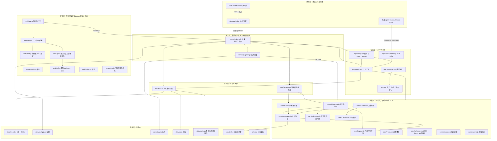

# 问心卦 · 系统设计说明书（SDD）

| 项目 | 内容 |
|---|---|
| 文档编号 | 01 |
| 标题 | 问心卦 · 系统设计说明书 |
| 版本 | 1.0 |
| 状态 | 已发布 |
| 适用产品版本 | v1.6.0 |
| 最后更新 | 2026-10-07 |
| 读者 | 维护者、新人工程师、评审者 |
| 关联文档 | [文档索引](./00-文档索引.md)、[架构与框图](./02-架构与框图.md)、[接口文档](./03-接口文档.md)、[数据模型与存储设计](./07-数据模型与存储设计.md)、[术语表](./13-术语表.md) |

---

## 1. 引言

### 1.1 目的

本文说明「问心卦」的系统定位、需求、总体架构、关键取舍与部署形态，使一名未接触过本项目的工程师能够在半天之内建立正确的整体认识，并知道**哪些决定不能随手改**。

本文**不**重复 [README.md](../README.md) 的教程内容，也**不**替代 [规范.md](./规范.md) 的规范性条款。字段级的接口契约见 [接口文档](./03-接口文档.md) 与 [接口控制文档 ICD](./04-接口控制文档-ICD.md)，图形化的结构说明见 [架构与框图](./02-架构与框图.md)。

### 1.2 范围

本文覆盖以下代码范围（路径相对仓库根）：

| 范围 | 内容 |
|---|---|
| 计算内核 | `core/`（14 个 `.mjs`） |
| 本地服务与存储 | `server/`（3 个 `.mjs`） |
| 网页界面 | `web/`（`index.html`、`style.css`、`icon.png` 与 6 个 `.js`） |
| 桌面外壳 | `desktop/`（`main.mjs`、`preload.cjs`） |
| Agent 与 MCP | `agent/`（4 个 `.mjs`） |
| 网关 | `hermes/`（4 个 `.mjs`） |
| 对外契约 | `schema/record.schema.json`、`schema/gua-tiao.schema.json` |
| 知识库 | `knowledge/64gua.json`、`knowledge/yaoci.json` |
| 命令行工具与自检 | `tools/`（9 个 `.mjs`） |
| 用户数据 | `data/`（卦录、配置、插件） |

**不覆盖**：用户自己的卦录内容与解读文字（那属于用户数据，不属于本系统设计）；`desktop/dist/` 下打包产物的内部结构。

### 1.3 读者

| 角色 | 建议读法 |
|---|---|
| 新人工程师 | 全文通读，重点第 4、6、11 章与附录 A |
| 维护者 | 第 5 章（决策）、第 6 章（数据）、第 10 章（风险）与附录 B |
| 集成方 | 第 7 章（接口概览）、第 8 章（部署形态），细节转 [接口文档](./03-接口文档.md) |
| 评审者 | 第 3 章（需求）与第 9 章（质量属性对照），据此判定设计是否兑现需求 |

### 1.4 参考文档

- [规范.md](./规范.md) —— 数据格式与导入规范（规范文本）
- [architecture](../AGENTS.md) —— 给编码 agent 的硬规矩（[AGENTS.md](../AGENTS.md)）
- [README.md](../README.md) —— 使用者教程与已知限制
- [schema/record.schema.json](../schema/record.schema.json)、[schema/gua-tiao.schema.json](../schema/gua-tiao.schema.json)

### 1.5 术语约定

本文使用 [术语表](./13-术语表.md) 的定义。以下五个词在全文只有一种含义，不得混用：

| 术语 | 在本文中的唯一含义 |
|---|---|
| **卦录** | 一条记录，落盘为 `data/records/<id>.json` |
| **卦条** | 「卦条 v1」纯文本导入格式的一段，经 `core/guaTiao.mjs` 解析 |
| **卦象** | 由引擎算出的本卦／互卦／变卦／动爻／体用，**不得**手写 |
| **快照** | `chart` 与 `reading` 两份算好的结果，落盘后不随引擎升级而变 |
| **唯一真源** | `cast` 字段：任何一条卦录都能且只能由它重算 |

规范强度用词（必须／应当／可以／不得）依 [文档索引](./00-文档索引.md) 第 5.3 节的约定。

---

## 2. 系统概述

### 2.1 定位

「问心卦」是一个**单机、零第三方依赖、面向长期使用**的梅花易数卦录程序。它做六件事：起卦、导入旧卦、存录、出断语、看走势、用 AI 助手操作这套数据。核心价值主张有两条：

1. **卦象只能由引擎算。** 断语、卦名、爻辞、体用、动爻、旺衰一律来自 `core/divination.mjs` 的 `cast()` / `buildChart()`，模型不得凭记忆编写。这是「这套东西能不能长期用」的分水岭。
2. **用户数据几十年可读。** 一卦一个纯文本 JSON，不依赖数据库、不依赖本程序；结构升级走「先备份、再迁移、可回退」。

### 2.2 运行形态

| 形态 | 入口 | 说明 |
|---|---|---|
| **命令行 + 浏览器** | `node server/index.mjs --open` | 开发与调试入口；默认监听 `127.0.0.1:19730` |
| **Electron 桌面版** | `desktop/main.mjs` | 主进程内直接 `import` `server/index.mjs`，同进程起服务，不 spawn 子进程 |
| **MCP 服务** | `node agent/mcp-server.mjs` | JSON-RPC 2.0 over stdio，供 Codex CLI / Claude Code / DSH 等外部 agent 驱动 |

三种形态共用同一份内核、同一份存储实现、同一份工具注册表，**不存在**「桌面版一套、命令行一套」的分叉。

### 2.3 设计约束

| 约束 | 内容 | 违反的后果 |
|---|---|---|
| **零第三方依赖** | 根 `package.json` 的 `dependencies` 必须永远为空；只用 Node 内置模块与浏览器原生 API | 十年后无法原样跑起来，项目立项前提被破坏 |
| **本地优先** | 默认只监听 `127.0.0.1`；除用户显式配置的模型端点外不发起任何外部网络请求 | — |
| **数据长期可读** | 一卦一 JSON；`cast` 为唯一真源；快照不随引擎升级改写；迁移前必须备份 | 用户几十年的记录不可恢复 |
| **卦象不出自人手** | 任何地方不得手写卦名、卦符、爻辞、体用生克、动爻、旺衰 | 断语不可复现，校勘失去基准 |
| **一处实现，多处复用** | 解析器只有 `core/importer.mjs` + `core/guaTiao.mjs`；工具集只有 `agent/tools.mjs` | 同一份文本在不同入口识别结果不同 |
| **正文一律 UTF-8** | 不得用 PowerShell 的 `Get-Content -Raw` / `Set-Content` 往返改含中文的文件 | 中文变乱码（开发中真踩过一次） |
| **单机无多用户** | 刻意不做账号、不做云端同步 | — |

### 2.4 与 DeepSeek Harness 的形态关系

桌面版对齐 DeepSeek Harness 的形态：自带 Chromium 与 Node 运行时、独立窗口与任务栏图标、托盘、中文菜单、开始菜单与桌面快捷方式；**内核一行没改**，只是多了一层壳。

---

## 3. 需求

### 3.1 功能需求

每条需求给出**一句话描述**与**验收点**。验收点必须可从代码、自检输出或接口响应直接判定。

| 编号 | 需求 | 验收点 |
|---|---|---|
| F-01 | 起卦 | `core/divination.mjs` 的 `cast()` 支持**两种占法、六种起卦法**：梅花易数四种（`numberAndTime`／`twoNumbers`／`timeOnly`／`manual`），道教小六壬两种（`xlrNumbers`／`xlrTime`）。按 `chart.kind` 分派：梅花返回含 `ben/hu/bian/moving/tiyong/score/calendar` 的完整卦局，小六壬返回含 `palaces/result/casting/calendar` 的三宫之课 |
| F-02 | 真太阳时定时辰 | `core/calendar.mjs` 的 `trueSolarTime()` 返回经度时差与均时差；兰州 `2026-09-28 03:12` 应落丑时（取数 2） |
| F-03 | 卦局推演 | `buildChart()` 由「本卦 + 动爻」算出互卦、变卦、体用、变卦对体、互卦对体、旺衰与吉凶评分 |
| F-04 | 断语生成 | `core/verdict.mjs` 的 `interpret()` 返回 `signature`、七段 `tone`（主·互·变·断·宜·忌·应期）、`classical`、`plain`、`grade`；同一卦局重算其文必同 |
| F-05 | 卦录存录 | `server/store.mjs` 一卦一 JSON 落盘；`core/record.mjs` 的 `normalizeRecord()` 归一化补齐缺省字段 |
| F-06 | 版本迁移 | `core/migrate.mjs` 按 `MIGRATIONS` 逐级迁移；载入时先写 `data/backups/pre-migration/<id>-v<旧版本>-<时间戳>.json` 再落盘 |
| F-07 | 复盘 | `review` 含 `status`（六种）与 `log[]`（条目流：首条复盘 + 追记）；独立「复盘」页（`#/review`）读写，`update_review` 工具与 `PATCH /api/records/:id` 都能写 |
| F-08 | 走势 | `core/trend.mjs` 的 `buildTrend()` 支持 `fortune`／`element`／`category` 三模式；除五行占比外各线归一到 −100 ~ +100 |
| F-09 | 卦条导入 | `core/guaTiao.mjs` 解析「卦条 v1」；`FIELD_ALIASES` 26 组别名（含 v5 新增的「复盘条目」多行块）；`missing` 报缺、`unknownKeys` 报认不出的键名 |
| F-10 | 对话文本导入 | `core/importer.mjs` 的 `parseMany()` 分流卦条、JSON、表格行、起卦小标题、对话式；认不出时返回 0 条而不是硬认 |
| F-11 | 命令行导入 | `tools/import.mjs` 支持 `--template`／`--dry`／`--export md\|slip`，与界面、Agent 共用同一解析器 |
| F-12 | AI 助手 | `agent/loop.mjs` 的 `runAgent()` 在 `maxRounds` 内循环「模型 → 工具 → 模型」，返回 `reply/events/rounds/usage/mode` |
| F-13 | MCP 服务 | `agent/mcp-server.mjs` 实现 `initialize`、`tools/list`、`tools/call`、`resources/list`、`resources/read`、`prompts/list`、`prompts/get` |
| F-14 | 插件系统 | `server/plugins.mjs` 的 `PluginHost` 支持 `registerRoute/Page/Panel/Exporter` 与 `on(event)`；`POST /api/plugins/reload` 热载 |
| F-15 | 校勘 | `core/record.mjs` 的 `audit()` 把 `claimed` 与重算结果逐项对照，差异写入 `corrections`，原述保留不删改 |
| F-16 | 导出 | `core/render.mjs` 提供 `toMarkdown`／`toSlip`／`toIndexMarkdown`；插件可注册新导出格式 |
| F-17 | 备份与恢复 | `GET /api/export?format=json` 出整包备份；`POST /api/restore` 按 `merge` 语义恢复；删除默认移入 `data/trash/` |
| F-18 | 卦典查询 | `knowledge/64gua.json` 与 `knowledge/yaoci.json` 提供 64 卦卦辞、大象辞与 384 爻爻辞；`library().find()` 支持卦名／全称／卦序／卦符／片段 |
| F-19 | 格式校验 | `core/schema.mjs` 自实现的 JSON Schema 子集校验器；`tools/validate.mjs` 校验结构 + 语义（七段顺序、六爻长度、动爻阴阳一致） |
| F-20 | 走势可视化交互 | `web/chart.js` 手写 SVG 多线图：图例点选隐藏、十字准星多值提示、点击跳回该卦、`ResizeObserver` 自适应 |
| F-21 | 桌面外壳 | `desktop/main.mjs` 同进程起服务、建窗口、托盘、菜单、7 个 IPC 通道；`preload.cjs` 以 `contextBridge` 暴露 `window.__qxgDesktop` |
| F-22 | 卦典与规范 | 界面提供「卦典」页（可搜卦名／卦序／卦德）；卦条规范并进「导入与格式」页（模板、字段字典、版本与迁移） |
| F-23 | 起卦前预览 | `POST /api/cast` 起卦不落盘，并触发插件事件 `cast.preview` |
| F-24 | 模型接入 | `agent/provider.mjs` 支持 `deepseek`／`openai`／`ollama`／`custom` 四类 OpenAI 兼容端点；支持原生 function calling 与文本协议降级 |

### 3.2 非功能需求

| 编号 | 类别 | 需求 | 验收点 |
|---|---|---|---|
| N-01 | 依赖 | 零第三方依赖 | 根 `package.json` 的 `dependencies` 为 `{}`；`desktop/` 的 `electron` 与 `electron-builder` 属 `devDependencies`，不算破例 |
| N-02 | 性能 | 单条卦录重算与断语生成应在毫秒级 | `tools/check.mjs` 一次跑完 260 项（含 6 次历史起卦与全部卦录重算）应在一秒量级完成 |
| N-03 | 性能 | 服务启动不做重活 | 启动时只 `readdirSync` + 逐个 `JSON.parse`；`maybeRescan()` 每次请求只做一次 `statSync` |
| N-04 | 可靠性 | 位置写入原子 | `Store.save()` 先写 `<id>.json.tmp` 再 `renameSync` |
| N-05 | 可靠性 | 单条损坏不拖垮全部 | 损坏文件 `JSON.parse` 失败时告警并跳过，其余照常载入 |
| N-06 | 可靠性 | 服务外改动可见 | 服务运行期间用命令行导入的卦录，靠 `maybeRescan()` 在下次请求时被看见 |
| N-07 | 可维护性 | 一处实现多处复用 | 解析器两处入口、工具集三处入口共用同一实现 |
| N-08 | 可维护性 | 回归网可执行 | `npm run check:all` 串联七套自检；合计 554 项全过 |
| N-09 | 可扩展性 | 加插件不改内核 | 新增 `data/plugins/<id>.mjs` 导出 `{id,name,version,activate(ctx)}` 即可；`POST /api/plugins/reload` 生效 |
| N-10 | 可扩展性 | 加走势领域不改前端 | `core/trend.mjs` 的 `DOMAINS` 加一项，`/api/meta` 的 `domains` 自动带上 |
| N-11 | 可移植性 | 跨平台启动 | 数据目录按 `QXG_DATA_DIR` → 代码目录下 `data/` 可写 → `%APPDATA%/问心卦/data` 三级回退 |
| N-12 | 可移植性 | 便携运行 | 整个目录拷到 U 盘即可跑（`win-unpacked` 形态） |
| N-13 | 安全 | 默认只监听本机 | `HOST` 默认 `127.0.0.1`；`QXG_HOST` 可覆盖 |
| N-14 | 安全 | 密钥不出本机、不回显 | `GET /api/agent/config` 不返回 `apiKey` 原文，只给 `apiKeySet` 布尔 |
| N-15 | 安全 | 静态文件不得越界 | `serveStatic()` 解析后的绝对路径必须以 `baseDir` 为前缀，否则返回 403 |
| N-16 | 数据开放 | 可脱离本程序读取 | 卦录为缩进 2 空格的纯文本 JSON，字段名与别名有兼容性承诺（见 [规范.md](./规范.md) 第八节） |

---

## 4. 总体架构

### 4.1 分层



**这张图在说什么**：系统严格分层，**依赖只向下**。表现层只通过 `fetch /api` 与接入层说话；内核层（L4）不 import 任何上层模块、不碰网络与 DOM，因此可被 `tools/check.mjs` 单独加载断言。唯二的跨层捷径是 `server/plugins.mjs` 通过 `ctx.core` 把整个内核交给插件、`server/index.mjs` 通过 `toolkit` 把工具集挂到 HTTP —— 这两条捷径都是刻意的复用设计。

### 4.2 每层职责

| 层 | 职责 | 不做什么 |
|---|---|---|
| L1 表现层 | 路由与渲染、表单交互、图表绘制、桌面版标记 | 不做计算、不拼卦象、不直接读写数据 |
| L2 接入层 | 路由分发、请求体解析、插件路由优先匹配、静态文件服务、CORS 与下载头 | 不实现业务规则 |
| L3 应用层 | 卦录 CRUD、配置读写、迁移触发与备份、统计聚合、校勘 | 不做卦象推演 |
| L4 内核层 | 起卦、卦局、断语、走势、解析、校验、迁移纯函数、渲染 | 不碰网络、不碰 DOM、不写文件（`core/hexagram.mjs` 只读知识库） |
| L5 智能层 | 工具注册与执行、agent 循环、模型接入、MCP 协议、多协议适配 | 不决定卦象——卦象必须回到 L4 |
| L6 外壳层 | 窗口、托盘、菜单、IPC、文件对话框、打包 | 不改内核一行 |
| L7 数据层 | 持久化纯文本 | 不承载逻辑 |

### 4.3 关键模块清单

| 模块 | 关键导出 | 职责 |
|---|---|---|
| `core/bagua.mjs` | `TRIGRAMS`、`trigramByRemainder`、`wuxingRelation`、`wangShuai`、`yaoTitle` | 八卦与五行的基础数据表 |
| `core/calendar.mjs` | `julianDay`、`trueSolarTime`、`monthBuild`、`dayGanZhi`、`calendarInfo`、`PLACES` | 历法与真太阳时 |
| `core/lunar.mjs` | `lunarInfo`、`lunarFromSolar`、`LUNAR_MIN_YEAR`、`LUNAR_MAX_YEAR` | 零依赖农历（朔用截断三角级数＋ΔT 近似、冬至基准、无中气置闰；闰月按本月计，适用 1900–2100，越界抛错） |
| `core/hexagram.mjs` | `sixLines`、`mutualLines`、`changedLines`、`tiYongOfLines`、`library` | 六十四卦合成与检索 |
| `core/divination.mjs` | `METHODS`、`cast`、`buildChart`、`kindOf`、`inferMovingFrom` | 起卦与卦局组装；`METHODS` 为两种占法（梅花四种＋小六壬两种）的起卦法总表，`kindOf()` 判别占法 |
| `core/xiaoliuren.mjs` | `XLR_PALACES`、`XLR_METHODS`、`castXlr`、`interpretXlr`、`computeXlrYingqi`、`xlrBriefOf`、`isXlrMethod`、`isXlrChart` | 道教传统小六壬：六宫唯一真源（大安／留连／速喜／赤口／小吉／空亡，各带六神、五行、方位、神数、口诀、吉凶）与起课、断课、应期、简报 |
| `core/verdict.mjs` | `interpret`、`normalizeCategory`、`CATEGORIES` | 断语引擎 |
| `core/record.mjs` | `buildRecord`、`buildFromHexagram`、`recompute`、`audit`、`summarize`、`makeId` | 卦录模型 |
| `core/trend.mjs` | `DOMAINS`、`buildTrend`、`trendSummary` | 走势聚合 |
| `core/importer.mjs` | `parseOne`、`parseMany`、`suggestImport` | 文本解析与分流 |
| `core/guaTiao.mjs` | `FIELD_ALIASES`、`parseGuaTiao`、`parseGuaTiaoMany`、`toGuaTiao`、`template` | 卦条格式 |
| `core/schema.mjs` | `validate`、`firstError` | JSON Schema 子集校验 |
| `core/migrate.mjs` | `CURRENT_SCHEMA`、`MIGRATIONS`、`migrate`、`migrateAll` | 版本迁移 |
| `core/render.mjs` | `toMarkdown`、`toSlip`、`toIndexMarkdown`、`drawLines` | 渲染导出 |
| `server/index.mjs` | `app`、`DATA_MODE` | HTTP 服务与路由表 |
| `server/store.mjs` | `Store` | 卦录存储 |
| `server/plugins.mjs` | `PluginHost` | 插件宿主 |
| `agent/tools.mjs` | `createToolkit` | 21 个工具的唯一实现 |
| `agent/loop.mjs` | `SYSTEM_PROMPT`、`runAgent` | agent 循环 |
| `agent/provider.mjs` | `PROVIDERS`、`resolveConfig`、`chat`、`ping`、`listModels` | 模型接入 |
| `agent/mcp-server.mjs` | `makeRuntime`、`handleRpc`、`serveStdio` | MCP stdio 服务 |
| `hermes/index.mjs` | `createHermes`、`isRetryable`、`PROTOCOLS`、`PRESETS`、`DEFAULT_ROUTES`、`DEFAULT_POLICY` | 信使层门面：选目标 → 编协议 → 发请求 → 解析 → 重试 → 降级 → 留痕 |
| `hermes/protocols.mjs` | `PROTOCOLS`、`PROTOCOL_IDS`、`protocolById`、`renderToolCatalog`、`prepare`、`parse`、`guessProtocol` | 协议适配器 |
| `hermes/router.mjs` | `DEFAULT_ROUTES`、`normalizeRoutes`、`routeMatches`、`selectTargets`、`explainSelection` | 路由：能力筛选、规则匹配与候选链 |
| `hermes/targets.mjs` | `PRESETS`、`presetById`、`DEFAULT_POLICY`、`normalizeTarget`、`targetReadiness`、`breakerOpen`、`markSuccess`、`markFailure`、`buildTargets` | 目标定义、服务商预设、就绪判定与熔断 |

---

## 5. 关键设计决策摘要

每条一句话，展开与备选方案见对应的 ADR。

| 编号 | 决策 | 一句话理由 |
|---|---|---|
| ADR-0001 | [零第三方依赖](./adr/ADR-0001-零第三方依赖.md) | 十年后还要能原样跑起来，`dependencies` 必须永远为空 |
| ADR-0002 | [一卦一个 JSON 文件而不是数据库](./adr/ADR-0002-一卦一个JSON文件.md) | 卦录要陪用户几十年，纯文本最耐久且不依赖本程序 |
| ADR-0003 | [断语用规则引擎而不是让 LLM 写](./adr/ADR-0003-断语用规则引擎.md) | 可复现、可追溯、可校准，并避免「模型记错卦」 |
| ADR-0004 | [cast / chart / reading 三段式与「cast 是唯一真源」](./adr/ADR-0004-cast是唯一真源.md) | 断语引擎一定会改，但已存下的卦不能因引擎改了而变样 |
| ADR-0005 | [卦条 v1 作为稳定导入契约](./adr/ADR-0005-卦条v1导入契约.md) | 一份纯文本格式让人、脚本、AI 三方都能产出 |
| ADR-0006 | [本地优先、默认不出网](./adr/ADR-0006-本地优先默认不出网.md) | 无账号、无云同步，外发路径只能是用户显式启用的通道 |
| ADR-0007 | [插件用文件模块而不是 npm 包](./adr/ADR-0007-插件用文件模块.md) | 一个 `.mjs` 放进数据目录即装、热载即生效 |
| ADR-0008 | [桌面版把服务内嵌进 Electron 主进程](./adr/ADR-0008-桌面版内嵌服务.md) | 不 spawn 子进程就不闪控制台、不依赖用户装 Node |
| ADR-0009 | [用 MCP 作为外部 agent 的接入面](./adr/ADR-0009-MCP接入面.md) | JSON-RPC 2.0 over stdio 与 Codex／Claude／DSH 直接互通；stdout 必须保持纯净 |
| ADR-0010 | [吉凶评分用加权归一而非简单加减](./adr/ADR-0010-吉凶评分加权归一.md) | 八项量纲不同，先归一再按权重平均 |
| ADR-0011 | [校勘存而不改](./adr/ADR-0011-校勘存而不改.md) | 原述进 `claimed`、差异进 `corrections`、原文留 `narrative`，程序不替用户抹掉历史 |
| ADR-0012 | [界面不做构建步骤（原生 ES 模块）](./adr/ADR-0012-界面无构建步骤.md) | 浏览器直接执行源码，可读可改、十年后还能开 |
| ADR-0013 | [助手受控联网工具](./adr/ADR-0013-受控联网工具.md) | 助手能抓网页，但每次调用都要用户确认；SSRF 在内核挡；**作用域取代** ADR-0006 的「唯一出网路径」一条表述 |

以下四条决策在本说明书中成立、且由自检或既有约定守护，但**尚未**写进 [adr/](./adr/) 目录（`docs/adr/` 现为 ADR-0001 至 ADR-0013）：

| 决策 | 一句话理由 | 现有落点 |
|---|---|---|
| 卦象只能由引擎算，模型不得编造 | 模型会记错卦，引擎不会 | `agent/loop.mjs` 的 `SYSTEM_PROMPT`；`tools/check.mjs` 的「system prompt 含硬约束」一项 |
| 删除与迁移的兜底：先入 trash、迁移先备份 | 用户数据不可删改，破坏性操作必须可回退 | `server/store.mjs` 的 `remove()` 与 `loadAll()`；`tools/check.mjs` 的迁移段 |
| 走势各线归一到同一量程 | 量程不同的线绝不硬画在一根轴上 | `core/trend.mjs` 的 `SCALE` 与 `DOMAINS` |
| 下载头用 RFC 5987 的 `filename*` | HTTP 头只能是 latin-1，中文文件名必须另给 ASCII 兜底 | `server/index.mjs` 的 `attachment()` |

---

## 6. 数据设计概览

### 6.1 卦录三段式

一条卦录由三段构成，职责互不重叠：

| 段 | 角色 | 规矩 |
|---|---|---|
| `cast` | **唯一真源** | 起卦输入（`method`／`numbers`／`localTime`／`useTrueSolarTime`／`movingFrom`／`longitude`／`placeName`／`hexagram`／`movingPosition`／`question`／`category`）。必须完整、可读、不省略 |
| `chart` | 卦局快照 | 本卦／互卦／变卦／六爻／动爻／体用／旺衰／评分／历法。**引擎升级后旧快照不动** |
| `reading` | 断语快照 | 谶 ＋ 七段定调 ＋ 通俗解 ＋ 古辞佐证。同上 |

其余字段：`claimed`（当初别人怎么说的）、`corrections`（自动校勘差异）、`review`（复盘）、`narrative`（原文存录）、`background`／`plan`／`collation`／`qa`（补充存录：背景／方案／人工校勘／原文问答，均可省）、`tags`、`origin`、`revisionCount`、`schema`、`createdAt`／`updatedAt`。完整结构见 [schema/record.schema.json](../schema/record.schema.json)，根级 `additionalProperties: false`。

### 6.2 「cast 是唯一真源」的含义

这句话有四个可检验的推论：

1. **可重算**：`core/record.mjs` 的 `recompute(record)` 只用 `record.cast` 调 `cast()`，再调 `interpret()`，即可复现整条卦录。`tools/check.mjs` 对全部卦录做这件事，并要求本卦与动爻一致。
2. **可迁移**：结构升级只需保证 `cast` 语义不变；`core/migrate.mjs` 的迁移函数是纯函数（旧记录 → 新记录）。
3. **可校勘**：`audit(claimed, chart)` 把原述与重算结果对照。差异一律**存录**，不删改原述。
4. **不可反向推导**：`chart` 与 `reading` 不是输入。改快照的唯一正当途径是显式「重算」，那是一次用户操作，会把 `revisionCount` 加一。

### 6.3 存储布局

```text
data/
├─ records/<id>.json          一卦一文件，id 形如 202609280338-01
├─ trash/<id>-<时间戳>.json    删除先进这里（?hard=1 才真删）
├─ backups/pre-migration/     迁移前原件，可回退
├─ config.json                默认地点、经度、真太阳时开关、插件开关、AI 配置
└─ plugins/<id>.mjs           一个插件一个文件
```

---

## 7. 接口概览

三类接口共用同一份底层实现。逐条字段与错误码见 [接口文档](./03-接口文档.md) 与 [接口控制文档 ICD](./04-接口控制文档-ICD.md)。

### 7.1 REST（本地 HTTP）

`server/index.mjs` 注册 **37 条路由**，覆盖健康检查、元信息、卦录 CRUD 与重算、导入解析与入库、卦条模板与解析、走势、格式规范与校验、卦典、统计、Agent 配置与工具、插件管理、备份恢复与停止服务。统一约定：

- 成功响应 `{ ok: true, ... }`；失败 `{ ok: false, error: "…" }`，HTTP 状态码 400（参数或执行错）或 404（未找到）。
- 全部响应为 UTF-8 JSON（缩进 2 空格）；文件下载走 `Content-Disposition` 的 RFC 5987 `filename*`。
- 允许 `OPTIONS` 预检（204），带 `Access-Control-Allow-Origin: *`。

### 7.2 IPC（Electron 桌面版）

`desktop/preload.cjs` 通过 `contextBridge` 暴露 `window.__qxgDesktop`，共 **8 个口子**：`isDesktop`、`info`、`openDataDir`、`openBackups`、`exportBackup`、`revealRecordFile`、`chooseDataDir`、`onNavigate`。另一端是 `desktop/main.mjs` 的 `registerIpc()` 注册的 6 个 `ipcMain.handle` 与 1 个 `qxg:navigate` 推送，合计 **7 条通道**。`contextIsolation: true`、`nodeIntegration: false`，渲染进程拿不到 Node。

### 7.3 MCP（stdio）

`agent/mcp-server.mjs` 实现 JSON-RPC 2.0 换行分隔的 stdio 传输：`initialize`、`notifications/initialized`、`ping`、`tools/list`、`tools/call`、`resources/list`、`resources/read`、`prompts/list`、`prompts/get`。暴露 **21 个工具**、**3 个资源**（`wenxingua://records`、`wenxingua://spec/gua-tiao`、`wenxingua://stats`，另支持 `wenxingua://record/<id>`）与 **2 个提示模板**（`divine`、`review_due`）。协议版本 `2024-11-05`。

**约束**：MCP 服务的 stdout 只允许出现 JSON-RPC 消息，任何日志必须走 stderr。

---

## 8. 部署形态

| 形态 | 依赖 | 数据目录 | 启动方式 | 适用场景 |
|---|---|---|---|---|
| 命令行 + 浏览器 | Node.js ≥ 18 | 项目内 `data/`；不可写则退回 `%APPDATA%\问心卦\data` | `node server/index.mjs --open`（`--port` 换端口） | 开发调试、脚本化、无图形界面环境 |
| Electron 桌面版 | 无（自带 Chromium 与 Node） | 开发态项目内 `data/`；安装态 `%APPDATA%\问心卦\data`；可在「数据 → 更换数据目录」改 | `cd desktop && npm start`；分发的 `问心卦.exe` 双击；免安装 `dist/win-unpacked/问心卦.exe` | 日常长期使用 |
| MCP stdio | Node.js ≥ 18 | 固定为项目根下的 `data/` | 由外部 agent 以 `command = "node"`、`args = ["<项目绝对路径>/agent/mcp-server.mjs"]` 拉起 | 把起卦与卦录能力接给 Codex / Claude / DSH |

数据目录解析优先级（`server/index.mjs` 的 `resolveDataDir()`）：`QXG_DATA_DIR` 环境变量 → 代码目录下 `data/` 可写 → `%APPDATA%/问心卦/data`（随包 `seed-data` 里只有示例插件、不含卦录与 `config.json`；由 `server/seed.mjs` 的 `seedPlugins()` 补进 `plugins/`——**升级新增的会补、已存在的不覆盖、用户删掉的不还原**）。桌面版在 `import` 服务**之前**就把 `QXG_DATA_DIR` 设好（`desktop/main.mjs`），避免服务自作主张挑到安装目录里的 `data/`——那样一升级就被覆盖。

端口冲突处理：桌面版先试 `19730`，遇 `EADDRINUSE` 改为让系统分配空闲端口（`listen(0)`）。

---

## 9. 质量属性与实现手段对照

| 质量属性 | 需求编号 | 实现手段 | 验证方式 |
|---|---|---|---|
| 长期可运行 | N-01、N-16 | 零第三方依赖；纯文本 JSON；不使用实验性 API | 根 `package.json` 的 `dependencies` 为空；`tools/validate.mjs` 全过 |
| 可复现性 | F-04、ADR-0011 | 断语变体按「卦局指纹」（本卦／互卦／变卦／动爻／体用／所问）取 FNV-1a 散列选定，不用随机 | `tools/check.mjs` 对六次历史起卦断言断语七段齐备、无重复标点 |
| 数据不丢 | F-06、F-17、N-04、N-05 | 迁移前备份、删除入 trash、写入走 `.tmp` + rename、损坏文件跳过而不中断 | `tools/check.mjs` 的迁移段与重扫段；`tools/check-validate.mjs` 负向测试 |
| 契约稳定 | F-09、F-19、N-16 | 卦条字段名与别名只增不改；卦录只做向前迁移；根级 `additionalProperties: false` | `tools/validate.mjs`；`check-validate.mjs` 注入缺陷必须报错 |
| 易扩展 | N-09、N-10、F-14 | 插件宿主 + 事件钩子 + `DOMAINS` 数据驱动 + 视图表驱动 | `tools/check.mjs` 验三个内置插件全部载入无错 |
| 可移植 | N-11、N-12 | 三级数据目录回退；便携模式；Electron 自带运行时 | 手工实测 U 盘运行；`check-desktop.mjs` 验打包配置 |
| 性能 | N-02、N-03 | 内核纯计算无 IO；服务启动只读文件；`maybeRescan()` 一次 `statSync` | 自检执行时间；`check.mjs` 的「无外部改动时不重扫」 |
| 安全 | N-13、N-14、N-15 | 默认 `127.0.0.1`；密钥不回显；静态文件前缀校验 | `check-web.mjs` 验接口约定；代码审查 |
| 协议互操作 | F-13、F-24、ADR-0010 | MCP stdio 严格 JSON-RPC；四类 OpenAI 兼容provider；四类协议适配器 | `tools/check-mcp.mjs`（14 项，真起子进程验 stdout 纯净） |
| 界面不崩 | F-20、F-22 | 视图表驱动 + 统一错误卡；图表零依赖手写 SVG | `check-web.mjs` 逐条路由渲染并检查 `undefined`／`NaN`／`[object Object]` |

---

## 10. 风险、限制与已知缺口

### 10.1 算法与知识的限制

| 项 | 现状 | 影响与处置 |
|---|---|---|
| 历法精度 | `core/calendar.mjs` 用低精度天文近似，太阳视黄经误差约 0.01°，折合时刻误差 ≲ 15 分钟 | 定节气、月建、时辰足够；**不得**当历书用。若需更高精度，应当引入更完整的 VSOP 级数而非换库 |
| 断语上限 | 断语是规则引擎，文采上限固定 | 强项是稳定、可复现、可追溯；要更活就扩 `core/verdict.mjs` 顶部词库，不改架构 |
| 卦典释义 | `coreMeaning`／`keywords`／`advice`／`fortune` 是编写的释义，不是古籍原文；卦辞、大象辞、爻辞是原文 | 个别异文已在知识库注明；未做多底本对照 |
| 走势可读性 | 现有卦录集中在同一天同一小时，横轴挤在一起 | 走势是**按数据量设计**的；等积累到几十卦、跨数月才显趋势。时间跨度不足一日时时间轴退化为等距并在 `notes` 里说明，不假装是真时间轴 |

### 10.2 能力缺口（工程视角）

| 缺口 | 现状 | 技术影响 |
|---|---|---|
| 全文检索高亮 | 只有关键词筛选（`/api/records?q=` 对标题／所问／原文／chart／reading 做 `JSON.stringify` 子串匹配） | 全量序列化后匹配，卦录规模上千后需改为建索引 |
| 流式输出 | `/api/agent/chat` 一次性返回；`hermes/protocols.mjs` 的 `prepare()` 已支持 `stream` 参数，但 `provider.chat()` 未走流式解析 | 长回答等待数秒；这是接口能力与实现的差 |
| 打印版式 | 只有卦签纯文本与插件提供的离线 HTML 卡片 | 无 A4／PDF 分页 |
| 移动端 | 接口齐备，无客户端 | 无 |
| 多用户／云同步 | **刻意不做** | 单机软件，数据只在本机 |
| 六爻／纳甲／奇门 | 未实现 | 插件接口已留好（`registerRoute/Page/Panel`） |
| 日历热力图 | 未实现 | 走势是时间线，不是日历 |

### 10.3 结构性风险

| 风险 | 说明 | 缓解 |
|---|---|---|
| `web/views.js` 体量大 | 单文件约 80 KB，12 个视图集中在一处，是前端最重的一个文件 | 视图表驱动便于新增；但改动时应当跑 `check-web.mjs` 全量路由 |
| 全局 CORS `*` | `server/index.mjs` 对所有响应设 `Access-Control-Allow-Origin: *` | 服务默认只监听 `127.0.0.1`；若用 `QXG_HOST` 暴露到局域网，应当先评估这一点 |
| API Key 明文 | 存于 `data/config.json` 的 `agent.apiKey`，明文 | 本地程序的有意取舍；`data/` 不得提交公开仓库、不得放同步盘 |
| 桌面外壳清单易被外部工具覆盖 | `tools/check-desktop.mjs` 的前 4 项断言 `desktop/package.json` 必须声明 `main: "main.mjs"`、`type: "module"`、`devDependencies.electron` 与 `electron-builder`、以及 NSIS 打包配置（`productName`、`win.icon`、`nsis.shortcutName`）。本项目开发中真的发生过该文件被 `npx asar extract-file` 覆盖成 DSH 运行时清单、导致 Electron 静默退出的情形 | 这 4 项静态检查就是哨兵，当前已全过；改桌面外壳后**必须**跑 `check-desktop.mjs`。这一项**不得**靠放宽自检来「修好」 |
| `agent/provider.mjs` 是 Hermes 之上的兼容薄壳 | `agent/provider.mjs` 已收敛为门面：`PROVIDERS` 直接就是 `hermes/targets.mjs` 的 `PRESETS`（同一份，不复制），`extractTextToolCalls()` 转调 `hermes/protocols.mjs` 的 `extractTextCalls()`；只有 `agent` 段的旧配置由 `hermes/` 的兼容层合成单目标 | 这层薄壳不能悄悄长回实体逻辑。见 [Hermes 网关与路由设计](./06-Hermes网关与路由设计.md)；`tools/check-hermes.mjs` 第五节（8 项）专门守这条兼容承诺 |
| 未做静态类型检查 | 项目无 TypeScript、无 lint 配置 | 用 `node --check` 保证语法；用 `check*.mjs` 保证行为 |

### 10.4 兼容性承诺

- 卦条 v1 的字段名与别名**不会**删改，只会新增别名；旧文件永远能读。
- 卦录 JSON 只做**向前迁移**，不做破坏性重写。
- `schema` 号当前为 **4**（`core/migrate.mjs` 的 `CURRENT_SCHEMA` 与 `core/record.mjs` 的 `SCHEMA_VERSION` 均为 4；v4 收录小六壬）。升级 schema 必须同时改 `core/migrate.mjs`、`schema/record.schema.json` 与 [规范.md](./规范.md) 的版本历史。

---

## 附录 A：目录结构与文件职责全表

### A.1 内核 `core/`（14 个文件）

| 路径 | 职责 | 关键导出 |
|---|---|---|
| `core/bagua.mjs` | 先天八卦数、五行生克、旺衰表、地支天干、爻位 | `TRIGRAMS`、`NUMBER_TO_TRIGRAM`、`trigramByRemainder`、`trigramByLines`、`WUXING_SHENG`、`WUXING_KE`、`wuxingRelation`、`DIZHI`、`WANG_SHUAI_TABLE`、`wangShuai`、`yaoTitle` |
| `core/calendar.mjs` | 儒略日、太阳视黄经、均时差、真太阳时、月建节气、日/年干支 | `PLACES`、`julianDay`、`fromJulianDay`、`equationOfTime`、`trueSolarTime`、`parseLocalTime`、`hourZhi`、`zhiNumber`、`monthBuild`、`nextJieTime`、`dayGanZhi`、`yearGanZhi`、`calendarInfo` |
| `core/lunar.mjs` | 零依赖农历：朔（截断三角级数）与 ΔT 近似、冬至基准、无中气置闰、月序与日序 | `LUNAR_MIN_YEAR`、`LUNAR_MAX_YEAR`、`newMoonCivilJD`、`dayNumberOf`、`sunTermCivilJD`、`lunarFromSolar`、`lunarInfo`、`chineseMonthName`、`chineseDayName` |
| `core/hexagram.mjs` | 六十四卦合成、互卦、变卦、体用、知识库载入与检索 | `BUILTIN_TABLE`、`hexagramSymbol`、`sixLines`、`trigramsOfLines`、`mutualLines`、`changedLines`、`tiYongOfLines`、`library`、`hexagram` |
| `core/divination.mjs` | 起卦主函数、卦局组装、吉凶评分、动爻取法反推 | `METHODS`、`cast`、`buildChart`、`kindOf`、`placeByName`、`inferMovingFrom` |
| `core/xiaoliuren.mjs` | 道教小六壬六宫唯一真源与起课／断课／应期／简报 | `XLR_METHODS`、`XLR_METHOD_IDS`、`XLR_LABELS`、`XLR_PALACES`、`XLR_PALACE_NAMES`、`isXlrMethod`、`isXlrChart`、`palaceIndexFromCounts`、`palaceOfCounts`、`castXlr`、`interpretXlr`、`computeXlrYingqi`、`xlrBriefOf` |
| `core/verdict.mjs` | 断语引擎：谶、七段定调、通俗解、古辞佐证、类别归一 | `CATEGORIES`、`interpret`、`normalizeCategory` |
| `core/record.mjs` | 卦录构造、归一化、重算、校勘、摘要、id 生成 | `SCHEMA_VERSION`、`REVIEW_STATUS`、`stampOf`、`makeId`、`resetSeqCache`、`audit`、`buildRecord`、`buildFromHexagram`、`recompute`、`normalizeRecord`、`summarize` |
| `core/trend.mjs` | 走势领域表与三种模式的时间序列聚合 | `SCALE`、`DOMAINS`、`ELEMENT_COLORS`、`ELEMENTS`、`buildTrend`、`trendSummary` |
| `core/importer.mjs` | 粘贴文本解析与分块分流 | `parseOne`、`parseMany`、`suggestImport`、`pickHex` |
| `core/guaTiao.mjs` | 卦条 v1 的解析、序列化、模板、别名表 | `GUATIAO_VERSION`、`HEADER`、`FIELD_ALIASES`、`METHOD_NAMES`、`METHOD_LABELS`、`splitGuaTiao`、`looksLikeGuaTiao`、`parsePosition`、`parseGuaTiao`、`normalizeTime`、`parseGuaTiaoMany`、`toGuaTiao`、`template` |
| `core/schema.mjs` | 零依赖 JSON Schema 子集校验器 | `validate`、`firstError` |
| `core/migrate.mjs` | 卦录结构版本与逐级迁移 | `CURRENT_SCHEMA`、`MIGRATIONS`、`detectVersion`、`needsMigration`、`migrate`、`migrateAll` |
| `core/render.mjs` | 卦录 → Markdown／卦签／总览 | `drawLines`、`toMarkdown`、`toSlip`、`methodLabel`、`toIndexMarkdown` |

### A.2 服务 `server/`（4 个文件）

| 路径 | 职责 | 关键导出 |
|---|---|---|
| `server/index.mjs` | HTTP 服务、50 条 REST 路由、数据目录解析、静态文件、下载头、命令行为入口 | `DATA_MODE`、`app`（含 `httpServer`／`core`／`store`／`plugins`／`toolkit`／`routes`／`root`／`dataDir`／`listen`／`close`） |
| `server/store.mjs` | 卦录存储：一卦一 JSON、迁移触发与备份、回收、配置、统计、整包备份与恢复 | `Store` |
| `server/chatStore.mjs` | AI 会话存储：一段会话一个 JSON、模型侧消息与展示轨迹双存、附件、删除进回收 | `ChatStore`、`CHAT_SCHEMA` |
| `server/plugins.mjs` | 插件宿主：扫描载入、上下文构造、路由匹配、事件分发、启停 | `PluginHost` |
| `server/seed.mjs` | 随包示例插件落进数据目录的规则（升级新增要补、已存在不覆盖、用户删掉的不还原） | `seedPlugins`、`SEED_MANIFEST` |

### A.3 界面 `web/`（10 个文件）

| 路径 | 职责 | 关键导出 |
|---|---|---|
| `web/index.html` | 单页外壳：顶栏、侧栏 `#nav` 与插件组 `#nav-extra`、主区 `#main`、状态栏 `#status`、助手面板 `#agent-panel`、更新横幅 `#update-banner`，加载 `/app.js` | — |
| `web/style.css` | 全部样式（约 48 KB）：顶部是「宣纸／夜读」两套令牌，之下全部引用令牌 | — |
| `web/app.js` | 侧栏导航表 `NAV` 与侧栏外入口表 `OFF_NAV`、侧栏插件组、`parseHash()` 路由、视图表 `VIEWS`、渲染与桌面桥接线；版本更新两件事（`WHATS_NEW` 更新说明卡、顶部可更新横幅）也在这里 | 全局 `window.__qxg` |
| `web/views.js` | 14 个视图对象：`dashboard`、`records`、`recordDetail`、`reviewDesk`、`castDesk`、`importDesk`、`dian`、`dianDetail`、`pluginsView`、`pluginPage`、`trendView`、`agentView`、`settingsView`、`docsView` | 上述 14 个导出（`recordDetail` 在 `app.js` 的 `VIEWS` 表里名为 `record`，`reviewDesk` 名为 `review`） |
| `web/chatpanel.js` | 助手对话面板：会话切换／新建／改名／删除、流式轨迹渲染、附件、面板顶栏两枚 chip | `createChatPanel`、`chatState`、`convoHtml`、`foldEvent`、`splitNdjson`、`absorbResult` |
| `web/chart.js` | 零依赖 SVG 多线叠加图：图例、准星、提示、点击回调、自适应 | `renderLineChart`、`legendHtml`、`NS` |
| `web/api.js` | 接口封装、HTML 转义、toast、modal、时间格式、卦象可视化片段 | `api`、`h`、`attr`、`toast`、`modal`、`debounce`、`gradeTag`、`fmtLocal`、`fmtFull`、`toLocalInput`、`fromLocalInput`、`nowLocalInput`、`liuyaoHtml`、`hexRowHtml`、`tiyongHtml`、`readingHtml`、`calendarHtml`、`renderMarkdown`（转出） |
| `web/skin.mjs` | 皮肤的应用与记忆：读 `localStorage` 的 `qxg.skin`、注入 `<link id="skin-css">`、设 `<html data-skin>`、按 meta 清单校验与回落（[ADR-0014](./adr/ADR-0014-皮肤由插件提供.md)） | `applyStoredSkin`、`applySkin`、`setAvailableSkins`、`availableSkins`、`readSkinPref` |
| `web/palette.js` | 命令面板：模糊匹配、条目构建、键盘交互（侧栏只放六项加一组插件，文档／卦典／设置与插件页面从这里也能进） | `createPalette`、`fuzzyScore` |
| `web/md.js` | 极简 Markdown 渲染（标题、列表、表格、引用、围栏代码） | `renderMarkdown` |
| `web/icon.png` | 页面图标（favicon） | — |

### A.4 桌面外壳 `desktop/`

| 路径 | 职责 | 关键导出 |
|---|---|---|
| `desktop/main.mjs` | 主进程：日志、数据目录解析、单实例锁、起服务、建窗口、IPC、菜单、托盘、`--selftest`／`--shot` | `_log`；内部 `main`、`registerIpc`、`buildMenu`、`buildTray`、`showWindow` |
| `desktop/preload.cjs` | `contextBridge` 暴露 `window.__qxgDesktop`（**必须是 CJS**） | — |
| `desktop/build/make-icon.py` | 由卦符生成 `icon.ico`／`icon.png`／`tray.png` | — |
| `desktop/package.json` | 桌面外壳清单：`main: main.mjs`、`type: module`、`devDependencies` 声明 electron 与 electron-builder、`build.win` 的 NSIS 与图标配置 | — |
| `desktop/dist/` | 打包产物：`win-unpacked/` 与 `问心卦-安装包-1.1.0.exe` | — |

`tools/check-desktop.mjs` 的前 4 项静态检查断言 `desktop/package.json` 的上述字段，当前全过；改桌面外壳后**必须**跑 `check-desktop.mjs`。

### A.5 Agent 与网关 `agent/`、`hermes/`

| 路径 | 职责 | 关键导出 |
|---|---|---|
| `agent/provider.mjs` | OpenAI 兼容模型接入：4 个 provider 预设、配置归一、对话补全、文本协议降级、模型列表、连通自检 | `PROVIDERS`、`DEFAULT_AGENT_CONFIG`、`resolveConfig`、`chat`、`extractTextToolCalls`、`listModels`、`ping` |
| `agent/tools.mjs` | 21 个工具的唯一实现与三种格式导出 | `createToolkit` |
| `agent/loop.mjs` | agent 循环与硬约束 system prompt | `SYSTEM_PROMPT`、`runAgent` |
| `agent/mcp-server.mjs` | MCP stdio 服务：JSON-RPC 分发、资源与提示模板 | `SERVER_INFO`、`PROTOCOL_VERSION`、`makeRuntime`、`handleRpc`、`serveStdio` |
| `hermes/protocols.mjs` | 协议适配器：4 类协议的请求编码与响应解析、工具目录文本化、协议推断 | `PROTOCOLS`、`PROTOCOL_IDS`、`protocolById`、`renderToolCatalog`、`prepare`、`parse`、`stripHermesXml`、`stripAllFences`、`extractTextCalls`、`guessProtocol`、`flattenToolMessages` |

### A.6 契约、知识与工具

| 路径 | 职责 | 关键内容 |
|---|---|---|
| `schema/record.schema.json` | 卦录 JSON Schema | 根级必填 10 项、`additionalProperties: false`、七段 `tone` 的 `minItems/maxItems: 7` 与枚举 |
| `schema/gua-tiao.schema.json` | 卦条解析结果 Schema | 必填 `ok/source/version/fields/claimed/missing`；`source` 常量 `gua-tiao`、`version` 常量 `1` |
| `knowledge/64gua.json` | 六十四卦卦典 | `meta` 与 `hexagrams[64]`，字段含 `palace`、`coreMeaning`、`keywords`、`guaci`、`xiang`、`fortune`、`advice` |
| `knowledge/yaoci.json` | 三百八十四爻爻辞 | `meta`、`lines`（64 卦 × 6 爻）、`yong`（键 `1`／`2`，即乾用九、坤用六） |
| `tools/check.mjs` | 内核自检（260 项，不需服务） | 见附录 B |
| `tools/check-validate.mjs` | 校验器负向测试（10 项） | 见附录 B |
| `tools/check-mcp.mjs` | MCP stdio 自检（14 项） | 见附录 B |
| `tools/check-hermes.mjs` | Hermes 协议／路由／策略自检（63 项，全离线） | 见附录 B |
| `tools/check-desktop.mjs` | 桌面版自检（54 项，真起 Electron） | 见附录 B |
| `tools/check-web.mjs` | 前端联调自检（123 项，连不上服务时自起示例服务） | 见附录 B |
| `tools/check-docs.mjs` | 文档与代码一致性（30 项） | 见附录 B |
| `tools/validate.mjs` | 按 schema 校验卦录／卦条／备份包 | 结构 + 语义（七段顺序、六爻长度、动爻阴阳一致）；`--json` 机器可读 |
| `tools/import.mjs` | 命令行导入 | `--template`、`--dry`、`--export md\|slip`；与界面、Agent 共用解析器 |
| `tools/seed.mjs` | 把成对的对话记录批量录成卦录（**语料自备**，路径作参数） | `--force` 覆盖同名 id |

### A.7 用户数据 `data/`

| 路径 | 职责 |
|---|---|
| `data/records/*.json` | 卦录，一卦一文件（当前 6 条） |
| `data/trash/` | 删掉的卦录（先进这里） |
| `data/backups/pre-migration/` | 迁移前原件 |
| `data/config.json` | 默认地点、经度、真太阳时开关、插件开关、AI 配置 |
| `data/plugins/*.mjs` | 插件（内置 3 个：`review-watch` 应期提醒、`stats-plus` 卦气统计、`html-card` 单卦 HTML 卡片） |

### A.8 仓库根

| 路径 | 职责 |
|---|---|
| `README.md` | 使用者教程 |
| `AGENTS.md` | 给编码 agent 的硬规矩与扩展点速查 |
| `package.json` | 根清单：`version: 1.1.0`、`type: module`、`dependencies: {}`、`engines.node >= 18` 与全部 npm scripts |
| `docs/规范.md` | 数据格式与导入规范（规范文本） |
| `启动问心卦.bat` | 有桌面版就开桌面版，没有才退回浏览器 |
| `问心卦(桌面窗口).vbs` | 零安装兜底：静默起服务 + Edge `--app` 独立窗口 |
| `创建快捷方式.ps1` | 建带卦符图标的桌面／开始菜单快捷方式 |

---

## 附录 B：自检套件清单

| 套件 | 命令 | 项数 | 前置条件 | 验什么 |
|---|---|---|---|---|
| 内核自检 | `node tools/check.mjs` | 260 | 无 | 卦典、历法、六次历史起卦、断语、已录卦录、插件、走势、规范与迁移、Agent 工具与 MCP、Agent 权限与二次确认、应期与领域走势、**AI 会话存储（含「存档能否回推给模型」）**、**工具来源与联网守卫**、**上下文窗口预设与厂商余额档案**、**小六壬（六宫表、起课算例、农历朔闰、三宫记录与分区导出）** |
| 校验器负向测试 | `node tools/check-validate.mjs` | 10 | 无（用示例卦录当基样） | 故意注入缺陷，校验器**必须**报错（含小六壬四例：段序、三宫数、缺结果宫、术语混用） |
| MCP stdio 自检 | `node tools/check-mcp.mjs` | 14 | 无（真起子进程） | stdout 纯净性与协议往返 |
| Hermes 网关自检 | `node tools/check-hermes.mjs` | 63 | 无（全离线，不打网络） | 4 类协议的请求编织与响应还原、路由选择、重试与熔断、旧配置兼容、失败留痕、**不设上限就不发 `max_tokens`／`finish_reason` 要留住** |
| 桌面版自检 | `node tools/check-desktop.mjs` | 54 | 已装 `desktop/node_modules/electron` | 12 项静态检查 ＋ 41 项真窗口断言 ＋ 1 项退出码 |
| 前端联调自检 | `node tools/check-web.mjs` | 123 | **连不上服务时自起示例服务** | 逐条路由渲染、外壳组织与命令面板、接口约定、导入识别、起卦往返、**半句话与空回复的可见性**、**面板顶栏两枚常驻 chip**、**小六壬详情页的分区渲染（不混梅花术语）**、**Markdown 段内换行与用户消息的换行／格式**、**版本更新（更新说明表、版本比较、横幅、检测接口与配置白名单）** |
| 文档与代码一致性 | `node tools/check-docs.mjs` | 30 | 无（须先跑过 `check-web`／`check-desktop`，它会读它们写入的 `docs/.counts.json`） | 结构事实、各套项数、文档里写的数字、易过期断言、**附录 B 表与 ADR 编号**、文档自身健康 |
| 合计 | `npm run check:all` | **554** | 网页套连不上服务时会自起示例服务 | 七套全过才算可提交 |

### B.1 `tools/check.mjs`（260 项）分节明细

| 节 | 项数 | 内容 |
|---|---|---|
| 【一】卦典与爻辞 | 8 | 六十四卦齐备、来源为知识库、卦辞完整、爻辞完整、无上下卦告警、卦符与卦序对应、六爻与上下卦互推自洽、六十四卦阴阳组合互异 |
| 【二】历法 | 5 | 兰州真太阳时落丑时、钟表时辰为寅时、月建为酉月、1949-10-01 为甲子日、2024-01-01 为甲子日 |
| 【三】起卦与断语 | 24 | 六次历史起卦，每次 4 项：卦象与体用正确、断语七段齐备且无空段、断语无重复标点、Markdown 渲染无 `undefined`／`NaN` |
| 【四】已录卦录 | 2 | 存在卦录文件；全部卦录结构完整、可重算且重算结果一致、可导出（两种占法各按其形断言：梅花比本卦与动爻，小六壬比三宫与末宫） |
| 【五】插件 | 11 | 插件全部载入无错、插件页面已注册、插件面板已注册；**皮肤五条（清单字段齐备、CSS 挂上只读路由、拒绝重复 id／无作用域／缺 id 的注册、非法注册不留路由、停用时清单与路由一起撤下）**；**示例插件落地三条（升级新增会补进老数据目录、用户删掉的不复活、已存在的不覆盖）** |
| 【六】走势聚合 | 11 | 吉凶模式每点一线、同量程可叠看、取值在量程内、时间点与卦录一一对应、**小六壬记录被排除且图上给出说明**、五行模式五条线量程 0~100、平滑窗口生效、分类别模式含虚线基准线、可选领域与移动平均生效、无数据不崩、走势摘要可算 |
| 【七】格式规范、schema 与迁移 | 29 | 两份 schema 合法且有 `$id`、全部卦录过 record schema（**先迁移再校验**：盘上可能是旧结构）、schema 能抓未声明字段、卦条模板带版本头、模板可被自己解析、模板结果过 gua-tiao schema、卦录→卦条→再解析往返一致、**卦条「复盘条目」块一行一条且行首日期认得出**、**旧键「实况」仍认（转成无日期条目）**、缺时间报缺而不猜、认不出的键名会报出、结构版本是大于 0 的整数、每一级都有迁移函数、无版本号旧记录被迁到最新版、已是最新版本不改动、v1→v2 只新增应期不动 `cast`／`reading`、**v2→v3 只新增补充存录四字段**、**v4→v5 复盘条目化三条（搬家不丢字／不猜日期／空实况不造条目）**、**卦条四个多行块都认得出来**、**补充存录过 gua-tiao schema**、**补充存录往返一字不丢**、载入时自动迁移、迁移前已备份、新建库起始为空、外部新增会被重扫发现、无改动不重扫、校验器抓得出五类缺陷 |
| 【八】Agent 工具与 MCP | 36 | 工具集齐备且都带 JSON Schema、OpenAI function 格式、MCP inputSchema 格式、`cast` 算出正确卦象、`cast` 返回完整七段、**`cast` 支持小六壬（三宫与末宫，不带梅花术语）**、`hexagram_lookup` 按爻辞反查、`format_spec` 给出卦条格式、**`save_record`／`list_records` 支持小六壬且按起课法筛得出来**、未知工具返回失败而非抛错、`save_gua_tiao` 可入库、入库结构合法、来源标注为卦条、`update_review` 可写复盘、动爻取法反推两项、卦条忠实还原不误记校勘、MCP 六项协议断言、MCP 按权限裁剪两条、system prompt 四条硬约束、**system prompt 要求「对话里那卦」先看这段对话（别只翻卦录台），且承让自己在对话里写下过的卦**、未配 Key 时明确不可用、本地 Ollama 无需 Key、文本协议降级可解析、**上下文窗口预设（deepseek 1M／gpt-o 128k／认不出为 0）两条**、**余额档案（deepseek 给得出 url、ollama 给不出）**、**不支持余额的厂商返回 supported:false 且不发请求** |
| 【十】Agent 权限与二次确认 | 30 | 四级权限且累加、高级别含低级别、低级别不越权、同名等级自反、未知等级回落而非放行、默认是「可写」、工具数覆盖内部操作、每个工具都登记权限且无多余、存在删除与恢复类工具、删除是软删、等级越高工具越多、权限惰性读三条、给模型的工具清单按等级裁剪、MCP 同样裁剪、越权被拒且不执行、拒绝文案说清现状与去处、破坏性工具未确认不执行、确认请求带人话摘要、确认提示叫模型别重复调用、需要确认的两个工具、`update_config` 白名单挡提权、`restore_record` 挡目录穿越、循环在破坏性操作前停下、停下时摘掉悬空 `tool_calls`、system prompt 交代了怎么办、事件流含思考与工具轨迹、**推理模型的思维链会作为「思考」事件发出** |
| 【十二】AI 会话存储 | 25 | 会话目录已建立、起始为空、新建会话且标题是默认值、标题取自首条用户消息、摘要给出轮次与条目数、**模型侧消息不被界面的 4000 截断影响**、trace 与 messages 双存、**存档可回推的判据（tool_calls 与结果必须成对）**、**历史优先取存档（工具结果与这一轮的用户话都在，按轮切而不按条切）**、**历史按字符预算往回装（20 轮全带得回来；预算不够时只留末尾几轮，且不切开整轮）**、**老会话从 trace 重塑历史（tool_calls 与工具结果成对回到模型眼前）**、附件落盘并进清单、附件可再取回、附件路径越界被拒、附件有体积上限、可重命名、外部新增会被重扫发现、无改动不重扫、删除进回收目录、无版本号旧会话被迁到最新版、迁移前已备份、真实会话通过 chat schema、schema 抓得出未声明字段／id 形状不对／缺必填字段 |
| 【十三】工具来源与联网守卫 | 24 | 13 类内网与保留地址一律拦下（含 IPv4-mapped）、公网不误拦、只允许 http/https、域名解析后仍拦内网、拦云元数据、允许名单内放行／名单外被拒／拒绝名单优先、HTML 剥掉脚本样式、保留正文且实体还原、取出网页标题、联网来源默认给出工具、停用后不再贡献工具、来源工具合并进同一份工具集、来源工具也登记权限、权限表与工具集一一对应、清单标出来源、联网确认语义与破坏性分开、破坏性工具仍只有两个、模型清单带确认、MCP 清单同样带、未确认只返回待确认不执行、确认了也不许抓本机、联网工具是只读级 |
| 【十一】应期与领域走势 | 22 | 应期是区间而非点、带出处日期、分档在四档内、给出逐项依据、标了是算出来的、每条真实卦录都算得出、**小六壬应期按末宫神数给区间（梅花算法对小六壬返回 null）**、体未得气时给「得令之月」锚点、量化上限不越过得令之月、体得气时落在短窗口、断语里有「应期」可对读、按起卦时间会把长期之事挤在一起、按应验时间排到右侧未来、应验时间轴至少跨过一个季度、轴标签用应验日期、领域一领域一线、线名标出该领域有几卦、另有全体基准线、同领域多卦综合进基准、返回相对本领域基准的偏离、缺应期的卦退回按起卦时间放、新建卦录自带应期 |
| 【十四】小六壬 | 35 | 起卦法六项且分组、判别只走 `kindOf`、六宫表完整（名／六神／五行／方位／神数／口诀／吉凶）、吉凶映射合传统、手算算例四组（3·5·2→留连、月日时三宫、公历→小吉、单数 7→大安／6→空亡）、农历取数与推算同源、春节七个锚点对万年历、闰月岁次三例、闰月起课按本月计、农历越界报错、断课七段、术语隔离（无梅花说法）、记录升 v4 且过 schema（`oneOf` 分支）、应期按神数、无校勘无总分、摘要带方法标识、默认标题体现末宫、重算三宫不变、导出走三宫版式、卦签含三宫、方法名有中文标签、总览导出两法并列、卦条拒收小六壬、小六壬卦条不产可再导入的梅花卦条、schema 两个负例 |

### B.2 `tools/check-validate.mjs`（10 项）

| 项 | 期望 |
|---|---|
| 卦条缺时间 + 认不出的键名 | 失败 |
| 卦条完整 | 通过 |
| 卦录含未声明字段 | 失败 |
| 断语七段顺序被打乱 | 失败 |
| 动爻阴阳与六爻不一致 | 失败 |
| 类别不在枚举里 | 失败 |
| 小六壬断课段顺序被打乱 | 失败 |
| 小六壬三宫数与起课方式不符 | 失败 |
| 小六壬缺结果宫 | 失败 |
| 小六壬宫位段混入梅花术语文案 | 失败 |

### B.3 `tools/check-mcp.mjs`（14 项）

| 节 | 项数 | 内容 |
|---|---|---|
| 【一】stdout 纯净性 | 2 | 每一行都是合法 JSON-RPC；日志确实走 stderr |
| 【二】协议往返 | 12 | `initialize` 返回协议与服务器信息、声明 tools 与 resources 能力、带 `instructions`；`tools/list` 工具齐全且有 `inputSchema`；通知不产生响应；`resources/list` 返回资源；`prompts/list` 返回提示模板；`tools/call stats` 与 `format_spec` 成功；未知工具返回 `isError`；未知方法返回 `-32601`；`resources/read` 能读卦录清单 |

### B.4 `tools/check-hermes.mjs`（63 项）

| 节 | 项数 | 内容 |
|---|---|---|
| 【一】协议适配：模型输出 → 统一工具调用 | 16 | 协议表有四种；`hermes-xml` 的标签解析／参数规范化／正文清理／多调用／漏闭合容错；`text-fence` 的围栏数组、围栏移除、单对象；`openai-native` 的原生 `tool_calls` 直通与文本退化兜底；纯文本不误判；**推理模型 `reasoning_content` 的还原、`reasoning` 别名、无思维链时给空串**；按模型名推断协议 |
| 【二】请求编织：统一请求 → 各协议要的 HTTP 体 | 11 | `openai-native` 带 `tools` 与 `tool_choice`；`hermes-xml` 的工具目录与调用格式注入 system、必填／可选标注、`tool` 消息压平、不带 `tools`；`text-fence` 注入围栏格式；`plain` 不注入；无工具时不注入；历史 `tool_calls` 反向还原成 XML；**不设上限就不发 `max_tokens`、被截断时 `finish_reason` 被留住** |
| 【三】路由：决定交给谁 | 13 | 健康总览（含协议与中文名）；按权重降序；优先本地；不需要工具时全部入链；无支持工具的目标给出原因；降级链完整；显式停用被跳过；缺 Key 不入链；零目标不崩；自定义规则；按标签选目标；解释文本可读 |
| 【四】策略：重试判定与熔断 | 12 | 超时／429／503／网络错误可重试；401／400／业务错不重试；目标默认带协议与权重；一次失败不熔断；达阈值熔断；成功解除并记延迟；缺 Key 不就绪 |
| 【五】与旧配置的兼容 | 8 | 只有 `agent` 段的旧配置合成单目标且就绪；`resolveConfig` 形状不变、仍报缺 Key、`extractTextToolCalls` 可用；`PROVIDERS` 与 Hermes 预设同源（5 家）；选 Hermes 预设协议自动变 `hermes-xml`；关掉原生工具调用降级 `text-fence` |
| 【六】失败路径 | 3 | 连不上返回 `ok:false` 而不抛异常；记录尝试与降级轨迹；零目标给出可读原因 |

### B.5 `tools/check-desktop.mjs`（54 项）

| 节 | 项数 | 内容 |
|---|---|---|
| 【一】桌面外壳就位（静态） | 12 | `desktop/package.json` 存在；声明 electron 与 electron-builder；`main` 与 `type` 正确；NSIS 打包配置齐备；三个图标已生成；Electron 运行时已就位；`main.mjs`／`preload.cjs`／`build/make-icon.py` 存在；preload 用 CommonJS；主进程无顶层 `await app.whenReady()`；`registerIpc()` 在 `loadURL` 之前 |
| 【二】真实窗口内断言 | 41 | 桌面桥、版本与数据目录、状态栏「桌面版」标记、桌面专属按钮、侧栏常驻主项恰好六项、侧栏不出现滚动条、六项一屏放得下、**侧栏外页面对应一个临时项且高亮／离开即消失**、顶栏齐备、底部状态栏齐备、**助手面板默认打开**、**对话日志里的思考卡／工具卡不被 flex 压扁且日志能滚动**、命令面板开合与三类搜索（侧栏外入口／卦录／Esc 关闭）、页面标题、`onNavigate`、5 条路由渲染、卦录详情七段定调；设置页四档权限可点、设置页里 `Ctrl+J` 只提示不弹走、**设置页「外观」区与插件注册的皮肤清单一致**、**点一款皮肤即换整套令牌（比计算后的 `--bg`）／选回默认即复原**、**文档页能内嵌读文档**、外链被拦住、**文档可深链直达某一篇**、**重取 meta 的入口在且能重画「更多」浮层**、**桌面桥带上了「程序内下载安装包」这组能力** |
| 退出码 | 1 | Electron 进程以成功码退出 |
| 跳过条件 | — | 未安装 Electron 时只跑第一节的 12 项后退出 |

### B.6 `tools/check-web.mjs`（123 项）

| 节 | 项数 | 内容 |
|---|---|---|
| 【一】载入前端并跑通路由 | 29 | `web/app.js` 可载入并完成首次启动；21 条路由逐一渲染并检查期望文案、`undefined`／`NaN`／`[object Object]`／DOM 桩串（含 `#/docs/<id>` 文档深链、`#/settings/help/<id>` 旧地址转发、**复盘页两条**——`#/review` 清单与 `#/review/<id>` 选中一条，以及**小六壬卦录详情**——库中无小六壬记录时降级为空库路由）；**小六壬详情页不混梅花区块的机器断言**；**详情页不再内嵌复盘表单**；**复盘页默认只读——条目上看不到「改／删」**；**开启操作后每条才出现「改／删」**、关掉即回到只读；**条目真的写进卦录**且**自检跑完还原** |
| 【一·B】起卦台：不许替用户预填 | 5 | 报数栏为空、本卦栏为空、动爻无预选项、有「让助手替我起这卦」入口、报数栏旁说明了为什么不预填 |
| 【二】外壳组织：侧栏要少，入口不丢 | 12 | 侧栏主项恰好六项、主项都带路径／图标／说明、侧栏主项不含格式／卦典／插件管理（格式已并入导入、插件在侧栏插件组）且侧栏外不再有独立格式入口、非侧栏入口仍有至少三项、**暴露了重取 meta 的入口**、`meta.nav` 合并入口、命令面板开合与四项模糊匹配断言 |
| 【二·B】对话轨迹渲染 | 20 | 思考事件单独成块、工具调用渲染成卡片且带工具名与耗时、参数与结果可展开、被拒的调用标成权限不足、用量脚注带 token 与轮次、权限等级随结果带回、待确认渲染成确认卡并有两个按钮、待确认时不把「回答」写进对话、**被截断的那一轮有明说／空正文的一轮有兜底说明**、**NDJSON 分片解析（半行留到下一块）**、**流式过程渲染（思考卡实时出现、工具卡先「调用中」再就地补结果）**、**用户消息保留换行与格式（多行折行、列表与加粗认得出来）**、**随包文档全部渲染得出来且不空转（渲染器死循环会让文档页永远停在「载入中…」）**、**Markdown 段内换行渲染成 `<br>` 而不是字面 `&lt;br&gt;`**、**多行段落每行各自解析行内记号**、**面板顶栏上下文 chip 按本轮 prompt tokens／窗口算占比**、**窗口未知时只显示已用 token、不显示百分比**、**余额 chip 支持时显金额、不支持时显「余额 —」** |
| 【二·C】接口与前端约定一致性 | 10 | `meta.methods`／`categories`（8 类）／`places`（含兰州）／`reviewStatuses`／`plugins.pages`／`domains`／`agent`／版本号／应期分档；**`meta.config` 暴露 `lastSeenVersion` 与 `updateCheck`** |
| 【二·D】版本更新：更新说明、版本比较与横幅 | 3 | 更新说明表有版本注记且每条要点非空；版本比较按数字段比（`1.10` 比 `1.9` 新，同版／更旧／空串都不算新）；横幅带新版本号、「查 看 更 新」入口与关闭按钮 |
| 【二·E】更新检测接口与配置写入口 | 5 | 检测接口网络通有版本号、不通静默降级（照样 `ok:true`，绝不 500）；配置写入口白名单之外的键一律 400；`lastSeenVersion`／`updateCheck` 可写且不碰其他键；关掉检测后接口如实说 `enabled:false` 且不再出网；**自检跑完把配置复原，不在用户 `config.json` 里留测试值** |
| 【二·B】走势接口 | 6 | 多领域叠加、平滑保留原始序列、五行占比 0~100%、分类别均值、**小六壬记录被排除且接口给出说明**、未知模式不崩 |
| 【二·C】规范、校验、Agent 接口与卦录字段 | 13 | 规范接口返回模板与字段字典与两份 schema、合法卦条判为可入库、缺时间判为不可入库、Agent 工具清单与 MCP 接法、`cast` 可由外部直调、**`cast` 支持小六壬（三宫，不带梅花术语）**、未知工具返回 4xx；卦录含七段断语、插件面板、评分项权重与说明、六爻图数据完备、历法信息完备、断语无重复标点 |
| 【三】导入器对多种格式的识别 | 6 | DeepSeek 对话式、紧凑表格式、分行标签式各 1 项；缺年月报缺而不猜；无关文字不硬认；**卦条里的六壬文本解析标「不支持」、提交硬拦** |
| 【四】起卦与断语的完整往返 | 7 | 起卦成功、上海真太阳时换算正确、断语七段齐备、谶语有卦象气质、通俗解含一句话与缘由与做法、可入库、可删除（移入 trash） |
| 【五】皮肤 | 6 | 皮肤清单随 meta 到达且字段齐备、每款 CSS 可命中且类型正确且宣纸／夜读两式齐全且覆盖核心令牌、清单 id 唯一、设置页「外观」区列出每一款、选用皮肤写到 `<html data-skin>` 并记住选择、回默认撤掉属性并清掉选择 |

---

*本文档与源码同步；发现不一致时以源码为准，并应当修正本文档。*
