# 问心卦 · 架构与框图

| 项目 | 内容 |
|---|---|
| 文档编号 | 02 |
| 标题 | 问心卦 · 架构与框图 |
| 版本 | 1.0 |
| 状态 | 已发布 |
| 适用产品版本 | v1.5.1 |
| 最后更新 | 2026-10-07 |
| 读者 | 维护者、新人工程师、集成方 |
| 关联文档 | [系统设计说明书](./01-系统设计说明书.md)、[接口文档](./03-接口文档.md)、[接口控制文档 ICD](./04-接口控制文档-ICD.md)、[Hermes 网关与路由设计](./06-Hermes网关与路由设计.md)、[数据模型与存储设计](./07-数据模型与存储设计.md)、[术语表](./13-术语表.md) |

本文以图为主。每张图后面有一段「这张图在说什么」，说明该图的读法、边界与它**没有**表达的东西。文字描述以 [系统设计说明书](./01-系统设计说明书.md) 为准。

---

## 1. 分层架构图

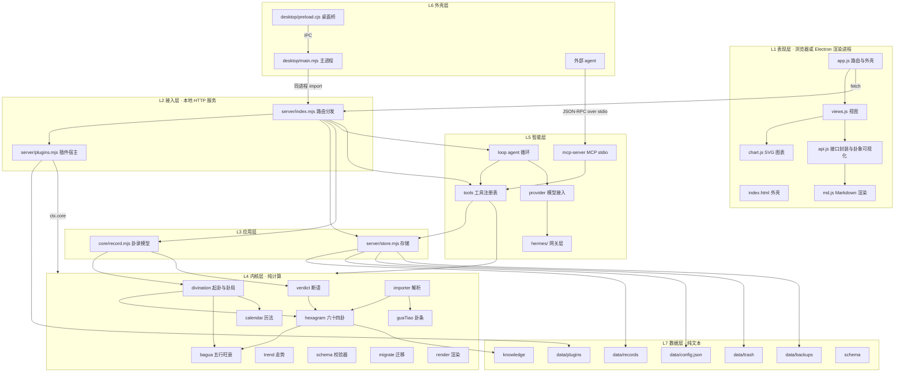

**这张图在说什么**：系统分七层，**依赖只向下**。表现层与接入层之间只有 `fetch` 一条通路；内核层（L4）不 import 任何上层模块，也不碰网络与 DOM，因此可以被 `tools/check.mjs` 单独加载并断言。图中有两条跨层捷径，都是刻意的复用设计：`server/plugins.mjs` 通过 `ctx.core` 把整个内核对象交给插件；`server/index.mjs` 通过 `toolkit` 把工具集挂到 HTTP 上。

**这张图没有表达的**：同一层内部的细分依赖（见第 3 节）；进程边界（见第 4 节）；调用顺序（见第 5 节）。

---

## 2. 组件图

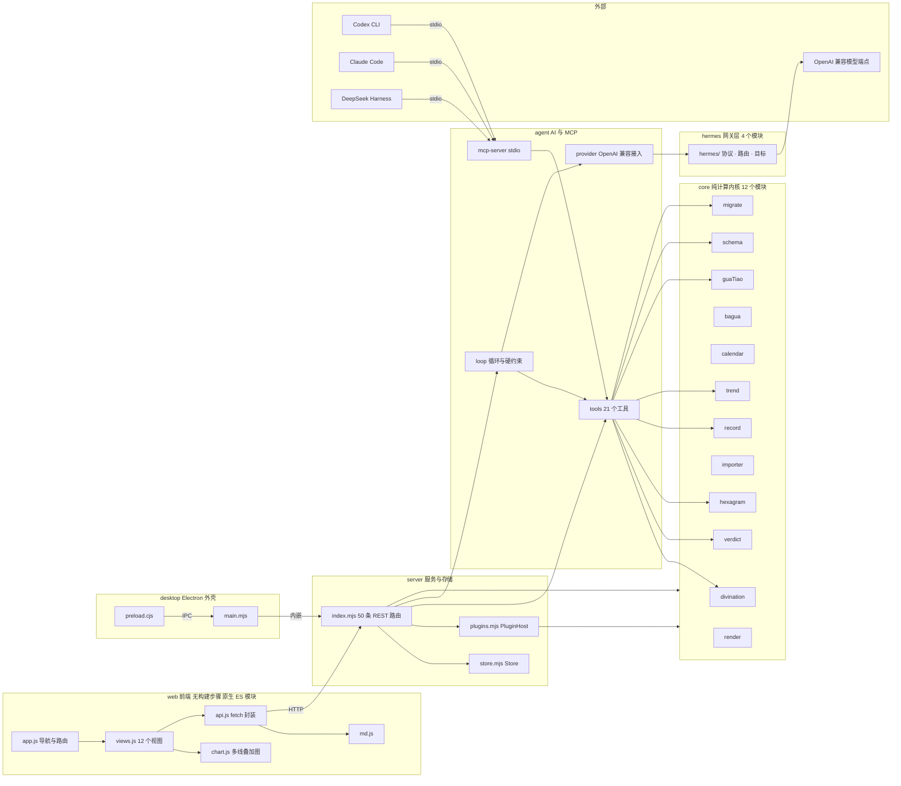

**这张图在说什么**：六个组件包的边界与对外通路。三条入口——浏览器（`F4 → V1`）、桌面版主进程（`D1 → V1` 同进程内嵌）、外部 agent（`X* → A4` stdio）——最终都汇到同一个 `V1` 或同一个工具集 `A1`，**不存在**第二份实现。

**hermes 是网关层**，职责是**统一模型接入与协议适配**：同一个「让模型调工具」的诉求，不同模型族表达方式不同（原生 `tool_calls`、`<tool_call>` XML 标签、围栏 JSON、纯对话），`hermes/protocols.mjs` 把这些差异收在 `prepare()` 与 `parse()` 两个函数里，使 `agent/loop.mjs` 不必知道对面是哪一族模型。它位于 `provider → 模型端点` 之间，共四个模块：`index.mjs`（门面：选目标 → 编协议 → 发请求 → 解析 → 重试 → 降级 → 留痕）、`router.mjs`（决定交给谁）、`targets.mjs`（目标定义、服务商预设、就绪与熔断）、`protocols.mjs`（请求编织与响应还原）。

**这张图没有表达的**：`hermes/` 内部的四文件分工——图里把它们合成一个 `H1`，因为对 `agent/` 而言它就是一个「统一模型接入」的黑盒；`agent/provider.mjs` 现在只是它之上的一层兼容薄壳，`PROVIDERS` 直接就是 `hermes/targets.mjs` 的 `PRESETS`（见 [Hermes 网关与路由设计](./06-Hermes网关与路由设计.md)）。

---

## 3. 模块依赖图（基于真实 `import` 关系）

本图的每一条边都来自源码里的 `import` 或动态 `import()` 语句，逐文件核对过。图中只画**仓库内**的模块，`node:*` 内置模块与 `electron` 省略。

```mermaid
graph TD
    subgraph CORE["core"]
        c_bagua["bagua.mjs"]
        c_calendar["calendar.mjs"]
        c_hexagram["hexagram.mjs"]
        c_divination["divination.mjs"]
        c_verdict["verdict.mjs"]
        c_record["record.mjs"]
        c_trend["trend.mjs"]
        c_importer["importer.mjs"]
        c_guaTiao["guaTiao.mjs"]
        c_schema["schema.mjs"]
        c_migrate["migrate.mjs"]
        c_render["render.mjs"]
    end
    subgraph SRV["server"]
        s_index["index.mjs"]
        s_store["store.mjs"]
        s_plugins["plugins.mjs"]
    end
    subgraph AGT["agent"]
        a_tools["tools.mjs"]
        a_loop["loop.mjs"]
        a_provider["provider.mjs"]
        a_mcp["mcp-server.mjs"]
    end
    subgraph WEB["web"]
        w_api["api.js"]
        w_md["md.js"]
        w_chart["chart.js"]
        w_views["views.js"]
        w_palette["palette.js"]
        w_app["app.js"]
    end
    subgraph HMS["hermes"]
        h_index["index.mjs"]
        h_protocols["protocols.mjs"]
        h_router["router.mjs"]
        h_targets["targets.mjs"]
    end
    subgraph DSK["desktop"]
        d_main["main.mjs"]
        d_preload["preload.cjs"]
    end
    subgraph TLS["tools"]
        t_check["check.mjs"]
        t_validate["validate.mjs"]
        t_import["import.mjs"]
        t_seed["seed.mjs"]
        t_checkweb["check-web.mjs"]
        t_checkmcp["check-mcp.mjs"]
        t_checkdesk["check-desktop.mjs"]
        t_checkval["check-validate.mjs"]
        t_checkhermes["check-hermes.mjs"]
    end
    subgraph KNW["knowledge"]
        k_64gua["64gua.json"]
        k_yaoci["yaoci.json"]
    end
    subgraph SCH["schema"]
        x_record["record.schema.json"]
        x_guatiao["gua-tiao.schema.json"]
    end

    c_calendar --> c_bagua
    c_hexagram --> c_bagua
    c_divination --> c_bagua
    c_divination --> c_hexagram
    c_divination --> c_calendar
    c_trend --> c_bagua
    c_record --> c_divination
    c_record --> c_verdict
    c_record --> c_hexagram
    c_record --> c_calendar
    c_importer --> c_hexagram
    c_importer --> c_calendar
    c_importer --> c_guaTiao
    c_hexagram --> k_64gua
    c_hexagram --> k_yaoci

    a_tools --> c_verdict
    a_tools --> c_guaTiao
    a_loop --> a_provider
    a_mcp --> s_store
    a_mcp --> a_tools
    a_provider --> h_index
    a_provider --> h_protocols
    h_index --> h_protocols
    h_index --> h_router
    h_index --> h_targets
    h_router --> h_targets
    h_router --> h_protocols

    s_index --> s_store
    s_index --> s_plugins
    s_index -->|"动态 import 12 个内核"| CORE
    s_index -->|"动态 import"| a_tools
    s_index -->|"动态 import"| a_loop
    s_index -->|"动态 import"| a_provider
    s_index --> x_record
    s_index --> x_guatiao

    w_api --> w_md
    w_chart --> w_api
    w_views --> w_api
    w_views --> w_chart
    w_palette --> w_api
    w_app --> w_api
    w_app --> w_views
    w_app --> w_palette

    d_main -->|"动态 import"| s_index
    d_preload -.->|"仅经 IPC 与 main 通信"| d_main

    t_check -->|"动态 import 12 个内核"| CORE
    t_check --> s_store
    t_check --> s_plugins
    t_check --> a_tools
    t_check --> a_mcp
    t_check --> a_loop
    t_check --> a_provider
    t_check --> x_record
    t_check --> x_guatiao
    t_validate --> c_schema
    t_validate --> c_guaTiao
    t_validate --> c_migrate
    t_validate --> x_record
    t_validate --> x_guatiao
    t_import -->|"动态 import 8 个内核"| CORE
    t_import --> s_store
    t_seed --> c_record
    t_checkweb --> w_app
    t_checkmcp --> a_mcp
    t_checkdesk --> d_main
    t_checkdesk --> d_preload
    t_checkhermes -->|"动态 import"| HMS
    t_checkhermes -->|"动态 import"| a_provider
```

**这张图在说什么**：三条结论。

1. **无环。** 所有边都从上层指向下层：`core` 内部最深的一条链是 `bagua → calendar/hexagram → divination → record`，没有任何回指的边；`server`／`agent`／`tools`／`web` 各自成层，**没有任何环**。
2. **内核自洽。** `core/` 的 12 个模块只互相依赖，唯一的仓库外输入是 `knowledge/64gua.json` 与 `knowledge/yaoci.json`（`core/hexagram.mjs` 用 `readJsonSafe()` 读取，读不到就退化为内置卦表并记告警）。`bagua`、`guaTiao`、`verdict`、`schema`、`migrate`、`render` 六个模块在 `core` 内**零依赖**，可单独测试。
3. **工具与自检是聚合点。** `tools/check.mjs` 是最大的扇入节点（动态 import 全部 12 个内核 + 存储 + 插件宿主 + agent 四件套）；`server/index.mjs` 紧随其后。

**本图的核对方式**：逐文件提取 `import` 语句与 `import()` 调用后重建，不是凭印象画的。各文件的真实依赖如下表，可据以复核：

| 文件 | 静态 `import` 的仓库内模块 |
|---|---|
| `core/calendar.mjs` | `./bagua.mjs` |
| `core/hexagram.mjs` | `./bagua.mjs`（另运行时读 `knowledge/64gua.json`、`knowledge/yaoci.json`） |
| `core/divination.mjs` | `./bagua.mjs`、`./hexagram.mjs`、`./calendar.mjs` |
| `core/trend.mjs` | `./bagua.mjs` |
| `core/importer.mjs` | `./hexagram.mjs`、`./calendar.mjs`、`./guaTiao.mjs` |
| `core/record.mjs` | `./divination.mjs`、`./verdict.mjs`、`./hexagram.mjs`、`./calendar.mjs` |
| `core/verdict.mjs`／`schema.mjs`／`migrate.mjs`／`render.mjs`／`guaTiao.mjs` | 无 |
| `agent/tools.mjs` | `../core/verdict.mjs`、`../core/guaTiao.mjs` |
| `agent/loop.mjs` | `./provider.mjs` |
| `agent/provider.mjs` | `../hermes/index.mjs`、`../hermes/protocols.mjs` |
| `hermes/index.mjs` | `./protocols.mjs`、`./router.mjs`、`./targets.mjs` |
| `hermes/router.mjs` | `./targets.mjs`、`./protocols.mjs` |
| `hermes/protocols.mjs`／`targets.mjs` | 无 |
| `server/index.mjs` | `./store.mjs`、`./plugins.mjs`（另动态 import 12 个内核与 agent 三件套） |
| `server/store.mjs`／`plugins.mjs` | 无 |
| `web/app.js` | `./api.js`、`./views.js`、`./palette.js`、`./skin.mjs` |
| `web/views.js` | `./api.js`、`./chart.js`、`./skin.mjs` |
| `web/skin.mjs` | 无 |
| `web/palette.js`／`web/chart.js` | `./api.js` |
| `web/api.js` | `./md.js`（转出 `renderMarkdown`） |
| `web/md.js` | 无 |
| `desktop/main.mjs` | 无（动态 import `server/index.mjs`；`electron` 为外部依赖） |
| `desktop/preload.cjs` | 无（`require('electron')`） |
| `tools/check.mjs` | 动态 import 12 个内核 + `server/store.mjs` + `server/plugins.mjs` + agent 四件套 + `core/schema.mjs` + `tools/fixtures.mjs` |
| `tools/validate.mjs` | 动态 import `core/schema.mjs`、`core/guaTiao.mjs`、`core/migrate.mjs` |
| `tools/import.mjs` | 动态 import 8 个内核（divination／verdict／hexagram／record／render／importer／guaTiao／migrate）+ `server/store.mjs` |
| `tools/seed.mjs` | 动态 import `core/record.mjs` |
| `tools/check-web.mjs` | 动态 import `../web/app.js`、`../web/palette.js` 与 `./fixtures.mjs`（其余为 `node:*`；连不上服务时会 `spawn` `server/index.mjs`） |
| `tools/check-hermes.mjs` | 动态 import `hermes/` 四件与 `agent/provider.mjs`（其余为 `node:*`） |
| `tools/check-mcp.mjs`／`check-desktop.mjs` | 无仓库内 import（分别 `spawn` MCP 子进程、Electron 子进程） |
| `tools/check-validate.mjs` | import `./fixtures.mjs`（合成示例卦录；其余为 `node:*`），并 `spawn` `tools/validate.mjs` 子进程 |

**静态与动态之分**：`s_index → CORE`、`t_check → CORE`、`t_import → CORE`、`d_main → s_index`、`a_mcp → 各内核与 store/tools` 这几组是**动态 `import(pathToFileURL(...))`**，发生在运行时。这样做的理由有两条：一是桌面版必须在设好 `QXG_DATA_DIR` 之后再载入服务；二是插件与自检需要拿到「同一批模块实例」，动态载入便于集中管理。其余边都是顶层静态 `import`。

**这张图没有表达的**：`data/plugins/*.mjs` 这三个插件在运行时被 `server/plugins.mjs` 动态载入（路径在 `data/` 下，属用户数据，不在上图中）；`desktop/build/make-icon.py` 是打包期脚本，不参与运行时依赖。

---

## 4. 部署图

### 4.1 形态一：命令行 + 浏览器

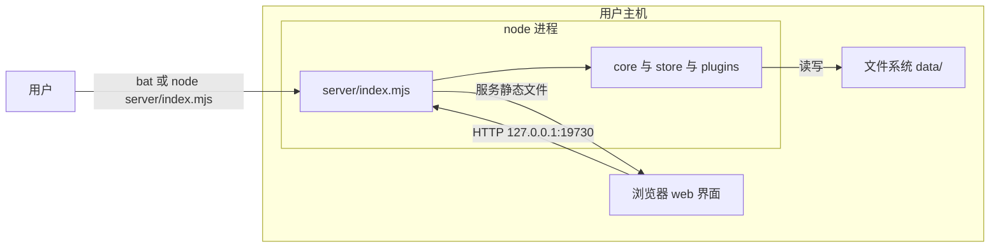

**这张图在说什么**：Node 进程独占数据目录；浏览器只做渲染，所有计算发生在 `N1` 侧。文件系统是唯一的持久化位置，网络出口为零（除用户配置的模型端点）。默认端口 `19730`，`--port` 可改，`QXG_PORT`／`QXG_HOST` 环境变量优先。

### 4.2 形态二：Electron 桌面版

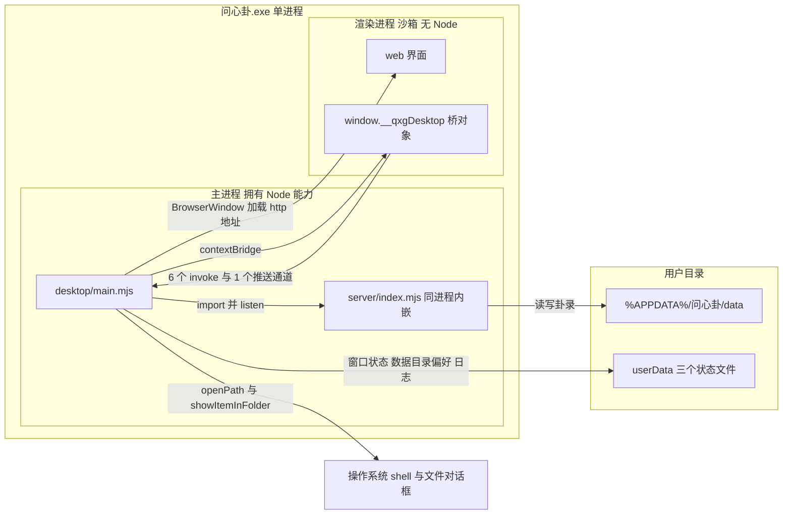

**这张图在说什么**：桌面版是**单进程**——`M1` 直接 `import` `server/index.mjs` 并在自己进程里 `listen()`，不 `spawn` 子进程，因此不会闪出黑色控制台窗口，也不要求用户机器上装 Node。数据目录在 `import` 服务**之前**由 `desktop/main.mjs` 通过 `QXG_DATA_DIR` 定好（优先级：用户显式选择的 `data-dir.json` → 开发态项目内 `data/` → 安装态 `%APPDATA%\问心卦\data`），避免服务自己挑到安装目录里的 `data/` 而被升级覆盖。

`D2` 指 `userData` 下的三个文件：`window-state.json`（窗口尺寸位置与最大化状态）、`data-dir.json`（用户自选的数据目录）、`desktop.log`（启动日志）。渲染进程开着 `contextIsolation: true`、`nodeIntegration: false`，只能通过 `R2` 暴露的 **8 个成员**触达主进程——6 个 invoke 方法（`info`／`openDataDir`／`openBackups`／`exportBackup`／`revealRecordFile`／`chooseDataDir`）、1 个事件订阅 `onNavigate`、1 个布尔标识 `isDesktop`；对应主进程侧 6 个 `ipcMain.handle` 与 1 个 `qxg:navigate` 推送通道，合计 7 条通道。

### 4.3 形态三：MCP stdio 被外部 agent 调用

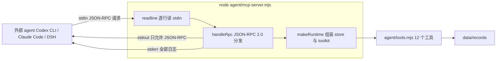

**这张图在说什么**：MCP 形态下本程序没有 HTTP 端口，只有一对管道。生死线是**通道分工**：`stdout` 只允许出现 JSON-RPC 消息，任何日志必须走 `stderr`，否则 Codex / Claude 会直接解析失败。这条约束由 `tools/check-mcp.mjs` 真起子进程验证（14 项，其中 2 项专验 stdout 纯净性）。

MCP 形态的数据目录固定为项目根下的 `data/`（`makeRuntime()` 里 `new Store(path.join(ROOT, 'data'))`），**不读** `QXG_DATA_DIR`。

---

## 5. 数据流图：起卦 → 断语 → 入库

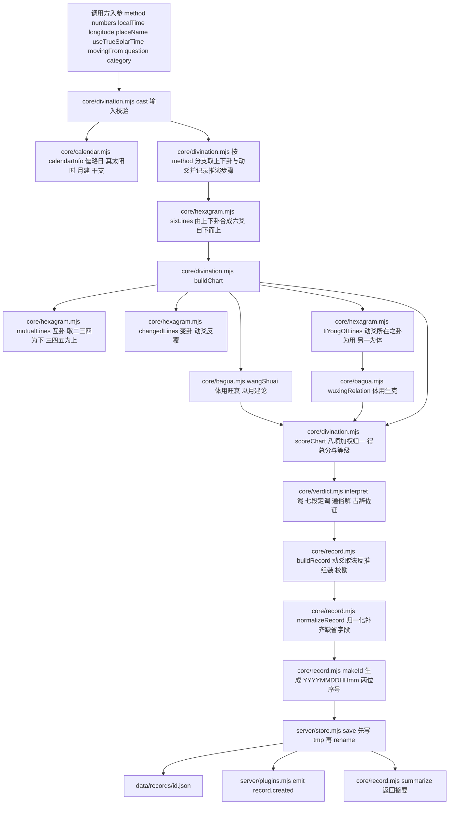

**这张图在说什么**：从入参到落盘，一共经过 **`core/divination.mjs` → `core/hexagram.mjs` → `core/bagua.mjs` → `core/verdict.mjs` → `core/record.mjs` → `server/store.mjs`** 六个模块。三个要点：

1. **`cast()` 一次性算齐全部时间量**（`C2`），再按 `method` 分支取上下卦与动爻（`C3`）；`manual` 方法跳过取数，直接由卦名定位上下卦。推演的每一步都写进 `casting.steps`，随卦局落盘，供界面「起卦推演」逐条展示。
2. **断语只读卦局，不改卦局**（`C11 → C12`）。`interpret()` 的输入是 `cast()` 的输出，输出是 `reading`；两者互不写回。
3. **入库前唯一一次可能改写输入的地方是动爻取法反推**（`C13`）：若 `claimed.moving` 只与「仅以报数除六」吻合，`buildRecord()` 会先调 `inferMovingFrom()` 把 `movingFrom` 定为 `number`，**忠实复现原卦而不是误记成校勘**。

**注意**：`POST /api/cast` 的路径只走到 `C12` 就返回（不落盘）；只有 `POST /api/records`、`POST /api/import/commit`、`save_record`／`save_gua_tiao` 工具与 `tools/import.mjs` 才走到 `C16`。

---

## 6. 时序图

### 6.1 用户在起卦台起一卦并入库

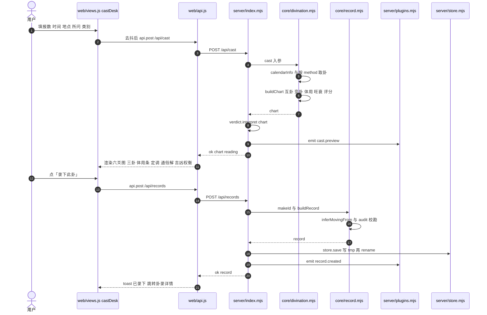

**这张图在说什么**：起卦台是「两段式」交互——先 `POST /api/cast` 预览（不入库、不产生 id），满意后 `POST /api/records` 才落盘。这样用户可以反复试算而不污染卦录。落盘路径与预览路径共用同一个 `cast()`，因此预览所见与入库所得**必然一致**。

### 6.2 导入一段 DeepSeek 文本并入库

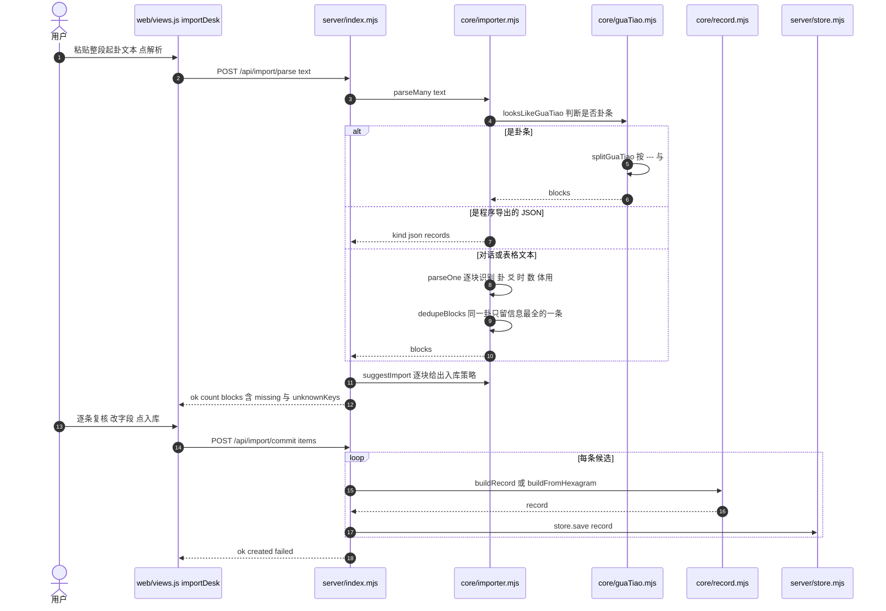

**这张图在说什么**：解析与入库是**两个接口**，中间夹着人工复核这一步，这是刻意的：解析原则是「宁可少认，不可错认」，所以 `parse` 只负责给出候选与「缺什么」，落盘必须由 `commit` 显式触发。卦条分支（`G`）优先级最高，因为它有版本号、有 schema、行为最稳定。

### 6.3 AI 助手一次对话（含模型 → 工具 → 模型往返）

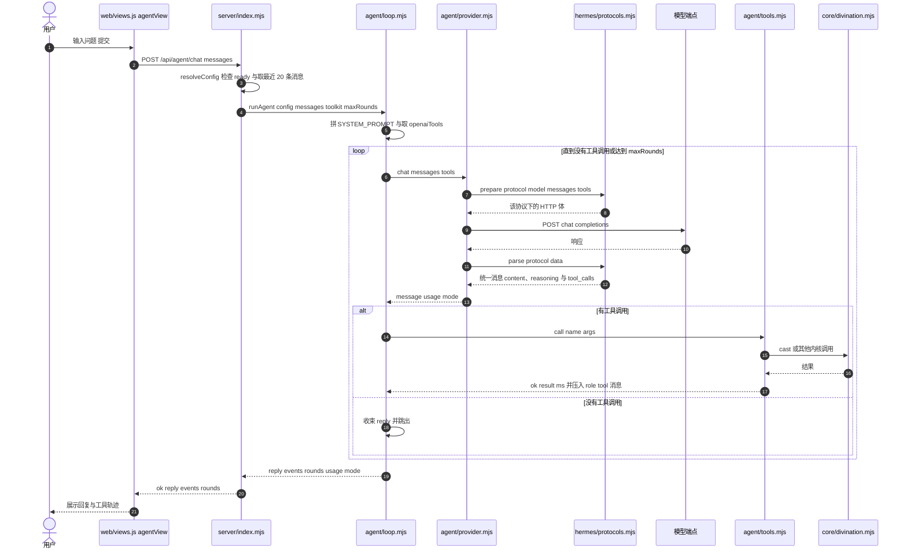

**这张图在说什么**：一次对话最多 `maxRounds` 轮（默认 6）。每轮都是「模型说 → 若有工具调用则本地执行 → 把结果作为 `role: "tool"` 消息塞回对话 → 再问模型」。**卦象在 `T → D` 这一步由引擎算出**，模型只负责决定调哪个工具和怎么讲结果——这是 system prompt 里那条硬约束在时序上的落点。`H` 的介入点很窄：只在 `prepare` 与 `parse` 两个函数，`L` 与 `T` 都不感知协议差异。

### 6.4 插件热载

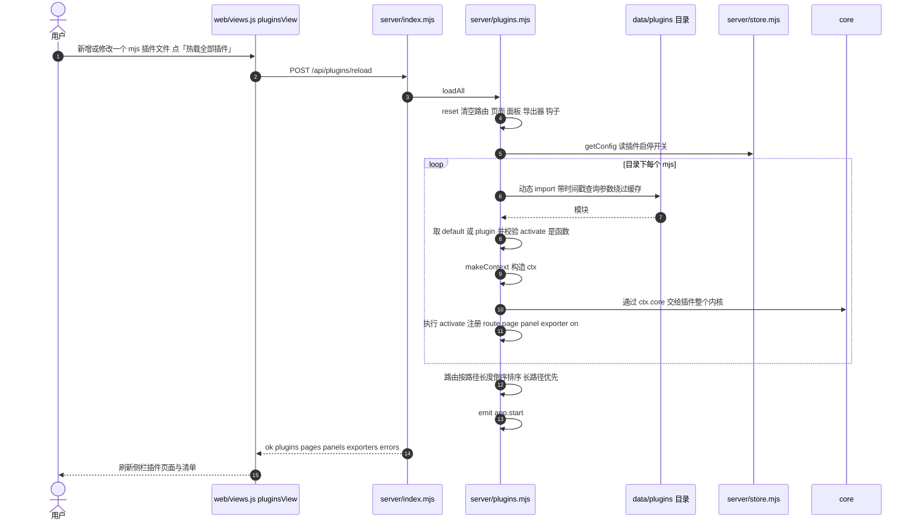

**这张图在说什么**：热载是「全量重建」而不是增量补丁：`reset()` 先清空全部注册表，再逐个 `import`，所以插件之间不会残留上一次的注册。`import` 时拼了 `?t=<时间戳>` 查询参数来绕过 Node 的模块缓存，因此改完文件不重启也能生效。插件路由在 `server/index.mjs` 的主处理里**优先于**内置路由匹配，且按路径长度倒序排序，保证更具体的路径先命中。

### 6.5 桌面版启动（主进程内嵌服务 → 建窗口 → preload 桥）

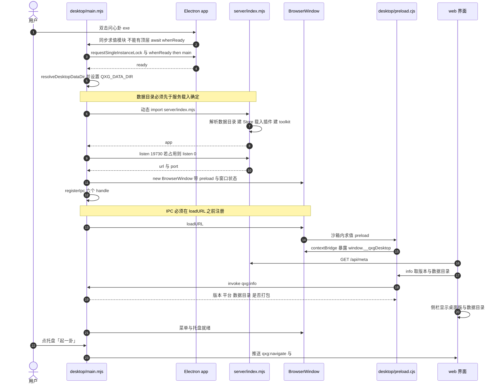

**这张图在说什么**：启动顺序里有**三条不可调换的次序**，都真踩过坑：数据目录必须先于服务载入（第 6 步在第 8 步之前，否则服务会挑到安装目录里的 `data/`）；`registerIpc()` 必须先于 `loadURL`（否则页面一加载就来调，报 `No handler registered for 'qxg:info'`）；主模块必须**同步**求值完毕再在 `whenReady().then()` 里跑 `main()`（顶层 `await app.whenReady()` 会死锁，现象是「进程在跑、没有窗口」）。

---

## 7. 状态机：卦录复盘状态

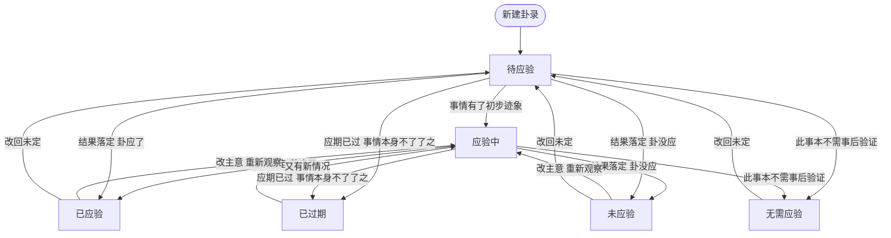

**这张图在说什么**：`review.status` 的六种取值来自 `core/record.mjs` 的 `REVIEW_STATUS` 常量，也是 [schema/record.schema.json](../schema/record.schema.json) 里 `review.status` 的枚举：`待应验`｜`应验中`｜`已应验`｜`未应验`｜`已过期`｜`无需应验`。它是**平铺的枚举，不是层级状态**——`normalizeRecord()` 只校验取值是否在枚举内，不在就回落到 `待应验`，不做任何状态合法性检查。图中实线是常见路径，虚线意义上的「回退」路径（如 `已应验 → 应验中`）在实现上同样只是把 `status` 字段改掉，**没有任何守卫**。

`update_review` 每次带 `text` 就往 `review.log` **追加一条** `{at, text}`（`at` 默认当天）：v5 起复盘只有一个条目流，最早那条通常就是首回复盘，之后是追记。状态改动是就地改 `status`，与条目互不牵连——改状态不会动任何一条已写下的文字。

---

## 8. ER 图：卦录 JSON 内部结构关系

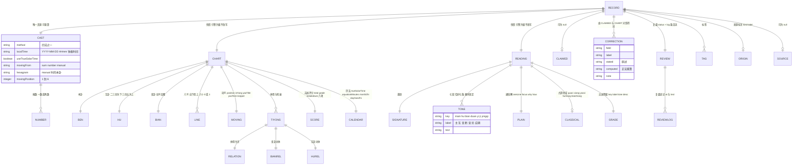

**这张图在说什么**：卦录 JSON 的内部结构关系。三条读图要点：

1. **`CAST` 是唯一真源**，`CHART` 与 `READING` 都是从它派生出来的快照。图中 `RECORD ||--|| CAST` 与另外两条的关系一样都是「一对一」，但语义不同：改 `CAST` 意味着换了一卦，改快照只意味着重算。
2. **`CORRECTION` 不是独立输入**，它由 `CLAIMED`（当初别人怎么说的）与 `CHART`（按正法重算的结果）对照得出（`core/record.mjs` 的 `audit()`）。`CLAIMED` 为 `null` 时 `CORRECTION` 必为空数组。
3. **`TONE` 恰好七条且顺序固定**（主·互·变·断·宜·忌·应期），这一条由 schema 的 `minItems: 7` / `maxItems: 7` 与 `tools/validate.mjs` 的语义检查双重把关。

图中的属性块只列了**读图必需的关键字段**，不是完整字段字典。完整定义见 [schema/record.schema.json](../schema/record.schema.json) 与 [数据模型与存储设计](./07-数据模型与存储设计.md)。实体属性块**省略**的还有：`additionalProperties` 的可扩展点（`cast`、`chart`、`reading`、`claimed`、`corrections` 项都是 `true`，只有根级与 `review` 是 `false`）；`BREAKDOWN` 的八项标签与权重；`PLAIN` 的 `oneLine/focus/why/how`；`CLASSICAL` 的五个辞条。

---

## 9. 一次请求的完整生命周期（ASCII 图）

```text
 ┌─ 客户端 ────────────────────────────────────────────────────────────────┐
 │  浏览器 fetch / Electron 渲染进程 fetch / 脚本 curl                      │
 └───────────────────────────────┬────────────────────────────────────────┘
                                 │  TCP 127.0.0.1:19730
                                 ▼
 ┌─ server/index.mjs http.createServer 回调 ───────────────────────────────┐
 │ 1. new URL(req.url, host)                    解析 pathname 与 query     │
 │ 2. 设 CORS 三个响应头；method 为 OPTIONS 则直接 204 返回并结束          │
 │ 3. store.maybeRescan()                       一次 statSync             │
 │      目录 mtime 变了 → loadAll() 重扫并打印 before → after             │
 │ 4. plugins.matchRoute(method, pathname)      插件路由优先               │
 │      命中 → 构造已绑定 res 的 ctx（json/send/html/text/readBody/query） │
 │             → await handler → 未结束响应则补 {ok:true}                  │
 │ 5. pathname 以 /plugin-assets/ 开头 → serveStatic 到 data/plugins/<id>  │
 │ 6. 遍历 routes 数组，method 相同且正则匹配 → 解出 params → await handler│
 │ 7. pathname 以 /api/ 开头但没命中 → 404 { ok:false, error:"未知接口 …" }│
 │ 8. 其余路径 → serveStatic(web/)，目录或不存在时回落 index.html          │
 │ 9. 任何未捕获异常 → console.error 并返回 500 { ok:false, error }        │
 └───────────────────────────────┬────────────────────────────────────────┘
                                 │  以内核为例：POST /api/records
                                 ▼
 ┌─ 处理链（以入库为例） ──────────────────────────────────────────────────┐
 │ route handler                                                          │
 │   └─ readBody(req)          JSON.parse 失败则返回 { _raw: raw }         │
 │   └─ newRecordFromBody(body)                                            │
 │        ├─ mode = hexagram 时 → core/record.buildFromHexagram            │
 │        └─ 否则               → core/record.buildRecord                  │
 │             ├─ inferMovingFrom()   需要时反推动爻取法                    │
 │             ├─ core/divination.cast()                                   │
 │             │    ├─ core/calendar.calendarInfo()   历法与真太阳时        │
 │             │    ├─ core/hexagram.sixLines()       六爻                  │
 │             │    └─ buildChart()  互卦 变卦 体用 旺衰 scoreChart         │
 │             ├─ core/verdict.interpret(chart)       谶 七段 通俗解 古辞   │
 │             ├─ core/record.audit(claimed, chart)   校勘                  │
 │             └─ normalizeRecord()                   补齐缺省字段          │
 │   └─ store.save(rec)  写 <id>.json.tmp → renameSync → 更新内存缓存       │
 │   └─ plugins.emit('record.created', rec)                                │
 │   └─ json(res, { ok:true, record })                                     │
 └───────────────────────────────┬────────────────────────────────────────┘
                                 │  200 application/json; charset=utf-8
                                 ▼
 ┌─ 客户端 ────────────────────────────────────────────────────────────────┐
 │  web/api.js handle()：JSON.parse，ok===false 则 throw                   │
 │  web/views.js 视图 render() 拼 HTML → app.js 注入 #view-root            │
 │  web/api.js 的 h() 转义全部插值；错误进 .card.err 卡片                  │
 └─────────────────────────────────────────────────────────────────────────┘
```

**这张图在说什么**：一次请求在服务端最多经过九步，其中第 3、4、6 步是**每一步请求都会发生**的：`maybeRescan()` 的代价是一次 `statSync`；插件路由匹配是一次数组遍历；内置路由匹配是一次线性正则扫描（37 条）。第 4 步的插件优先意味着**插件可以用同路径覆盖内置行为**，这是刻意的扩展点，也是排查「接口行为不对」时应当先看 `GET /api/plugins` 的原因。

---

*图与源码同步；发现不一致时以源码为准，并应当修正本文档。*
