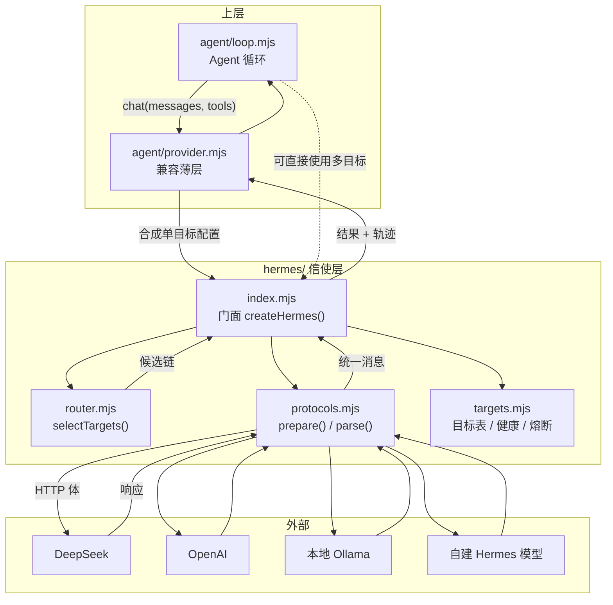
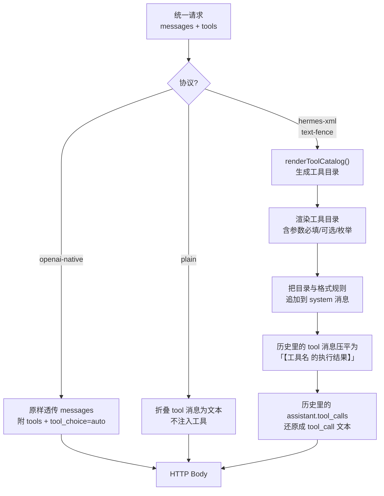
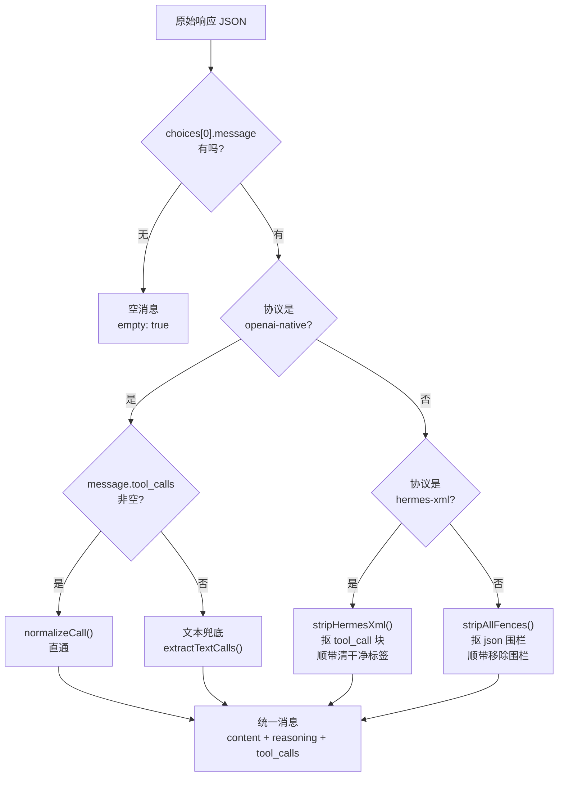
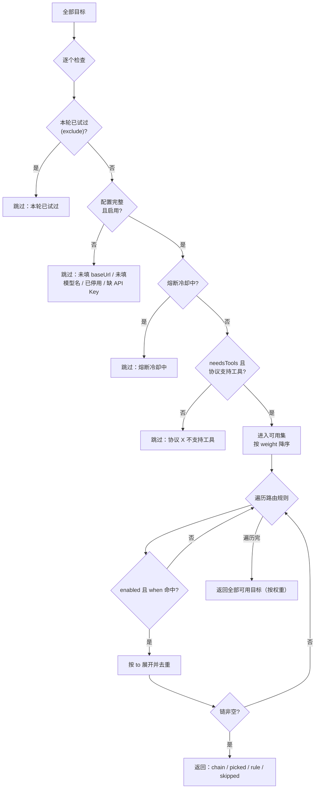
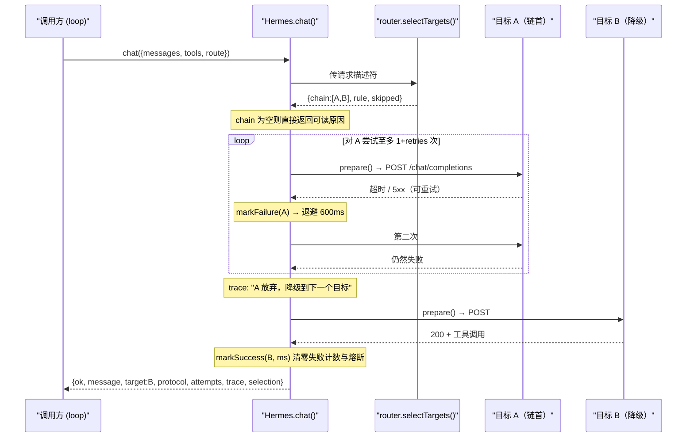
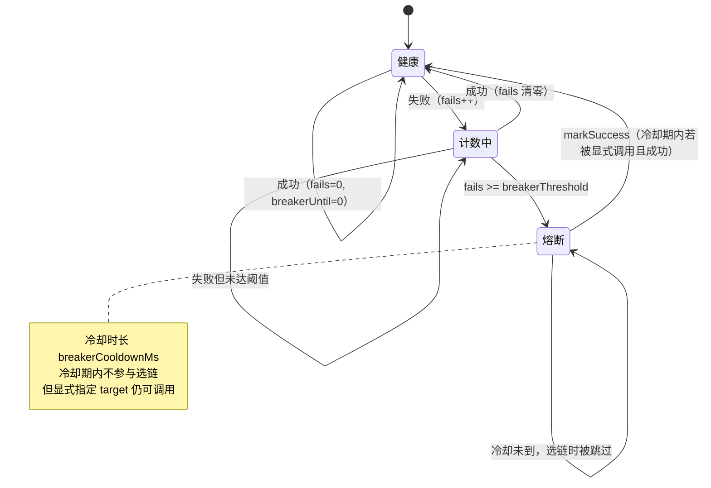
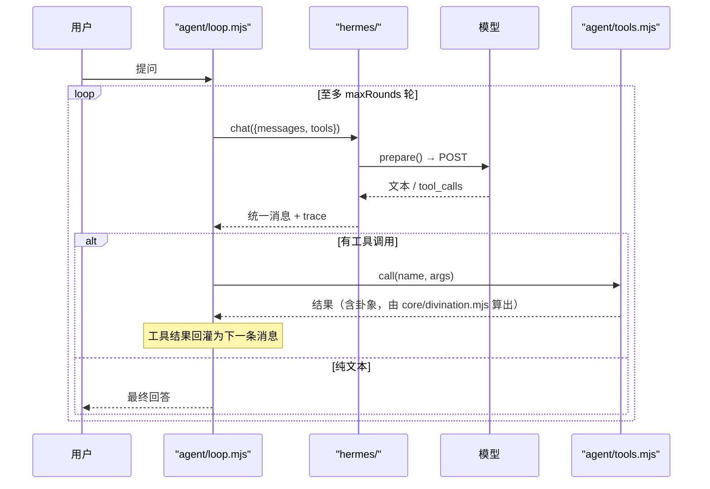

# Hermes 网关与路由设计

| 项 | 内容 |
|---|---|
| 文档编号 | 06 |
| 标题 | Hermes 网关与路由设计 |
| 版本 | 1.0 |
| 状态 | 已发布 |
| 适用产品版本 | v1.1.0 |
| 最后更新 | 2026-10-03 |
| 读者 | 后端工程师、AI 工程师、集成方、维护者 |
| 关联文档 | [Agent 设计文档](./05-Agent设计文档.md)　[架构与框图](./02-架构与框图.md)　[接口文档](./03-接口文档.md)　[接口控制文档 ICD](./04-接口控制文档-ICD.md)　[安全与隐私设计](./11-安全与隐私设计.md)　[术语表](./13-术语表.md) |

---

## 一、Hermes 是什么，为什么叫这个名字

Hermes 是希腊神话里的**信使之神**——神与人之间传话、带路、往返。

本项目用它命名**模型接入与路由层**（`hermes/` 目录），因为它干的正是这件事：

- **对外**，它替上层去跟各家模型说话。DeepSeek、OpenAI、本地 Ollama、自建的 Hermes 系模型……每家的请求形状、工具调用表达方式都不一样，Hermes 把这些差异吃掉。
- **对内**，它决定这句话该交给谁，并且在这个目标超时、报错、熔断时，自动换下一个。

一句话概括这一层存在的理由：

> **把「模型会挂、协议会不一致、网络会抖」这三件事，收敛到一个地方处理。**

在 Hermes 出现之前，这三件事散落在 `agent/provider.mjs` 里：协议判断写死在 `useNativeTools` 开关上，没有重试，没有降级，模型一挂整轮对话就失败。现在 `provider.mjs` 退化成一层薄薄的兼容壳，真正的活都在 `hermes/`。

### 1.1 这一层做什么、不做什么

| 做 | 不做 |
|---|---|
| 把统一消息编成各协议要的 HTTP 体 | 不管业务语义（不知道「卦」是什么） |
| 把各协议的响应还原成统一的「文本 + 工具调用」 | 不执行工具（那是 `agent/loop.mjs` 的事） |
| 按能力与偏好选目标，给出可解释的候选链 | 不做真正的成本优化（本项目通常只配一个模型） |
| 超时、重试、退避、降级、熔断、留痕 | 不落盘调用日志（只留内存态健康信息） |
| 提供健康总览与选择解释给界面 | 不做密钥管理（只管把 Key 放进请求头） |

---

## 二、总体架构



**图注**：`provider.mjs` 与 `index.mjs` 是两条入口——前者是历史遗留的兼容壳（老配置只有 `agent` 段时走它），后者允许调用方直接声明多目标与路由规则。两者最终都落到同一个 `createHermes()`。

### 2.1 文件职责

| 文件 | 职责 | 关键导出 |
|---|---|---|
| `hermes/index.mjs` | 门面：编排「选目标 → 编协议 → 发请求 → 解析 → 重试 → 降级 → 留痕」 | `createHermes`、`isRetryable`、`PROTOCOLS`、`PRESETS`、`DEFAULT_ROUTES`、`DEFAULT_POLICY` |
| `hermes/protocols.mjs` | 协议适配：请求编织与响应还原 | `PROTOCOLS`、`PROTOCOL_IDS`、`protocolById`、`prepare`、`parse`、`stripHermesXml`、`stripAllFences`、`extractTextCalls`、`guessProtocol`、`renderToolCatalog` |
| `hermes/targets.mjs` | 目标定义、服务商预设、就绪判定、健康与熔断状态 | `PRESETS`、`presetById`、`DEFAULT_POLICY`、`normalizeTarget`、`targetReadiness`、`breakerOpen`、`markSuccess`、`markFailure`、`buildTargets` |
| `hermes/router.mjs` | 路由：能力筛选、规则匹配、候选链、可解释性 | `DEFAULT_ROUTES`、`normalizeRoutes`、`routeMatches`、`selectTargets`、`explainSelection` |

---

## 三、三个核心抽象

整个 Hermes 围绕三个概念转，其余的代码都是它们的推论：

```text
        ┌──────────────┐
        │   Target     │  一个可以对话的模型端点
        │  目标        │  baseUrl + apiKey + model + protocol + 权重/标签
        └──────┬───────┘
               │ 被谁选中
        ┌──────▼───────┐
        │   Route      │  一条「什么样的活交给谁」的声明式规则
        │  路由        │  when: {needsTools, preferLocal, hasTag, minContextTokens}
        │              │  to:   [选择器…]
        └──────┬───────┘
               │ 怎么说话
        ┌──────▼───────┐
        │   Protocol   │  一套编码/解码规则
        │  协议        │  prepare() 编织请求 / parse() 还原响应
        └──────────────┘
```

| 概念 | 一句话定义 | 代码里的形状 |
|---|---|---|
| Target（目标） | 一个能收 `POST {baseUrl}/chat/completions` 的端点，连同它的策略与运行期健康状态 | `{id, name, kind, preset, baseUrl, apiKey, model, protocol, tags, weight, temperature, maxTokens, timeoutMs, enabled, health}` |
| Protocol（协议） | 「怎么把工具说明给模型、怎么从回复里把工具调用抠出来」的一套约定 | `{id, name, capabilities, description}` + `prepare()` / `parse()` 两个函数的行为 |
| Route（路由） | 声明式的选择规则，回答「要工具的活优先给谁」 | `{id, name, when, to, enabled, note}` |

---

## 四、协议适配层

### 4.1 四种协议

同样是「让模型调工具」，不同模型族的表达方式并不一样。Hermes 内置四条路线：

| 协议 id | 名称 | 能力 | 适用 | 工具怎么表达 |
|---|---|---|---|---|
| `openai-native` | OpenAI 原生 function calling | 工具、流式、多工具 | DeepSeek、OpenAI、多数 vLLM 端点 | 请求带 `tools` 数组，响应给 `message.tool_calls` |
| `hermes-xml` | Hermes XML 工具调用 | 工具、XML 标签 | Hermes 系开源模型（如 `NousResearch/Hermes-3-Llama-3.1-8B`） | 工具目录写进 system，模型吐 `<tool_call>{…}</tool_call>` |
| `text-fence` | 文本协议（围栏 JSON）降级 | 工具 | 本地小模型、不支持 tools 的端点 | 让模型吐 ` ```json {"tool":…,"args":{…}}``` ` |
| `plain` | 纯对话 | —— | 只要文本生成、或端点完全不认工具 | 不注入任何工具说明 |

`capabilities` 不是装饰——路由层**真的**用它筛目标：`needsTools` 为真时，`plain` 协议的节点会在选链阶段就被跳过，并留下「协议 plain 不支持工具」的跳过原因。

### 4.2 请求编织：`prepare()`



关键设计点：

1. **非原生协议下不发送 `tools` 字段。** 有些端点看到不认识的字段会直接 400；宁可把工具说明写进提示词。
2. **工具目录是可读文本，不是 JSON dump。** `renderToolCatalog()` 逐参数标注类型、必填/可选、枚举取值与说明——模型读这种结构比读裸 JSON Schema 准。
3. **历史消息要「降维」。** 原生协议里 `role: "tool"` 与 `assistant.tool_calls` 是结构化字段；换到 Hermes/文本协议后它们不被承认，必须压成普通文本，否则会 400 或被忽略。
4. **不注入两次。** 若消息里已有 system，就追加进去；没有才新建一条。避免出现两个 system 让模型精神分裂。

### 4.3 响应还原：`parse()`



`normalizeCall()` 统一三件事，让上层不必判断来源：

- **工具名**：兼容 `function.name` / `name` / `tool` 三种写法。
- **参数**：字符串一律尝试 `JSON.parse`；解析失败不抛错，包成 `{_raw: "..."}` 交给工具层报错——这样错误信息能带上模型原始输出，便于排查。
- **id**：模型没给就本地生成 `call_<时间戳36进制>_<序号>`。

### 4.4 Hermes XML 协议的完整格式

这是本项目对 **Hermes 系模型**的一等支持，格式定义如下。

**注入到 system 的格式说明（原文）：**

```text
你可以调用工具来完成任务。需要调用时，**只输出下面这一种格式**，不要额外解释：

<tool_call>
{"name": "工具名", "arguments": {"参数": "值"}}
</tool_call>

需要一次调用多个工具时，连续写多个 <tool_call> 块。
不需要工具时，直接用自然语言回答。**不要臆造工具名与参数。**
```

**工具目录（同一段 system 里的另一部分）：**

```text
## 可用工具

### cast
起一卦。卦象由引擎依正法算出。
参数：
  - method（string，必填）　起卦之法　取值：numberAndTime / twoNumbers / timeOnly / manual
  - numbers（array，可选）　报数
  - localTime（string，必填）　起卦时刻
  ...
```

**模型应当输出的形状：**

```text
好的，我先起一卦。

<tool_call>
{"name": "cast", "arguments": {"method": "numberAndTime", "numbers": [82], "localTime": "2026-09-28 03:12"}}
</tool_call>
```

**解析器的容错**（`stripHermesXml()`）：

| 情形 | 处理 |
|---|---|
| 正文里夹杂多个 `<tool_call>` 块 | 全部提取，正文清干净 |
| 漏了 `</tool_call>` 闭合标签 | 从最后一个 `<tool_call>` 起一直到结尾当作调用体，兜一手 |
| 块内是数组 `[{…},{…}]` | 展开成多个调用 |
| 工具名写在 `tool` 字段而非 `name` | 认 |
| 参数写在 `args` 而非 `arguments` | 认 |
| 嵌套 JSON 里有 `</tool_call>` 字符串 | 正则非贪婪匹配可能截断——这是已知边界，见 §10 失败模式 |

### 4.5 文本协议（围栏）格式

给不支持 function calling 的本地小模型用。注入的规则：

```text
你可以调用工具来完成任务。需要调用时，**只输出一段 JSON 代码块**，不要额外解释：

```json
{"tool": "工具名", "args": {"参数": "值"}}
```

需要一次调用多个工具时，输出一个 JSON 数组。不需要工具时，直接用自然语言回答。**不要臆造工具名与参数。**
```

`stripAllFences()` 用 `/```(?:json|tool_call)?\s*([\s\S]*?)```/gi` 匹配，**只有当围栏内容是合法调用时才把它从正文里移除**——否则模型写的普通代码示例会被误删。

### 4.6 协议推断

`guessProtocol(model, baseUrl)` 在配置写 `protocol: "auto"` 时按名字猜：

| 命中 | 结果 |
|---|---|
| 模型名含 `hermes` | `hermes-xml` |
| baseUrl 或模型名含 `ollama` / `127.0.0.1` / `localhost` | `text-fence` |
| 模型名含 `deepseek` / `gpt-` / `o1`–`o4` / `claude` / `qwen` / `glm` / `moonshot` / `kimi` / `grok` | `openai-native` |
| 都不命中 | `openai-native`（保守默认：多数端点都兼容） |

**推断只是省事的默认值**，猜不中不致命——服务商预设里已经给了每家的正确协议，配置里也可以显式写死。

---

## 五、路由层

### 5.1 请求描述符

路由不猜业务，只看四个客观事实：

| 字段 | 类型 | 含义 | 谁提供 |
|---|---|---|---|
| `needsTools` | boolean | 这次要不要工具。由 `tools` 数组是否为空自动推出 | `chat()` |
| `preferLocal` | boolean | 是否优先本地模型（隐私/离线诉求） | 调用方 |
| `tags` | string[] | 业务标签，用于命中 `hasTag` 规则 | 调用方 |
| `minContextTokens` | number | 需要的上下文长度下限 | 调用方 |

### 5.2 选择器语法

规则里的 `to` 是一个选择器数组，每个选择器展开成若干目标：

| 选择器 | 展开为 |
|---|---|
| `$any` | 全部可用目标（已按权重降序） |
| `$local` | `kind === 'local'` 的可用目标 |
| `$cloud` | `kind === 'cloud'` 的可用目标 |
| `#标签` | `tags` 含该标签的可用目标 |
| 目标 id（如 `deepseek`） | 该目标 |
| 预设 id | 该预设下的全部目标（同一预设可配多条） |

同一条规则里多个选择器的结果**按顺序去重合并**，这就是「降级链」。

### 5.3 内置默认路由表

顺序即优先级，第一条匹配上的胜出：

| 顺序 | id | 名称 | when | to | 说明 |
|---|---|---|---|---|---|
| 1 | `local-first` | 要工具 · 优先本地 | `{needsTools: true, preferLocal: true}` | `$local` → `$any` | 不想把卦录发出去时优先本地，本地不可用再退云端 |
| 2 | `tools-capable` | 要工具 · 任意可用 | `{needsTools: true}` | `$any` | 只要协议支持工具即可 |
| 3 | `long-context` | 长输入 | `{minContextTokens: 8000}` | `$any` | 目前不做真正的长度探测，按权重排；留作扩展 |
| 4 | `default` | 默认链 | `{}` | `$any` | 兜底 |

**用户可以在 `data/config.json` 的 `hermes.routes` 里整表替换**，不必改代码。

### 5.4 选链算法



**注意一处刻意的设计**：`targetReadiness()` 只检查**配置完整性**，不检查**网络可达性**。

> 配置层面的「就绪」不等于网络可达——Hermes 不预先探测，让它在链上跑，失败再降级。

原因是：预探测要么慢（每次对话前 ping 一遍），要么不准（探测成功不代表这次能成）。让降级链去承担这件事更简单也更可靠。`check-hermes.mjs` 有一条断言专门守这个语义。

### 5.5 可解释性

`explainSelection()` 输出人能读的一段话，例如：

```text
命中路由规则「要工具 · 优先本地」（离线或不想把卦录发出去时，优先本地模型；本地不可用再退到云端。）
候选链（2）：本地 Ollama/qwen2.5:7b[text-fence] → DeepSeek/deepseek-chat[openai-native]
已跳过：dead（已停用）；nokey（DeepSeek 需要 API Key）
```

这段文本会出现在：
- `/api/agent/config` 的返回值里（界面「AI 助手」页展示）
- 每次 `chat()` 返回的 `trace` 里
- `check-hermes.mjs` 的断言里

**可解释不是锦上添花**：模型路由出问题时，「为什么选了它」是第一个要回答的问题；没有这段文本就只能靠猜。

---

## 六、策略层：超时、重试、降级、熔断

### 6.1 策略参数

`DEFAULT_POLICY`：

| 参数 | 默认 | 含义 |
|---|---|---|
| `timeoutMs` | 120000 | 单个目标的超时（毫秒），用 `AbortController` 实现 |
| `retries` | 1 | 单个目标的重试次数（不含首次），即最多尝试 2 次 |
| `backoffMs` | 600 | 重试退避基数，实际等待 `base × 2^(n-1)` |
| `breakerThreshold` | 3 | 连续失败多少次后熔断该目标 |
| `breakerCooldownMs` | 60000 | 熔断冷却时长 |
| `fallback` | true | 是否允许降级到链上的下一个目标 |

可在 `data/config.json` 的 `hermes.policy` 里覆盖。

### 6.2 可重试判定

`isRetryable(err)` 决定「同一个目标要不要再来一次」——判错会白等，所以规则写得很死：

| 情形 | 可重试 | 理由 |
|---|---|---|
| `AbortError` / 消息含「超时」 | ✅ | 网络慢，重来可能就好 |
| HTTP 429 | ✅ | 限流，退避后大概率能过 |
| HTTP 5xx | ✅ | 服务端抖动 |
| `ECONNRESET` / `ETIMEDOUT` / `ENOTFOUND` / `EAI_AGAIN` / `fetch failed` / `socket hang up` | ✅ | 网络层错误 |
| HTTP 401 / 403 | ❌ | Key 不对，重试一百次也一样 |
| HTTP 400 | ❌ | 请求本身有问题，重试无意义 |
| 其他业务错误 | ❌ | 不是传输问题 |

### 6.3 一次 `chat()` 的完整控制流



### 6.4 熔断状态机



**健康状态是内存态，不落盘。** 理由：进程重启后网络状况也变了，把上次的熔断状态带过来只会误判。

---

## 七、与 Agent 循环的衔接

Hermes 不执行工具，工具的执行在 `agent/loop.mjs`。一次带工具调用的完整往返：



**硬约束的落点**：Hermes 只负责把模型的工具调用**原样**还原出来，不去猜也不去补。工具名与参数的对错由 `agent/tools.mjs` 判定，卦象只能由 `core/divination.mjs` 算出——这条纪律与 Hermes 无关，因此换任何协议都不会被绕过。详见 [Agent 设计文档](./05-Agent设计文档.md)。

---

## 八、配置参考

`data/config.json` 里 `hermes` 段为可选。**不写也能跑**——`buildTargets()` 会用 `agent` 段的旧配置合成单目标。

### 8.1 `hermes.targets[]`

| 字段 | 类型 | 必填 | 默认 | 说明 |
|---|---|---|---|---|
| `id` | string | 是 | 预设 id | 目标唯一标识，路由里用它指名 |
| `preset` | string | 否 | `id` | 服务商预设：`deepseek` / `openai` / `hermes` / `ollama` / `custom` |
| `name` | string | 否 | 预设名 | 显示名 |
| `kind` | string | 否 | 预设 kind | `cloud` 或 `local`，供 `$local` / `$cloud` 选择器 |
| `baseUrl` | string | 是 | 预设 | 端点基址，末尾斜杠会被去掉 |
| `apiKey` | string | 视预设 | 空 | `needsKey` 的预设必填 |
| `model` | string | 是 | 预设 | 模型名 |
| `protocol` | string | 否 | 预设 / `auto` | `openai-native` / `hermes-xml` / `text-fence` / `plain` / `auto` |
| `tags` | string[] | 否 | 预设 | 用于 `#标签` 选择器与 `hasTag` 规则 |
| `weight` | number | 否 | 100 | 越大越优先 |
| `temperature` | number | 否 | 0.6 | |
| `maxTokens` | number | 否 | 0 | 0 = 请求里不带 `max_tokens`，交给服务商默认；正数才作为硬上限发出去 |
| `timeoutMs` | number | 否 | 120000 | 单目标超时 |
| `enabled` | boolean | 否 | true | 停用则不入链 |
| `note` | string | 否 | | 备注，界面展示 |

### 8.2 服务商预设

| 预设 | 名称 | kind | 默认 baseUrl | 默认模型 | 需 Key | 默认协议 |
|---|---|---|---|---|---|---|
| `deepseek` | DeepSeek | cloud | `https://api.deepseek.com/v1` | `deepseek-chat` | 是 | `openai-native` |
| `openai` | OpenAI | cloud | `https://api.openai.com/v1` | `gpt-4o-mini` | 是 | `openai-native` |
| `hermes` | Hermes 系（本地或自建） | local | `http://127.0.0.1:8000/v1` | `NousResearch/Hermes-3-Llama-3.1-8B` | 否 | `hermes-xml` |
| `ollama` | 本地 Ollama | local | `http://127.0.0.1:11434/v1` | `qwen2.5:7b` | 否 | `text-fence` |
| `custom` | 自定义（任一 OpenAI 兼容端点） | cloud | 空 | 空 | 否 | `auto` |

### 8.3 `hermes.routes[]`

| 字段 | 类型 | 说明 |
|---|---|---|
| `id` | string | 规则 id，缺省自动编号 `route-N` |
| `name` | string | 显示名，出现在解释文本里 |
| `when.needsTools` | boolean | 命中条件：是否要工具（不写则不限制） |
| `when.preferLocal` | boolean | 命中条件：是否优先本地 |
| `when.hasTag` | string | 命中条件：请求标签包含该值 |
| `when.minContextTokens` | number | 命中条件：请求的上下文字数下限 |
| `to` | string[] | 选择器数组，见 §5.2 |
| `enabled` | boolean | 默认 true |
| `note` | string | 备注 |

### 8.4 `hermes.policy`

字段同 §6.1 的 `DEFAULT_POLICY`。

### 8.5 配置示例：双目标 + 自定义路由

```json
{
  "agent": { "enabled": true, "provider": "deepseek", "apiKey": "sk-…", "model": "deepseek-chat" },
  "hermes": {
    "targets": [
      { "id": "cloud", "preset": "deepseek", "apiKey": "sk-…", "model": "deepseek-chat", "weight": 100, "tags": ["强"] },
      { "id": "local", "preset": "ollama", "model": "qwen2.5:7b", "weight": 50, "tags": ["便宜", "离线"] }
    ],
    "routes": [
      { "id": "quiet", "name": "私事只用本地", "when": { "hasTag": "私事" }, "to": ["local"] },
      { "id": "auto", "name": "默认", "when": {}, "to": ["cloud", "local"] }
    ],
    "policy": { "retries": 2, "breakerThreshold": 2, "breakerCooldownMs": 30000 }
  }
}
```

---

## 九、可观测性

Hermes 的观测信息**只留内存**，通过返回值暴露：

| 输出 | 结构 | 用途 |
|---|---|---|
| `trace` | `string[]` | 逐步轨迹，如「deepseek 第 1 次失败：模型接口返回 429（可重试）」「等待 600ms 后重试」「deepseek 第 2 次成功（1204ms，协议 openai-native）」 |
| `attempts` | `{target, attempt, ok, ms, error, retryable}[]` | 结构化尝试记录，便于统计 |
| `selection` | `{chain, picked, rule, skipped}` | 本次选链结果与跳过原因 |
| `health()` | 目标数组 | 每个目标的 ready / breakerOpen / fails / lastOkAt / lastError / latencyMs |
| `explain(route)` | `{chain, rule, skipped, text}` | 不发请求的纯预测，用于界面预览 |

界面上「AI 助手」页用 `health()` 显示各目标状态灯，用 `explain()` 展示「当前会走哪条链」。

---

## 十、失败模式与处置

| 失败模式 | 表现 | Hermes 的处置 | 用户能做什么 |
|---|---|---|---|
| 目标缺 Key | 该目标在选链阶段被跳过 | 留跳过原因，链上换下一个 | 在助手页填 Key |
| 目标连不上 | 首选失败，退避后重试，再失败则降级 | 记 `fails`，达阈值熔断 | 检查端点或本地服务是否启动 |
| 全部目标失败 | `ok: false`，`error` 汇总最后一条错误 | 返回可读原因，不抛异常 | 看 `trace` 定位 |
| 完全没配目标 | `ok: false`，「没有可用的模型目标。没有任何已配置的目标」 | —— | 去助手页配置 |
| 模型 401 | 不重试，直接换下一个目标 | `isRetryable` 判为否 | 换 Key |
| 模型返回空 | `message.empty = true` | 交给 loop 决定是否重问 | —— |
| 模型不调工具只会瞎答 | 工具的 `tool_calls` 为空 | Hermes 不做干预 | 换更强模型，或改用原生 function calling |
| 工具参数不是合法 JSON | `normalizeCall` 包成 `{_raw: "..."}` | 不抛错 | 报错信息里能看到模型原始输出 |
| Hermes XML 里嵌了 `</tool_call>` 字符串 | 非贪婪正则可能提前截断 | **已知边界**，未做转义处理 | 换原生协议，或避免参数里含该字符串 |
| 模型一次吐太多调用 | 全部还原，由 loop 逐个执行 | 不限制数量 | —— |
| 端点不认 `tools` 字段 | 400 | 判为不可重试 → 降级；或显式改协议为 `hermes-xml` / `text-fence` | 在配置里把 `protocol` 写死 |

---

## 十一、扩展指南

### 11.1 加一种协议

1. 在 `hermes/protocols.mjs` 的 `PROTOCOLS` 里加一条 `{id, name, capabilities, description}`。
2. 在 `prepare()` 里加该协议的分支，产出正确的 HTTP 体。
3. 在 `parse()` 里加该协议的还原分支；如有新的文本格式，写一个 `stripXxx()` 并导出。
4. 若新协议**支持工具**，务必把 `'tools'` 放进 `capabilities`，否则路由会把它筛掉。
5. 在 `tools/check-hermes.mjs` 的【一】【二】两节各加至少一条断言。
6. 更新本文档 §4.1 的表。

### 11.2 加一个服务商

在 `hermes/targets.mjs` 的 `PRESETS` 里加一条即可——协议推断、就绪判定、路由、熔断会自动生效。若该家有特殊请求头，改 `hermes/index.mjs` 的 `headersOf()`。

### 11.3 加一条路由规则

优先走配置（`hermes.routes`），不必改代码。只有当规则需要**新的请求描述符字段**时才改代码：

1. `router.js` 的 `routeMatches()` 加该字段的匹配分支。
2. `hermes/index.mjs` 的 `chat()` 里把该字段从 `route` 透传进请求描述符。
3. `DEFAULT_ROUTES` 里按需加默认规则。
4. 本文档 §5.1 与 §8.3 的表同步更新。

### 11.4 换掉整个 Hermes（比如改用某个 SDK）

只要新的实现导出同样形状的 `createHermes(config)`，返回对象带 `chat / health / explain / models / ping / targets / routes`，上层与自检都不用改。`agent/provider.mjs` 是唯一的接入点。

---

## 十二、与旧配置的兼容

`agent/provider.mjs` 保留了几个历史函数名，内部全部转调 Hermes：

| 导出 | 现在的行为 |
|---|---|
| `PROVIDERS` | 直接是 `hermes/targets.mjs` 的 `PRESETS`（同一份，不复制） |
| `DEFAULT_AGENT_CONFIG` | 形状不变，新增 `protocol: 'auto'` |
| `resolveConfig(raw)` | 形状不变（`ready`/`reason`/`baseUrl`/`model`/`apiKey`/`preset`/`isLocal`），**新增 `protocol`**：把 `useNativeTools: false` 的降级结果落在这里，这样界面与 `/api/agent/config` 看到的就是真正会用的协议 |
| `chat({config, messages, tools})` | 合成单目标 Hermes 后调用，返回值增加 `target` / `protocol` / `trace` |
| `extractTextToolCalls(content)` | 转调 `hermes/protocols.mjs` 的 `extractTextCalls()`，现在同时认 Hermes XML 与围栏 JSON |
| `listModels` / `ping` | 转调 Hermes，新增 `health` / `explain` |
| `PROTOCOLS` / `guessProtocol` / `extractTextCalls` | 重新导出，方便上层直接用 |

**承诺**：只有 `agent` 段的老 `data/config.json` 一行不改也能继续用。`check-hermes.mjs` 的【五】节有 8 条断言专门守这件事。

---

## 十三、测试

`node tools/check-hermes.mjs`（63 项，全离线，不发真实网络请求）：

| 节 | 覆盖 |
|---|---|
| 【一】协议适配 | 四种协议各自的解析；Hermes XML 的多调用、漏闭合、正文清理；围栏 JSON 的单个/数组/正文清理；原生直通；原生端点退化成文本时的兜底；纯文本不误判；协议推断 |
| 【二】请求编织 | 原生带 tools；Hermes/文本协议的工具目录注入与必填标注；tool 消息压平；plain 不注入；无工具不注入；历史 tool_calls 还原 |
| 【三】路由 | 健康总览；权重排序；优先本地；能力筛选（plain 不支持工具时链为空且有原因）；停用目标跳过；缺 Key 不入链；零目标；自定义规则；按标签选；解释文本可读 |
| 【四】策略 | 七种可重试判定；目标默认值；熔断阈值与解除；就绪判定 |
| 【五】兼容 | 旧 agent 配置合成单目标；`resolveConfig` 形状；缺 Key 报错；`extractTextToolCalls`；预设同源；Hermes 预设自动选协议；关掉原生工具调用降级为文本协议 |
| 【六】失败路径 | 连不上时返回 `ok:false` 而非抛异常；`trace` 与 `attempts` 有留痕；零目标给出可读原因 |

其中【六】那条「降级到不存在的端点」会真的往 `127.0.0.1:1` 发一次请求——它必然失败，但**失败正是被测的行为**，因此不需要网络也不需要 mock。

---

## 十四、演进路线

按价值排序，尚未实现：

1. **原生协议下的流式输出。** `prepare()` 已支持 `stream: true`，但 `parse()` 与上层还没按 SSE 逐块处理。
2. **真正的上下文长度探测。** `long-context` 规则目前只看调用方声明的 `minContextTokens`，没有按模型查表。
3. **token 计量与成本估算。** 响应里的 `usage` 已经取出并往上传递，但没汇总。
4. **调用日志落盘。** 目前只有内存态健康信息，进程重启即失。
5. **按任务类型自动选模型。** 例如「起卦解析」用便宜模型、「长文断语写作」用强模型——路由描述符已经支持 `tags`，缺的是调用方传标签。
6. **并发与限流。** 目前每个目标串行尝试，没有并发保护与速率限制。
7. **Hermes XML 的转义处理。** 解决 §10 里那条已知边界（参数内含 `</tool_call>` 字符串）。

---

## 十五、相关

- [Agent 设计文档](./05-Agent设计文档.md) —— 工具契约、循环、提示工程
- [架构与框图](./02-架构与框图.md) —— Hermes 在整体架构中的位置
- [接口文档](./03-接口文档.md) —— `/api/agent/config`、`/api/agent/ping`、`/api/agent/models`
- [接口控制文档 ICD](./04-接口控制文档-ICD.md) —— 与外部模型端点的接口控制条目
- [安全与隐私设计](./11-安全与隐私设计.md) —— 调用外部模型时哪些数据会出境
- [ADR-0001 零第三方依赖](./adr/ADR-0001-零第三方依赖.md) —— 为什么这套东西是自己写的而不是引 SDK
