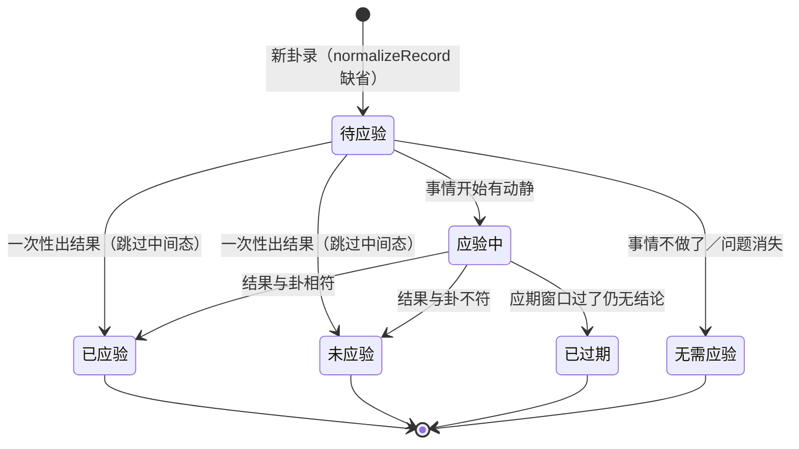

# 问心卦 · 数据模型与存储设计

| 项目 | 内容 |
|---|---|
| 文档编号 | 07 |
| 标题 | 数据模型与存储设计 |
| 版本 | 1.0 |
| 状态 | 已发布 |
| 适用产品版本 | v1.5.1 |
| 最后更新 | 2026-10-07 |
| 读者 | 内核与存储开发者、数据导入脚本作者、需要直接读写 `data/` 的用户、插件作者 |
| 关联文档 | [00-文档索引.md](00-文档索引.md)、[01-系统设计说明书.md](01-系统设计说明书.md)、[02-架构与框图.md](02-架构与框图.md)、[03-接口文档.md](03-接口文档.md)、[04-接口控制文档-ICD.md](04-接口控制文档-ICD.md)、[05-Agent设计文档.md](05-Agent设计文档.md)、[09-测试与质量保证.md](09-测试与质量保证.md)、[10-部署与运维手册.md](10-部署与运维手册.md)、[11-安全与隐私设计.md](11-安全与隐私设计.md)、[12-插件与扩展开发指南.md](12-插件与扩展开发指南.md)、[13-术语表.md](13-术语表.md)、[规范.md](规范.md) |

> 本文中的「必须 / 应当 / 可以 / 不得」按 RFC 2119 的中文惯例使用：**必须**为强制要求，**应当**为推荐做法，**可以**为可选，**不得**为禁止。

---

## 一、存储哲学：为什么一卦一个 JSON 文件

`server/store.mjs` 的文件头注释是这件事的正式表述：

> 一条卦录一个 JSON 文件，放在 `data/records/` 下。之所以不用数据库：卦录是「要陪几十年」的东西，纯文本 JSON 最耐久——可以直接看、直接改、直接备份、直接 git，也不怕哪天这个程序跑不起来。

展开成五条具体理由，每一条都对应一个可以被检验的性质：

| 理由 | 具体性质 | 反面（数据库会怎样） |
|---|---|---|
| **长期可读** | 一条卦录就是一份 `JSON.stringify(rec, null, 2)`，任何编辑器、任何语言、任何十年后的工具都能读 | 需要当年的引擎、当年的驱动、当年的 schema 才能读出内容 |
| **可 git** | 文本文件天然有行级 diff。改一条卦录、加一次复盘，`git diff` 能看出改了哪几行 | 二进制页面的 diff 无可读性 |
| **可手改** | 用户在任意编辑器里改标题、补标签、写复盘，存盘即可（运行中的服务靠 `maybeRescan()` 察觉） | 需要 SQL 客户端或界面 |
| **不依赖程序** | 程序跑不起来时，卦录依然在、依然完整；JSON 结构本身是自解释的 | 数据与程序的版本互相绑架 |
| **零依赖** | 只用 `node:fs`，没有 SQLite、没有 ORM；`package.json` 的 `dependencies` 永远是空的 | 引入第三方持久层，十年后未必能装 |

**代价是明确的，必须承认**：没有事务、没有并发写保护、没有索引。这三条代价由后文的机制覆盖——启动全量载入换掉了索引需求（§8.1），tmp + rename 换掉了写入原子性需求（§10），单进程单写者换掉了并发需求。

**一条推论**：既然存储层是「目录 + 文件」，那么**任何能写 JSON 的程序都可以是写入者**。命令行 `tools/import.mjs`、网页导入页、agent 的 `save_gua_tiao`、用户自己的脚本，写出来的都是同一种文件。这也是为什么 `Store.maybeRescan()` 是必需的而不是可选的（§8.2）。

---

## 二、目录布局

数据目录由 `QXG_DATA_DIR` → `<代码目录>/data`（可写时）→ `%APPDATA%\问心卦\data` 三级解析得到（见 [10-部署与运维手册.md](10-部署与运维手册.md) 与 [11-安全与隐私设计.md](11-安全与隐私设计.md) §5）。下面的结构以数据目录为根。

```
data/
├─ records/                      卦录正文，一条一个 JSON
│  ├─ 202609280312-01.json
│  ├─ 202609280312-02.json
│  └─ …
├─ trash/                        删掉的卦录（默认删除先进这里）
│  └─ <id>-<时间戳>.json
├─ backups/                      备份
│  ├─ pre-migration/             迁移前原件
│  │  └─ <id>-v<旧版本>-<时间戳>.json
│  └─ （用户自己放的整包备份也放这里）
├─ plugins/                      插件，一个 .mjs 一个插件
│  ├─ review-watch.mjs
│  ├─ stats-plus.mjs
│  └─ html-card.mjs
└─ config.json                   全局配置（含 AI 配置与 API Key）
```

### 2.1 逐目录说明

| 目录 / 文件 | 写入者 | 读法 | 清理策略 |
|---|---|---|---|
| `records/` | `Store.save()`（tmp + rename）；任何直接写 JSON 的外部脚本 | 启动时 `Store.loadAll()` 全量读入内存缓存；`maybeRescan()` 检测外部改动后重扫 | **永远不自动清理。** 文件只在用户主动删除时移入 `trash/`（`?hard=1` 才真删） |
| `trash/` | `Store.remove(id, false)`，文件名 `<safeId>-<Date.now()>.json`；目录不存在时先 `mkdirSync` | 不是程序功能。用户在文件管理器里直接看 | **不自动清理。** 由用户自行判断何时删——这是「不可恢复操作」与「误删」之间的缓冲层 |
| `backups/` | `Store.ensure()` 保证目录存在；`Store.loadAll()` 在迁移时写 `pre-migration/` | 桌面版菜单「数据 → 打开备份目录」直接打开；`desktop/main.mjs` 的 `qxg:open-backups` IPC | **不自动清理。** 迁移前备份是「原件」，删了就失去回退能力 |
| `backups/pre-migration/` | `Store.loadAll()`，仅当某条卦录实际发生了迁移：文件名 `<id>-v<from>-<Date.now()>.json`，内容是**迁移前的完整原文** | 手工回退时把它拷回 `records/` | 同上 |
| `plugins/` | 用户或插件作者手写 `.mjs`；`PluginHost` 只读不写（`mkdirSync` 保证目录存在） | `PluginHost.loadAll()` 扫描 `*.mjs` 并动态 `import`，带 `?t=<时间戳>` 破缓存 | 由用户管理。插件开关状态记在 `config.json` 的 `plugins` 里，**不删文件** |
| `config.json` | `Store.ensure()` 首次写默认值；`Store.setConfig(patch)` 后续写（整文件覆盖，非原子） | `Store.getConfig()` 每次都重新读盘并与 `DEFAULT_CONFIG` 合并 | 不清理。**这个文件含 API Key，不得提交到公开仓库、不得放同步盘**（见 [11-安全与隐私设计.md](11-安全与隐私设计.md)） |

### 2.2 `data/` 之外、但属于同一份数据的文件

| 位置 | 内容 | 说明 |
|---|---|---|
| `<userData>/data-dir.json` | `{ "dataDir": "<绝对路径>" }` | 桌面版记录用户选过的数据目录；`<userData>` 是 Electron 的 `app.getPath('userData')` |
| `<userData>/window-state.json` | 窗口尺寸、位置、是否最大化 | 纯界面状态，不是数据 |
| `<userData>/desktop.log` | 桌面版启动日志 | 桌面版没有控制台，出问题只能靠它；菜单「帮助 → 打开日志」 |
| `<代码目录>/seed-data/` | 随包的示例插件（只有 `plugins/`；不含卦录与 `config.json`） | 首次落到 `%APPDATA%\问心卦\data` 时由 `seedIfEmpty()`／`seedDataInto()` 复制进去 |

---

## 三、卦录数据模型

### 3.1 三段式的职责划分

一条卦录由三段构成，各自职责不重叠。`core/record.mjs` 的文件头注释就是这件事的正式表述：

> - inputs 是唯一真源，任何一条卦录都能被重算；
> - chart / reading 是快照，保证旧卦录在断语引擎升级后仍然稳定可读；
> - claimed 保存「当初别人是怎么说的」，与重算结果对照即得「校勘」。

| 字段 | 角色 | 内容 | 是否可重算 |
|---|---|---|---|
| `cast` | **唯一真源** | 起卦输入：`method`、`numbers`、`localTime`、`useTrueSolarTime`、`movingFrom`、`calendarType`、`longitude`、`latitude`、`placeName`、`hexagram`、`movingPosition`、`question`、`category`、`notes` | 它就是输入本身，不需要重算 |
| `chart` | 卦局快照 | 两种形态（靠 `oneOf` 分别约束）：梅花＝本卦／互卦／变卦／六爻／动爻／体用／旺衰／吉凶评分／历法／起卦推演；小六壬＝`kind:'xlr'`／`palaces`（三宫）／`result`／`casting`／`calendar`（不设六爻与体用） | 是：`core.divination.cast(record.cast)` |
| `reading` | 断语快照 | 两种形态：梅花＝`signature`（谶）＋ `tone[7]`（主·互·变·断·宜·忌·应期）＋ `classical`（古辞佐证）＋ `plain`（通俗解）＋ `grade`；小六壬＝`signature`＋ `tone[5..7]`（宫位段＋断·宜·忌·应期）＋ `plain`＋ `grade`（不设 `classical`、不设 `score`） | 是：`core.verdict.interpret(chart)` |

### 3.2 「cast 是唯一真源」的三条推论

**推论一：任何一条卦录都必须能被重算。** 判据是 `cast` 完整到能喂给 `cast()` 而不抛错。这就是为什么 `schema/record.schema.json` 把 `cast.required` 钉成 `["method", "localTime"]`——缺这两样就起不了卦。`core/record.mjs` 的 `recompute(record)` 做的就是 `cast(record.cast)` + `interpret(chart)`，并把 `revisionCount` 加一。

**推论二：断语引擎升级不得改动旧卦录。** `reading` 是快照——引擎升级后，旧卦录的 `reading` **保持不动**。想用新引擎看旧卦，必须显式点「重算断语」（`POST /api/records/:id/recompute`），那是一次由用户发起的、会改写 `chart` / `reading` 并递增 `revisionCount` 的操作。这是 `AGENTS.md` 硬规矩第 3 条的第三款。

**推论三：`chart` 与 `reading` 的结构可以演进，`cast` 不行。** `schema/record.schema.json` 里 `chart` 与 `reading` 都是 **`oneOf` 双分支**（梅花一支、小六壬一支），各只钉住少数关键字段（`chart` 梅花钉 `ben`/`hu`/`bian`/`moving`/`tiyong`/`score`/`calendar`，小六壬钉 `kind`/`palaces`/`result`/`casting`/`calendar`；`reading` 两支都钉 `signature`/`tone`/`plain`/`grade`），分支内 `additionalProperties: true`。而 `cast` 虽然也是 `additionalProperties: true`，但它承载的是**可重算性**：往里塞非起卦输入的东西会让重算语义变模糊。新增起卦法时应当在 `core/divination.mjs` 的 `METHODS` 与 `cast()` 里加分支（并按需要新增一支 `chart`/`reading` 形态），而不是往 `cast` 里加旁路字段。

### 3.3 实体关系图

| 主体 | 关系 | 客体 | 含义 |
|---|---|---|---|
| RECORD | 1 : 1 | CAST | 唯一真源 |
| RECORD | 1 : 1 | CHART | 卦局快照（可重算） |
| RECORD | 1 : 1 | READING | 断语快照（可重算） |
| RECORD | 1 : 0..1 | CLAIMED | 当初原述（可空） |
| RECORD | 1 : 0..n | CORRECTION | 校勘：原述 vs 正法 |
| RECORD | 1 : 1 | REVIEW | 复盘 |
| RECORD | 1 : 0..n | TAG | 标签 |
| RECORD | 1 : 0..1 | ORIGIN | 来源 |
| CHART | 1 : 1 | HEX_BEN | 本卦 |
| CHART | 1 : 1 | HEX_HU | 互卦 |
| CHART | 1 : 1 | HEX_BIAN | 变卦 |
| CHART | 1 : 1 | MOVING | 动爻 |
| CHART | 1 : 1 | TIYONG | 体用 |
| CHART | 1 : 1 | SCORE | 吉凶评分 |
| CHART | 1 : 1 | CALENDAR | 时间与历法 |
| CHART | 1 : 1 | CASTING | 起卦推演 |
| READING | 1 : 1 | SIGNATURE | 谶 |
| READING | 1 : 1..n | TONE | 定调：梅花恰好 7 段（主·互·变·断·宜·忌·应期）；小六壬 5–7 段（宫位段＋断·宜·忌·应期） |
| READING | 1 : 1 | PLAIN | 通俗解 |
| READING | 1 : 1 | GRADE | 吉凶等级 |
| READING | 1 : 0..1 | CLASSICAL | 古辞佐证 |
| REVIEW | 1 : 0..n | REVIEW_LOG | 追记 |

字段的类型、必填与取值一律以 §3.4 的全表为准——图中只画关系，不重复约束。

### 3.4 字段全表

下表与 `schema/record.schema.json` 逐项一致。`addl` 一列是该层的 `additionalProperties`（`false`＝不允许未声明字段）。

| 字段路径 | 类型 | 必填 | addl | 说明 |
|---|---|---|---|---|
| `schema` | integer ≥1 | **是** | `false` | 结构版本号，当前 4（v4 收录小六壬）；升级路径见 `core/migrate.mjs` |
| `id` | string，`^[0-9]{12}-[0-9]{2}$` | **是** | | 卦录编号：起卦时间 `YYYYMMDDHHmm` ＋ 两位序号；一经生成不再更改 |
| `title` | string ≤200 | **是** | | 标题；留空时由 `normalizeRecord()` 用「问」截取前 24 字，再退化为「X之占」 |
| `category` | string 枚举 | **是** | | 八类之一；不在枚举内的值会被 `normalizeRecord()` 归一为「其他」 |
| `question` | string ≤2000 | 否 | | 所问之事。一事一占 |
| `cast` | object | **是** | `true` | 起卦输入，唯一真源。`required: ["method","localTime"]` |
| `cast.method` | string 枚举 | **是** | | 六值：`numberAndTime`＝一数＋时辰；`twoNumbers`＝两数；`timeOnly`＝年月日时；`manual`＝已知本卦与动爻（以上梅花）；`xlrNumbers`＝小六壬报数起课；`xlrTime`＝小六壬月日时辰起课 |
| `cast.numbers` | integer[]，每项 ≥1 | 否 | | 报数（小六壬 `xlrNumbers` 给 1–3 个） |
| `cast.localTime` | string，`^[0-9]{4}-[0-9]{2}-[0-9]{2} [0-9]{2}:[0-9]{2}$` | **是** | | 钟表时间 `YYYY-MM-DD HH:mm` |
| `cast.useTrueSolarTime` | boolean | 否 | | 是否按真太阳时定时辰。**这一项会改时辰，从而改整个卦** |
| `cast.calendarType` | string 枚举 `lunar`/`solar` | 否 | | 仅小六壬 `xlrTime` 用：月与日按农历（`lunar`，默认，闰月按本月计）或公历（`solar`） |
| `cast.movingFrom` | string 枚举 `sum`/`number`/`manual` | 否 | | 动爻取法：数与时之和除六／仅以报数除六／手工指定 |
| `cast.longitude` / `cast.latitude` | number 或 null（经 ∈[−180,180]，纬 ∈[−90,90]） | 否 | | 经纬度。**纬度目前只存档，不参与计算** |
| `cast.placeName` | string | 否 | | 地点名；未给 `longitude` 时按它查表 |
| `cast.hexagram` | string | 否 | | `method=manual` 时的本卦 |
| `cast.movingPosition` | integer ∈[1,6] 或 null | 否 | | 动爻（自下而上） |
| `cast.question` / `cast.category` | string | 否 | | 起卦时填的所问与类别（**`cast.category` 不锁枚举**） |
| `cast.notes` | string[] | 否 | | 备注 |
| `chart` | object | **是** | `true` | 卦局快照，**`oneOf` 双分支**：梅花支 `required: ["ben","hu","bian","moving","tiyong","score","calendar"]`；小六壬支 `required: ["kind","palaces","result","casting","calendar"]`。结构随内核演进，故不锁死 |
| `chart.inputs` | object | （内核写） | | `cast` 的副本 |
| `chart.calendar` | object | **是** | | 历法，25 个字段：`localTime`、`dateTime`、`placeName`、`longitude`、`latitude`、`julianDay`、`trueSolarTime`、`trueSolarHour`、`equationMinutes`、`longitudeMinutes`、`offsetMinutes`、`clockHourZhi`、`clockHourNumber`、`trueHourZhi`、`trueHourNumber`、`monthZhi`、`monthIndex`、`jie`、`term`、`nextJie`、`sunLongitude`、`yearGanZhi`、`dayGanZhi`、`dayGanZhiIndex`、`summary` |
| `chart.casting` | object | （内核写） | | 起卦推演：`steps`（逐步算式文本数组）、`upperName`、`lowerName`、`movingNumber`、`hourZhi`、`hourNumber` |
| `chart.lines` | integer[6]（0/1） | （内核写） | | 六爻，自下而上；`1`＝阳 |
| `chart.ben` / `chart.hu` / `chart.bian` | object | **是** | | 卦象，17 个字段：`id`（卦序）、`name`、`fullName`、`upper`、`lower`、`symbol`、`upperNature`、`lowerNature`、`palace`、`coreMeaning`、`keywords[]`、`guaci`、`xiang`、`fortune`、`advice`、`known`、`lines[6]` |
| `chart.moving` | object | **是** | | `position`、`isYang`、`yaoTitle`、`yaoText`、`positionSymbol`、`positionName`、`inUpper` |
| `chart.tiyong` | object | **是** | | `ti`／`yong`（各含八卦属性与 `position`）、`relation`、`huTri`、`huRelation`、`bianTri`、`bianRelation`、`wang.ti`、`wang.yong`、`tiRange`、`yongRange` |
| `chart.score` | object | **是** | | `total`（−100~+100）、`grade`（`key`/`label`/`tone`/`desc`）、`breakdown[]`（八项，各含 `label`/`weight`/`value`/`pct`/`note`） |
| `chart.generatedAt` / `chart.method` | string | （内核写） | | 生成时间（ISO）与方法 id |
| `chart.kind` / `chart.palaces` / `chart.result` | string ／ array(1–3) ／ object | （小六壬形态） | | 小六壬之课：`kind` 为 `'xlr'`（老记录缺省即梅花）；`palaces[]` 每项含 `role`/`name`/`deity`（六神）/`element`/`direction`/`spiritNumbers`（神数）/`koujue`/`meaning`/`grade`；`result` 为末宫（结果宫）。该形态**不含** `lines`/`ben`/`hu`/`bian`/`moving`/`tiyong`/`score` |
| `chart.lunar` | object 或 null | （小六壬形态） | | 小六壬 `xlrTime` 按农历起课时给的农历日期（`year`/`month`/`monthName`/`day`/`dayName`/`isLeap`/`castingMonth`）；公历或报数起课为 `null` |
| `reading` | object | **是** | `true` | 断语快照，**`oneOf` 双分支**（梅花／小六壬），两支都 `required: ["signature","tone","plain","grade"]` |
| `reading.signature` | string | **是** | | 谶语：一卦气质最重处（小六壬为末宫谶语） |
| `reading.tone` | array | **是** | 元素级 `false` | 定调。梅花支：`minItems/maxItems: 7`，顺序固定 主·互·变·断·宜·忌·应期；小六壬支：`minItems: 5`、`maxItems: 7`，宫位段在前、末尾恒为断·宜·忌·应期 |
| `reading.tone[].key` | string 枚举 | **是** | | 梅花：`main`/`hu`/`bian`/`duan`/`yi`/`ji`/`yingqi`；小六壬：`palace1`/`palace2`/`palace3`/`duan`/`yi`/`ji`/`yingqi` |
| `reading.tone[].label` | string 枚举 | **是** | | 梅花：`主`/`互`/`变`/`断`/`宜`/`忌`/`应期`；小六壬：`月宫`/`日宫`/`时宫`（或 `初宫`/`次宫`/`末宫`）/`断`/`宜`/`忌`/`应期` |
| `reading.tone[].text` | string ≥4 字 | **是** | | 该段的文言正文 |
| `reading.classical` | object | 否 | `true` | 古辞佐证：`guaci`/`xiang`/`yaoci`/`huXiang`/`bianXiang`，每项 `{text, source}` |
| `reading.plain` | object | **是** | `true` | 通俗解。`required: ["oneLine","focus","why","how"]`；`why`/`how` 是 string[] |
| `reading.grade` | object | **是** | `true` | `required: ["key","label","tone"]`；`key` 六枚举、`label` 六枚举、`tone` 四枚举，另有可选 `desc` |
| `reading.category` / `reading.generatedBy` | string | 否 | | 生成断语时用的类别；生成此断语的引擎标识（便于判断是否需要重算） |
| `claimed` | object 或 null | 否 | `true` | 当初别人口头所述的卦，用于校勘。`ben`/`hu`/`bian`/`tiyong` 是 string 或 null，`moving` 是 integer ∈[1,6] 或 null |
| `corrections` | array | 否 | 元素 `true` | 校勘：原述与重算不符之处。元素 `required: ["label","note"]`，另有 `field`/`stated`/`computed` |
| `review` | object | **是** | `false` | 复盘。`required: ["status","log"]` |
| `review.status` | string 枚举 | **是** | | `待应验`/`应验中`/`已应验`/`未应验`/`已过期`/`无需应验` |
| `review.log` | array | **是** | 元素 `true` | **复盘条目流**：最早那条通常是最初写的复盘，之后是追记。每项 `{at, text}`；`at` 是自由日期串、**可为空串**（老数据没记时间，界面显示「未记时间」） |
| `tags` | string[] | 否 | | 标签 |
| `narrative` | string | 否 | | 原文存录：当初的完整解读文字（Markdown） |
| `narrativeHtml` | string | 否 | | 预留的 HTML 形式原文，当前记录里为空串 |
| `background` | string | 否 | | 补充存录：求测人背景——身份、处境、动机，几件事各占几分（v3 新增，可省，默认空串） |
| `plan` | string | 否 | | 补充存录：可执行方案——断语给的是通则，这里存落到这个人、这件事上的具体做法 |
| `collation` | string | 否 | | 补充存录：**人工**校勘——人对旧解读措辞的更正（如「第四爻阳变阴」应作「六四阴爻动，变阳」）。**它与程序自动算出的 `corrections`（自动校勘）是两回事，别混源** |
| `qa` | string | 否 | | 补充存录：原文问答——当初的往来问答，约定以「问：」「答：」起行 |
| `origin` | object | 否 | `true` | 来源：`kind`、`label`，另有可选 `url` |
| `source` | object 或 null | 否 | `true` | 预留的来源附加信息 |
| `createdAt` / `updatedAt` | string | **是** | | 录入时间与最后修改时间（ISO） |
| `revisionCount` | integer ≥0 | 否 | | 重算次数 |

**根级必填的完整列表**（`schema/record.schema.json` 的 `required`）：`schema`、`id`、`title`、`category`、`cast`、`chart`、`reading`、`review`、`createdAt`、`updatedAt`。

> **注意一处措辞不一致**：`agent/tools.mjs` 的 `format_spec` 工具把必填返回为 `['schema','id','title','category','cast','chart','reading','createdAt','updatedAt']`——**少了 `review`**。以 `schema/record.schema.json` 为准：`review` 是必填。这是一处已知的措辞不一致，改 `format_spec` 时应当对齐。

### 3.5 `origin.kind` 的实际取值

`origin.kind` 在 schema 里是自由 string。代码里实际写出的值有四种：

| `kind` | `label` | 写入者 |
|---|---|---|
| `cast` | `本机起卦` | `normalizeRecord()` 的缺省值；界面起卦台入库 |
| `agent` | `AI 助手录入` | `agent/tools.mjs` 的 `save_record` |
| `gua-tiao` | `卦条导入` | `agent/tools.mjs` 的 `save_gua_tiao`、`tools/import.mjs`、界面导入页 |
| `deepseek-chat` | 例如 `DeepSeek 起卦对话（首占）` | `tools/seed.mjs` 录入的六条历史卦录 |

---

## 四、`claimed` 与 `corrections`：校勘模型

### 4.1 存而不改

校勘的全部设计可以压成一句话：**原述照存，重算照算，差异另立一栏，谁都不改谁。**

| 字段 | 存什么 | 谁写 |
|---|---|---|
| `claimed` | 「当初别人是怎么说的」：`ben`、`hu`、`bian`、`moving`、`tiyong`（可只填认得出的几项） | 导入时由 `core/importer.mjs` 或 `core/guaTiao.mjs` 解析得到；也可由 `save_record` 直接给 |
| `corrections` | `core/record.mjs` 的 `audit(claimed, chart)` 逐项对照的**差异清单** | 由 `buildRecord()`、`buildFromHexagram()`、`recompute()` 自动生成，不接受手工填写 |

### 4.2 `audit()` 的比对规则

| 项 | 比对方式 | 触发条件 | `note` 的口径 |
|---|---|---|---|
| 本卦 | 双方都过 `library().find()` 归一成卦序再比 | 卦序不同 | 「本卦与重算不符，请核对起卦之数与时辰。」 |
| 互卦 | 同上 | 卦序不同 | 「互卦取「二三四爻为下、三四五爻为上」，此处原述有误，已按正法改正。」 |
| 变卦 | 同上 | 卦序不同 | 「变卦由动爻反覆而得，此处原述有误，已按正法改正。」 |
| 动爻 | 数值比较 | `claimed.moving` 与 `chart.moving.position` 不同 | 「动爻取法不同（有「数与时之和除六」与「仅以报数除六」两说），此处已按所记取法还原。」 |
| 体用 | 从 `claimed.tiyong` 文本里正则抽「体卦?<八卦名>」「用卦?<八卦名>」再比 | 任一侧不符 | 「体用之法定「动爻所在之卦为用，另一卦为体」；此处原述与正法不同，已按正法改正（若两卦同五行，吉凶结论不受影响）。」 |

**两条防误报的规矩（都很重要）**：**① 认不出的不报**——`cmpHex()` 里先 `lib.find(stated)` 与 `lib.find(computed)`，任一为 `null` 就直接 `return`，所以「互卦写成一句散文」不会产生假校勘（注释原话是「以卦典为准比对卦名：认不出的不报，避免误伤」）；**② 取法可反推**——`buildRecord()` 在落盘前会检查：若 `cast` 没写 `movingFrom`，而 `claimed.moving` 与「仅以报数除六」的结果吻合，就调 `inferMovingFrom()` 把 `movingFrom` 反推成 `number`，**忠实复现原卦**而不是记成校勘。这条正是从六条历史卦录里长出来的——首占「泽火革」的动爻当初以 `82 ÷ 6` 单取，若不做反推就会被误报成「动爻不符」。

### 4.3 校勘的定位

校勘是「本程序相对聊天记录最实在的一处增值」，也是**唯一一处允许「原述与正法并存」的地方**。三条边界：校勘**不得**修改 `narrative`（原文存录）——原述的文字完整保留，`corrections` 只是旁注；校勘**不得**改写 `chart`——`chart` 永远是正法重算的结果；校勘是**只读产物**——任何手工编辑 `corrections` 的行为都会在下一次 `recompute()` 时被覆盖，它是 `audit()` 的输出，不是输入。

---

## 五、`review` 复盘模型

### 5.1 数据结构

```jsonc
"review": {
  "status": "待应验",        // 六态之一
  "log": [                   // 复盘条目流：最早那条通常就是首回复盘，之后是追记
    { "at": "2026-12-20", "text": "初试已过，在等成绩。" }
  ]
}
```

**v5 起只有一个真源。** 之前是「`result`（实况，会覆盖）+ `reviewedAt`（复盘时间）+ `log`（追记，只追加）」两套并存的写法：同一个意思有两种说法（实况＝首条复盘、复盘时间＝那条的日期），界面上就表现为「保存的实况不像追记那样能回看」、追记写错一个字只能重开一条。现在 `result`／`reviewedAt` 由 4→5 迁移并入 `log` 的**第一条**（`at` 取原 `reviewedAt`，没记就留空串），`review` 只由 `status` 与 `log` 两个键组成。

`review` 在 schema 里是 `additionalProperties: false`——**这两个键以外一个都不许加**。这是全 schema 中除 `reading.tone[]` 元素之外唯一锁死的对象。

### 5.2 状态机



**说明：** 这张图的箭头表达的是**语义上的合理流转**，不是程序强制的约束。`update_review` 接受六态中的任意一个作为 `status`，不做状态机校验——这样用户可以随时纠正自己的判断。

### 5.3 状态语义与写入规则

| `status` | 含义 | 是否算「已复盘」 |
|---|---|---|
| `待应验` | 事情还没到能看到结果的时候 | 否 |
| `应验中` | 已有部分迹象，尚无定论 | 否 |
| `已应验` | 结果与卦相符 | 是 |
| `未应验` | 结果与卦不符 | 是 |
| `已过期` | 应期窗口已过，仍无结论 | 是 |
| `无需应验` | 事情没做／问题自然消失 | 是 |

**状态与条目互不牵连**：`status` 就地改（`update_review` 的 `status`，或复盘页里改一下即存），改状态**不会**动任何一条已写下的文字；反过来写一条新条目也不会改状态。v5 之前还有一条「终态自动补 `reviewedAt`」的规则，随着 `reviewedAt` 并入首条条目一起取消了——现在没有「时间戳由程序补」这种事。

`update_review` 的 `text` 存在时会 `review.log = [...(review.log||[]), {at, text}]`，即**追加**（`at` 缺省当天）。这是刻意的：复盘是一条时间线，不是一篇会被下一次覆盖的作文。**界面上允许改、删单条**（`#/review` 页里「开启操作」之后），但**没有任何自动化流程**会去改它们——迁移只搬家不改字，重算与插件都不碰 `review.log`。

### 5.4 复盘为什么是最值钱的部分

这是 `reading` 快照之外唯一一处「事后补写的、不可重算的」数据。卦象可以重算，断语可以重算，**「后来到底发生了什么」不可重算**。所以：`review.log` 里的每一条**不得**被任何自动化流程改写（迁移不改、重算不改、插件不改）；复盘状态分布是 `store.stats()` 的一个维度（`byReview`），也是插件「应期提醒」的输入；插件 `review-watch.mjs` 按动爻之位推算应期窗口，把「时间该到了、还没复盘」的卦挑出来——它读的就是 `review.status` 与 `cast.localTime`。

---

## 六、版本与迁移

### 6.1 `schema` 号

每条卦录的 `schema` 字段是它的结构版本。**真源只有一处**：`core/migrate.mjs` 的 `CURRENT_SCHEMA`（当前 `5`）。`core/record.mjs` 的 `SCHEMA_VERSION` 不再自己记一份，而是 `import { CURRENT_SCHEMA }` 的别名——早先它是第二个常量，「改一个忘一个」是迟早的事（`normalizeRecord()` 每次用 `SCHEMA_VERSION` 覆写 `rec.schema`：前者决定「要不要迁移」，后者决定「新写的记录标几版」，两处漂移就会出现「新记录标着旧版、每次载入都被重迁」这种怪事）。

`detectVersion(record)` 的规则：`Number(record.schema)` 是有限正数就取它，否则返回 `0`。**`0` 表示「早于版本号机制的裸记录」**，视同 v1 处理（`MIGRATIONS[0]` 就是干这个的）。

### 6.2 `MIGRATIONS` 登记表

```js
export const MIGRATIONS = {
  // 键是**源版本**，值把该版本的记录转成下一版本
  0: (rec) => {
    rec.schema = 1;
    rec.review = rec.review || { status: '待应验', log: [] };
    rec.tags = Array.isArray(rec.tags) ? rec.tags : [];
    rec.corrections = Array.isArray(rec.corrections) ? rec.corrections : [];
    return rec;
  },
  // v1 → v2：补 yingqi（应期区间），从 chart 现算，不动 reading 快照
  1: (rec) => {
    if (!rec.yingqi) {
      try { rec.yingqi = computeYingqi(rec.chart, { from: rec.cast?.localTime }) || null; }
      catch { rec.yingqi = null; }
    }
    return rec;
  },
  // v2 → v3：补「补充存录」四字段，一律留空串（纯新增，不碰任何已有内容）
  2: (rec) => {
    if (rec.background === undefined) rec.background = '';
    if (rec.plan === undefined) rec.plan = '';
    if (rec.collation === undefined) rec.collation = '';
    if (rec.qa === undefined) rec.qa = '';
    return rec;
  },
  // v3 → v4：收录道教传统小六壬。老记录全是梅花、结构一字未变，
  // 小六壬以 chart.kind 判别（缺省即梅花），故对旧记录是**纯空操作**。
  3: (rec) => rec,
  // v4 → v5：复盘条目化。result（非空时）搬成 log 的**第一条**（at 取原 reviewedAt，
  // 没记就留空串——不替用户猜日期），原 log 原样接在后面：文字一字不丢、不重排。
  4: (rec) => { /* 见 core/migrate.mjs 的完整实现 */ },
};
```

当前共 `0 → 1`、`1 → 2`、`2 → 3`、`3 → 4`、`4 → 5` 五步，其中 `3 → 4` 是**空操作**（`(rec) => rec`，老记录一字不动），`4 → 5` 是**搬家**（复盘条目化：只把 `result`／`reviewedAt` 挪进 `log`，不删一个字、不重排）。`migrate(record)` 的控制流：`from = detectVersion(record)`，若 `from >= CURRENT_SCHEMA` 直接原样返回（`applied` 为空）；否则从 `from` 逐级循环到 `CURRENT_SCHEMA`，每级取 `MIGRATIONS[v]`——取不到函数返回「缺少 vN → vN+1 的迁移函数」，函数抛错返回「vN → vN+1 迁移失败：<message>」，返回非对象返回「vN → vN+1 迁移返回了非对象」；每成功一级就把 `cur.schema = v + 1` 并记入 `applied`；全部成功时返回 `{ record: cur, from, to: CURRENT_SCHEMA, applied }`。`migrateAll(records)` 是批量版，返回 `{ migrated, errors, current }`——**只做迁移不落盘**，落盘的决定权在调用方（`Store.loadAll()`）。

### 6.3 迁移前备份

`Store.loadAll()` 里，只有**真的发生了迁移**（`out.applied.length > 0`）才写备份，顺序是：建 `backups/pre-migration/` 目录 → 把**迁移前的原文**写进 `<id>-v<from>-<Date.now()>.json` → `rec = out.record` → 把迁移后的记录写回 `records/<id>.json` → 把 `{id, from, to}` 记进 `this.migrations`。

四点必须知道：**① 备份文件名带源版本与时间戳**（`<id>-v<from>-<Date.now()>.json`），同名不会覆盖，可以反复迁移、反复留档；**② 备份写成功之后才写正本**——备份失败会抛错，被外层 `try/catch` 接住，这条记录会被「跳过」而不是「写坏」；**③ 本次启动的迁移记录进内存** `store.migrations` 数组，`GET /api/stats` 会把它返回给界面显示；**④ 落盘的是迁移后的记录**（`rec = out.record` 之后再 `writeFileSync(full, ...)`）。

### 6.4 失败时的降级行为

| 失败点 | 行为 | 数据后果 |
|---|---|---|
| `migrate()` 返回 `error` | `console.warn('[store] <文件> 迁移失败，按原样载入：<error>')`，然后 `this.cache.set(rec.id, rec)` —— **载入的是原记录，不迁移、不写盘** | **不丢数据**。卦录仍可在界面上看到与编辑；只是结构还是旧的 |
| JSON 解析失败或记录缺 `id` | `console.warn('[store] 跳过损坏的卦录文件 <文件>：<message>')`；`continue` | 该文件**不进内存缓存**，界面上看不见。**但文件仍在 `records/` 里**，可手工修复 |
| `records/` 读取本身失败 | `loadAll()` 会抛出，`Store` 构造失败 → 服务启动失败 | 数据完好，是环境问题（权限、路径） |
| `MIGRATIONS[v]` 缺失 | 同第一条：该条按原样载入并告警 | 不丢数据。**这是「忘记写迁移函数」的安全网**：不会静默丢内容，只会一直告警 |

**一句总结**：迁移的失败模式全部是「保留原样 + 告警」，没有一条会写坏或丢弃卦录。这是 `AGENTS.md` 硬规矩第 3 条的机器化保证。

### 6.5 如何新增一个版本（完整步骤）

以「升到 v2」为例，顺序不可颠倒：

1. **改 `core/migrate.mjs`**：`CURRENT_SCHEMA` 改成 `2`；在 `MIGRATIONS` 里加 `1: (rec) => { …把 v1 记录转成 v2…; return rec; }`（**不要**在函数里自己写 `rec.schema = 2`，`migrate()` 会统一补）。
2. **同步 `core/record.mjs`** 的 `SCHEMA_VERSION` 为 `2`（否则新写的记录还标 v1，下次启动又要迁一遍）。
3. **改 `schema/record.schema.json`**：加新字段、改 `required`、必要时改 `schema.minimum`。注意本项目校验器**不支持** `$ref`/`allOf`/`not`/`if-then-else`/`patternProperties`（见 §7.1）。
4. **改 `docs/规范.md`** 的「版本历史」表，写清改了什么、为什么、兼容性影响。
5. **检查 `tools/validate.mjs`** 的语义校验项是否要跟着加（当前有七段顺序、六爻长度、动爻阴阳三项）。
6. **跑四件套**：`node tools/validate.mjs`、`node tools/check.mjs`、`node tools/check-validate.mjs`、`node tools/check-web.mjs`（后者连不上服务时会自起一个示例服务）。
7. **手工验一次迁移路径**：把一条 v1 卦录放回 `data/records/`，起服务，确认三件事——`data/backups/pre-migration/` 下生成了 `<id>-v1-<时间戳>.json`；`records/` 里的文件已是 v2；`GET /api/stats` 的迁移记录里有这一条。
8. **更新本文档**的 §3.4 字段全表与 §6.2 登记表。

> **反向迁移不存在。** 程序不做降级（v2 → v1）。要回退，只能把 `pre-migration/` 里的原件拷回 `records/`，并把代码退回上一版。这是有意的：回退是人的决定，不是程序的自动行为。

---

## 七、校验

### 7.1 `core/schema.mjs` 支持的 JSON Schema 子集

本项目坚持零第三方依赖，所以校验器是自己写的，只支持一份**明确的子集**。不支持的关键字**遇到即报错**（不会静默放过），这是为了避免「写了却没生效」这种最坏的失败。

| 支持 | 说明 |
|---|---|
| `type` | `string`/`number`/`integer`/`boolean`/`object`/`array`/`null`；可以是数组（任一种通过即可）。`integer` 接受整数值的 number，`number` 也接受 integer |
| `enum` / `const` | `Object.is` 精确比较 |
| `properties` / `required` / `additionalProperties` | `additionalProperties` 可以是 `false`（禁止未声明字段）或一个 schema（对未声明字段套用） |
| `items` / `minItems` / `maxItems` | 数组；`items` 是单一 schema（不支持元组形式） |
| `minimum` / `maximum` / `exclusiveMinimum` / `exclusiveMaximum` | 数值 |
| `minLength` / `maxLength` / `pattern` | 字符串；`pattern` 走 `new RegExp(...).test()` |
| `oneOf` / `anyOf` | `oneOf` 要求**恰好命中一种**，`anyOf` 要求至少一种 |
| 元数据（忽略语义） | `$schema`、`$id`、`title`、`description`、`default`、`examples`、`format`、`deprecated` |

| 不支持（报「schema 使用了本校验器不支持的关建字」） | 替代写法 |
|---|---|
| `$ref` | 把公共结构复制一份，或用 `oneOf` 展开 |
| `allOf` | 把约束合并进同一个 schema 对象 |
| `not` | 用 `oneOf` + 精确 `const`/`enum` 表达 |
| `if` / `then` / `else` | 拆成两个 `oneOf` 分支，各自把条件写全 |
| `dependentSchemas` | 在 `required` 里写死，或让 `tools/validate.mjs` 做语义校验 |
| `patternProperties` | 用 `additionalProperties: {…}` 加 `pattern` |

**返回值形态**：`validate(value, schema, { path, errors, strict })` → `{ valid, errors: [{path, message, keyword}] }`。`strict` 缺省为 `true`（即做不支持关键字的检查）。`firstError(result)` 取第一条错误拼成一句人话，供界面显示。

### 7.2 `tools/validate.mjs` 的语义校验项

结构过 schema 之后，还要过三项 **schema 表达不了的语义约定**：**① 七段顺序**——`reading.tone.map(t => t.label).join('') === '主互变断宜忌应期'`，否则报「七段顺序应为 主·互·变·断·宜·忌·应期，实际为 &lt;实际&gt;」；**② 六爻长度**——`chart.lines.length === 6`，否则报「六爻应为 6 个元素，实际 N」；**③ 动爻阴阳自洽**——`chart.lines[moving.position - 1] === 1` 必须等于 `chart.moving.isYang`，否则报「动爻阴阳与六爻数据不一致」。

另有流程层面的三项（对卦条文本）：卦条解析出 `ok === false` 时加一条 `missing：信息不完整，缺：<missing 用「、」连接>`；有 `unknownKeys` 时加一条 `unknownKeys：认不出的键名：<…>`；有 `hints` 时逐条加为问题项。

**校验前先迁移**：`checkRecord()` 的第一步是 `migrate.migrate(rec)`；迁移报错就直接判失败（`(迁移)：<error>`）。也就是说，**校验器接受旧版本的卦录**，迁移后再验结构。成功时输出里会带「（自 vN 迁移）」的标注。

**用法与退出码**：`node tools/validate.mjs` 校验 `data/records/` 下全部卦录；带一个路径参数则校验指定卦录或备份包（自动识别 `.records` 数组），扩展名不是 `.json` 时按卦条解析校验；加 `--json` 输出机器可读结果。**通过返回 `0`，失败返回 `1`**；`data/records/` 为空时直接 `exit(1)` 并提示「data/records/ 下没有卦录文件。」

**`tools/check-validate.mjs` 是校验器的负向测试**（10 项）：故意注入未声明字段、打乱七段顺序、把动爻阴阳改成与六爻不符、填一个不在枚举里的类别，以及四条小六壬负例（段序、三宫数、缺结果宫、术语混用）……全部必须报错。**一个永远通过的校验器等于没有**，这 10 项就是「校验器必须抓得出错」的证明。

### 7.3 两份对外的 JSON Schema

| 文件 | 约束什么 | 谁在用 |
|---|---|---|
| `schema/record.schema.json` | 一条卦录的完整结构（见 §3.4） | `tools/validate.mjs`、`POST /api/validate`、`GET /api/schema/record`、界面「导入与格式」页 |
| `schema/gua-tiao.schema.json` | 「卦条 v1」纯文本**解析后**的结果结构 | `tools/validate.mjs`、`POST /api/guatiao/parse`、agent 的 `save_gua_tiao` 路径、界面在线校验 |

`gua-tiao.schema.json` 的要点：根级 `required` 是 `["ok","source","version","fields","claimed","missing"]`；`source` 是 `const: "gua-tiao"`，`version` 是 `const: 1`；`strategy` 枚举 `hexagram`/`cast`（决定入库走哪条路）；`fields` 的必填是 `["localTime","useTrueSolarTime","numbers","method"]`；`claimed` 是 `additionalProperties: false` 且五项都可为 null。**（缺失的）`localTime` 用空串表示并在 `missing` 里报出**——「宁可少认，不可错认」。

---

## 八、索引与性能

### 8.1 启动全量加载

`Store` 的构造流程是一次性的全量加载：`ensure()` 建立 `root`／`records`／`trash`／`backups` 四个目录并在 `config.json` 不存在时写默认值 → `this.cache = new Map()` → `loadAll()` 遍历 `records/*.json`，逐条 `JSON.parse`、（必要时）迁移、存入 cache。

`loadAll()` 里三件事的顺序值得记住：**先迁移（可能写盘）、再入缓存、最后 `markDir()`**。`markDir()` 把 `records/` 目录的 `mtimeMs` 记进 `this.dirMtime`，供 `maybeRescan()` 比较。

内存里的数据结构就是一个 `Map<id, record>`。`list()` 每次现排序（按 `cast.localTime` 降序，退化到 `createdAt`），不缓存顺序——所以任何写入之后顺序自动正确。

### 8.2 `maybeRescan()`：外部改动检测

`maybeRescan()` 做一件事：`fs.statSync(records/).mtimeMs` 与构造时记下的 `this.dirMtime` 比较，不同就 `loadAll()` 重扫，返回 `{rescanned, before, after}`。**触发点**是 `server/index.mjs` 的 HTTP 主处理里每次请求都调一次（`const scan = store.maybeRescan();`），开销是一次 `statSync`，可忽略。**为什么必需**：命令行 `tools/import.mjs` 导入的卦录，运行中的服务看不见——这个 bug 是手工实测发现的。**代价**：目录 `mtime` 变了就整目录重扫，没有增量逻辑，因为在「几百条卦录」的量级下重扫比维护增量索引更简单也更不容易错。**边界**：`statSync` 抛错时静默跳过，返回 `rescanned: false`。

### 8.3 多大量级下够用

按实测：**六条历史卦录单条 19.6 KB ~ 28.1 KB**（`data/records/` 里的实际文件大小），典型值约 20 KB。全量加载的开销是「读 N 个约 20 KB 的文件 + N 次 `JSON.parse`」。

| 卦录量 | 磁盘占用（约） | 全量加载 | 判断 |
|---|---|---|---|
| 100 条 | ≈ 2 MB | 十几毫秒 | 完全无感 |
| 1 000 条 | ≈ 20 MB | 百毫秒级 | 无感；即使每次 `maybeRescan()` 都重扫也能接受 |
| 10 000 条 | ≈ 200 MB | 秒级 | **开始需要关注**：启动变慢，内存里长期驻留约 200 MB 的解析后对象（实际更大，JS 对象开销高于 JSON 文本） |
| 100 000 条 | ≈ 2 GB | 不可接受 | 必须换架构 |

**结论与阈值建议**：**1 000 条以内**现有架构完全够用，不要引入索引；**1 000 ~ 10 000 条**时 `maybeRescan()` 的整目录重扫会成为瓶颈（每次外部改动扫全量），此时**应当**加一层「按文件 mtime 增量载入」——`loadAll()` 已经逐文件读，改成「只重读 mtime 变了的文件」是一次局部改动；**超过 10 000 条**需要引入真正的索引（例如启动时把摘要写成一个 `data/index.json`，`list()` 只读索引，`get(id)` 才读正文），**但这条路线要慎重**——它会把「一条卦录一个 JSON、可以直接看」的存储哲学撕开一个口子，一旦索引与正文不一致，排查成本远高于收益；更可能的正确做法是**分目录**（例如 `records/2026/`）而不是加索引。

### 8.4 查询的复杂度

| 操作 | 复杂度 | 说明 |
|---|---|---|
| `get(id)` | O(1) | `Map` 查表 |
| `list()` | O(n log n) | 每次现排序 |
| 按类别／吉凶／复盘状态筛选 | O(n) | `list_records` 工具与 `GET /api/records` 都是内存里 `filter` |
| 关键词搜索 `q` | O(n × m) | 对每条记录 `JSON.stringify({title,question,narrative,chart,reading,background,plan,collation,qa})` 后小写包含匹配。**`chart`、`reading` 与补充存录四字段也在被搜之列**，所以能搜到断语、卦局与补充存录内容，代价是字符串化开销 |
| `stats()` | O(n) | 一次遍历算六个分布 |
| `trend.buildTrend()` | O(n log n) | 排序后聚合 |

这些都是内存操作，1 000 条量级下每次请求毫秒级。

---

## 九、备份与恢复

### 9.1 三种备份方式

| 方式 | 入口 | 产物 | 适用 |
|---|---|---|---|
| **界面导出（整包 JSON）** | 「总览」页的「整包备份」按钮 → `GET /api/export?format=json` | 一个 JSON 文件：`{ meta, config, records }` | 日常备份；可直接被「恢复 JSON 备份」读回 |
| **桌面版原生保存框** | 菜单「数据 → 导出整包备份」→ IPC `qxg:export-backup` → `dialog.showSaveDialog` → 内部 `fetch(currentUrl + 'api/export?format=json')` → 写文件 | 同上的 JSON，默认文件名 `问心卦-备份-YYYY-MM-DD.json` | 桌面版用户；比走浏览器下载更顺手 |
| **命令行 / 直接拷目录** | 手工复制整个 `data/` 目录 | 目录副本 | **最保险**。连 `plugins/`、`config.json`、`backups/` 一起带走 |

`Store.backup()` 返回的结构：

```jsonc
{
  "meta": { "app": "问心卦", "schema": 1, "exportedAt": "<ISO>", "count": 6 },
  "config": { /* 完整配置，含 AI 配置 */ },
  "records": [ /* 全部卦录，按 list() 的时间倒序 */ ]
}
```

另有单条导出 `GET /api/records/:id/export?format=md|slip|json`（插件可注册新格式，例如内置插件 `html-card` 提供的 `html-card`）与全录 Markdown `GET /api/export?format=md`。

### 9.2 恢复流程

| 场景 | 怎么做 |
|---|---|
| 用界面 | 「导入」页 → 「恢复 JSON 备份」→ 选整包 JSON → 走 `POST /api/restore` |
| 桌面版 | 「数据 → 打开备份目录」找到文件，回到「导入」页恢复 |
| 命令行 | `node tools/import.mjs 备份.json`（该工具能识别备份包） |
| **整体回退到某个时点** | 停服务 → 把 `data/` 整个换掉（或只换 `records/`）→ 重启。这是唯一能回到**精确历史状态**的方式，因为整包恢复不删除本地多出来的记录（见下） |
| **回退某条迁移** | 从 `data/backups/pre-migration/` 里找到 `<id>-v<旧版本>-<时间戳>.json`，拷回 `data/records/<id>.json`，重启并让代码退回旧版 |

### 9.3 `/api/restore` 的合并语义

`POST /api/restore` 直接调 `store.restore(body, { merge: body.merge !== false })`。语义逐条如下：

| 规则 | 行为 |
|---|---|
| 入参形态 | 接受整包对象（取 `.records`）或直接一个记录数组 |
| 记录有效性 | **必须有 `id` 且有 `chart`**，否则 `continue` 跳过（不报错、不计数） |
| 本地没有该 `id` | `this.save(rec)`，`added += 1` |
| 本地已有该 `id` 且 `merge !== false` | `this.save({ ...this.cache.get(rec.id), ...rec })`，`updated += 1`。**浅合并：备份里的字段覆盖本地的同名字段** |
| 本地已有该 `id` 且 `merge === false` | 跳过，不计数 |
| 包里有 `config` | `this.setConfig(pack.config)` —— **整份覆盖**，不只是合并 |
| 返回值 | `{ added, updated, total }`（`total` 是恢复后的缓存条数） |

**三条必须知道的边界：** ① **恢复不删除本地多出来的记录**——备份里 6 条、本地 10 条，恢复后还是 10 条（其中 6 条被覆盖），要「精确还原」必须换目录；② **浅合并意味着「备份覆盖本地」**，如果本地对某条记录做了较新的修改（例如刚写的复盘）而备份里是旧版本，恢复会把新修改盖掉，所以**恢复前先做一次整包备份**；③ **`config` 会被一起覆盖，包括 `apiKey`**——`Store.backup()` 把 `getConfig()` 原样放进 `config` 字段，也就是说**整包备份文件里含 API Key 明文**。这是 [11-安全与隐私设计.md](11-安全与隐私设计.md) 里要处理的事项之一，也是「别把备份发到群里」这句提醒的技术依据。

---

## 十、完整性保障

| 机制 | 实现 | 保证什么 / 没保证什么 |
|---|---|---|
| **写入用 tmp + rename** | `Store.save()`：先写 `<file>.tmp`，再 `fs.renameSync(tmp, file)` | 保证**不会出现写了一半的 JSON**（同目录 rename 在主流文件系统上原子）；最坏结果是留下一个 `.tmp` 残留（`loadAll()` 只认 `.json`，不会污染数据）。**不做 fsync**，不保证掉电后已 rename 的内容一定落盘；不做多写者协调 |
| **删除先入 trash** | `Store.remove(id, hard=false)`：先把记录写进 `data/trash/<safeId>-<Date.now()>.json`，再 `rmSync` 原文件 | 保证默认删除**可恢复**；文件名带时间戳，同名不互相覆盖。不自动清理 trash；不提供「从 trash 恢复」的界面功能（要恢复就手工拷回去） |
| **迁移先备份** | `Store.loadAll()`：迁移前写 `backups/pre-migration/<id>-v<from>-<时间戳>.json`，成功后才写正本 | 保证任何结构升级都可回退到迁移前的原文。备份不删，长期会累积，需要用户自行清理 |
| **`hard=1` 的边界** | `DELETE /api/records/:id?hard=1` → `store.remove(id, true)` → 直接 `fs.rmSync(this.fileOf(id), { force: true })` | 给用户一个「真的要删」的出口。**`hard=1` 不可恢复**：不写 trash、不留副本。`AGENTS.md` 明确它「只应由用户主动触发」——agent 工具集里没有删除工具（见 [05-Agent设计文档.md](05-Agent设计文档.md) §11.3） |
| **损坏文件不阻塞启动** | `loadAll()` 的 `catch` 只 `console.warn` 并跳过 | 保证一条坏文件不会让整个程序起不来。跳过的文件在界面上看不见，需要用户从日志（桌面版是 `desktop.log`）里发现 |
| **`safeId()` 过滤文件名** | `String(id).replace(/[^\w.-]/g, '_')`，`fileOf()` 与 trash 文件名都用它 | 防止 `id` 里的路径分隔符造成目录穿越。不校验 `id` 的语义格式——格式约束由 `record.schema.json` 的 `pattern` 负责（校验时才查） |
| **外部改动可见** | `maybeRescan()` 比对 `records/` 的 `mtimeMs` | 保证服务运行期间被命令行导入的卦录能被看到。只检测 `records/` 目录本身的 mtime，**不检测文件内容的原地修改** |

---

## 十一、容量估算

**基准**：`data/records/` 里现存的六条卦录，文件大小 20 886 / 19 603 / 21 367 / 20 956 / 25 748 / 28 119 字节，平均约 **22.8 KB**。这些记录含完整的 `chart`（三卦的完整卦典字段、六爻、体用、八项评分分解、完整历法）与 `reading`（谶 + 七段 + 古辞 + 通俗解）以及一段数千字的 `narrative` 原文。

**单条卦录的构成（典型值）**：`chart` 占 50~60%（最大头——`ben`/`hu`/`bian` 各含完整卦典字段，`score.breakdown` 八项，`calendar` 二十余字段）；`reading` 占 15~25%（谶 + 七段文言 + `plain` 的 `why[]`/`how[]`）；`narrative` 占 10~30%（**唯一长度不可控的部分**，粘一段长对话可以几万字）；`cast` + `claimed` + `corrections` + `review` + 元信息合计不到 5%。

**不同量级的体积**（平均单条按 22.8 KB 计；`backups/` 一列按每次结构升级给每条留一份原件估）：

| 卦录量 | 纯 `records/` | 含 `backups/` | 备注 |
|---|---|---|---|
| 10 条 | ≈ 0.23 MB | ≈ 0.5 MB | 起步阶段 |
| 100 条 | ≈ 2.3 MB | ≈ 5 MB | |
| 1 000 条 | ≈ 23 MB | ≈ 50 MB | 一日一占，每天一卦也要三年 |
| 10 000 条 | ≈ 228 MB | ≈ 500 MB | 需要关注启动时间（§8.3） |

**影响估算的三个变量**：**① `narrative` 的长度**——不粘原文的卦录可以只有 6~8 KB，粘一整段 DeepSeek 对话的可能到 30~40 KB，差五倍；**② 是否把原文也进 git**——文本可 diff 是优点，但一次原文修订会产生一整段 diff；**③ `backups/` 与 `trash/` 从不自动清理**，它们会单调增长，估算时要单独算。

**给用户的建议**：一年一百卦，十年一千卦，约 23 MB。放 OneDrive 或 git 仓库都毫无压力——这也正是「纯文本 + 一卦一文件」这个选型在这个使用场景下成立的原因。

---

## 十二、数据字典（速查）

### 12.1 顶层字段

与 §3.4 同源，此处只列路径、类型与必填，方便速查；每项的详细说明见 §3.4。

| 必填（10 项） | `schema`:int ｜ `id`:str(`YYYYMMDDHHmm-NN`) ｜ `title`:str ｜ `category`:str ｜ `cast`:obj ｜ `chart`:obj ｜ `reading`:obj ｜ `review`:obj ｜ `createdAt`:str ｜ `updatedAt`:str |
|---|---|
| **可选（13 项）** | `question`:str ｜ `claimed`:obj\|null ｜ `corrections`:arr ｜ `tags`:str[] ｜ `narrative`:str ｜ `narrativeHtml`:str ｜ `background`:str ｜ `plan`:str ｜ `collation`:str ｜ `qa`:str ｜ `origin`:obj ｜ `source`:obj\|null ｜ `revisionCount`:int |

### 12.2 枚举速查

| 位置 | 取值 |
|---|---|
| `category` / `reading.category` | `考研学业`、`求职事业`、`财运生计`、`心态情绪`、`作息健康`、`人际情感`、`决策取舍`、`其他` |
| `cast.method` / `chart.method` | `numberAndTime`、`twoNumbers`、`timeOnly`、`manual`、`xlrNumbers`、`xlrTime`（前四梅花、后二小六壬） |
| `cast.calendarType` | `lunar`、`solar`（仅小六壬 `xlrTime`） |
| `chart.kind` | `xlr`（仅小六壬；缺省即梅花） |
| `cast.movingFrom` | `sum`、`number`、`manual` |
| `review.status` | `待应验`、`应验中`、`已应验`、`未应验`、`已过期`、`无需应验` |
| `reading.grade.key` / `.label` / `.tone` | `daji`/`ji`/`zhongji`/`ping`/`xiaoxiong`/`xiong`；`大吉`/`吉`/`中吉`/`平`/`小凶`/`凶`；`good`/`neutral`/`warn`/`bad` |
| `reading.tone[].key` / `.label` | 梅花：`main`、`hu`、`bian`、`duan`、`yi`、`ji`、`yingqi`；`主`、`互`、`变`、`断`、`宜`、`忌`、`应期`（顺序固定）。小六壬：`palace1`、`palace2`、`palace3`、`duan`、`yi`、`ji`、`yingqi`；`月宫`、`日宫`、`时宫`（或 `初宫`、`次宫`、`末宫`）、`断`、`宜`、`忌`、`应期` |
| `corrections[].field` | `ben`、`hu`、`bian`、`moving`、`tiyong`、`movingRule`（`movingRule` 见 `tools/seed.mjs` 录入的首占记录） |

### 12.3 配置文件的字段（`data/config.json`）

| 字段 | 类型 | 默认值 | 说明 |
|---|---|---|---|
| `schema` | integer | 1 | 配置文件版本 |
| `appName` | string | `问心卦` | 应用名 |
| `defaultPlace` | string | `兰州` | 起卦台默认地点 |
| `defaultLongitude` | number | 103.83 | 默认经度 |
| `useTrueSolarTimeByDefault` | boolean | `true` | 是否默认按真太阳时定时辰 |
| `movingFromByDefault` | string | `sum` | 默认动爻取法 |
| `theme` / `backupDir` | string | `ink` / `backups` | 界面主题；备份子目录名 |
| `plugins` | object | `{}` | 插件开关：`{ "<插件id>": { "enabled": boolean } }`。**`enabled !== false` 即视为启用**，所以新插件默认是开的 |
| `lastSeenVersion` | string | `''` | 上一次「看过更新内容」的版本号。与当前版本不一致时界面弹一次更新说明卡，关闭即把它更新为当前版本；同一版不再打扰 |
| `updateCheck` | boolean | `true` | 启动后是否向 GitHub 的发行版接口问一次新版本（本程序**唯一**的主动外呼，见 [11-安全与隐私设计.md](11-安全与隐私设计.md) §6.3.3）。关掉后程序完全不出网 |
| `agent` | object | 见下 | AI 助手配置 |

`agent` 的字段与 `agent/provider.mjs` 的 `DEFAULT_AGENT_CONFIG` 一致：`enabled`（false）、`provider`（`deepseek`）、`baseUrl`（空串）、`apiKey`（空串）、`model`（空串）、`temperature`（0.6）、`maxTokens`（0，= 不带 `max_tokens`）、`maxRounds`（6）、`useNativeTools`（true）。

**读写的两个要点**：**①** `getConfig()` 每次都重新读盘，并与 `DEFAULT_CONFIG` 浅合并——所以**新增配置项不需要迁移**，老配置文件缺的键会自动补默认值；**②** `setConfig(patch)` 是**整文件覆盖**（`JSON.stringify(next, null, 2)`），不是原子写。`/api/agent/config` 保存时只允许改 `enabled`/`provider`/`baseUrl`/`model`/`temperature`/`maxTokens`/`maxRounds`/`useNativeTools`；`apiKey` 需显式传值才改写、`clearApiKey: true` 才清空；回给界面时 `apiKey` 被置为 `undefined` 并换成 `apiKeySet: true/false`（见 [11-安全与隐私设计.md](11-安全与隐私设计.md)）。顶层还有一个小写入口 `POST /api/config`，白名单只有 `lastSeenVersion` 与 `updateCheck` 两项——其余顶层键（数据位置、插件开关…）各有专用入口，**不得**从这个入口改。

### 12.4 卦条 v1 的字段与别名

「卦条 v1」是**人写的导入格式**，与卦录 JSON 是两回事：它是输入契约，解析结果是 `schema/gua-tiao.schema.json`。完整规范见 [规范.md](规范.md) §2；下表给出内部字段与可写键名的对照（来自 `core/guaTiao.mjs` 的 `FIELD_ALIASES`，共 26 组）。

| 内部字段 | 可写的键名（任选其一） |
|---|---|
| `title` / `question` / `category` / `tags` | 题、标题、`title`／问、所问、所问之事、问题、`question`／类、类别、`category`／标签、`tags` |
| `localTime` | 时、时间、起卦时间、钟表时间、`time`、`localtime` |
| `placeName` / `longitude` / `latitude` | 地、地点、城市、`place`／经、经度、东经、`longitude`、`lon`／纬、纬度、北纬、`latitude`、`lat` |
| `useTrueSolarTime` | 真太阳时、真太阳、`truesolar` |
| `method` / `numbers` / `movingFrom` | 法、起卦法、方法、`method`／数、报数、数字、`numbers`／动爻取法、`movingfrom` |
| `hexagram` / `movingPosition` | 本卦、卦、`hexagram`、`ben`／动、动爻、`moving` |
| `hu` / `bian` / `tiyong` | 互卦、`hu`／变卦、`bian`／体用、`tiyong` |
| `signature` / `narrative` | 签、谶、`signature`／原文、原记录、记录、`narrative` |
| `background` / `plan` / `collation` / `qa` | 背景、求测人背景、背景动机、`background`／方案、可执行方案、行动方案、`plan`／校勘、人工校勘、勘误、`collation`／问答、原文问答、问答原文、`qa` |
| `status` / `result` / `reviews` | 复盘、状态、`status`／实况、结果、`result`（**旧键，v5 前**）／复盘条目、追记、复盘记录、reviews、entries |

**键名匹配规则**：统一 `toLowerCase()` 后查表，**所以 `localTime` 与 `localtime`、`trueSolar` 与 `truesolar` 是同一个字段**。认不出的键名进 `unknownKeys`（多半是写错了字），不会静默丢弃。

**布尔值写法**：真＝`是`/`对`/`真`/`true`/`yes`/`y`/`1`/`用`；假＝`否`/`不`/`假`/`false`/`no`/`n`/`0`/`不用`。

**起卦法中文名**：`一数一时辰`/`一数加时辰`/`数与时` → `numberAndTime`；`两数`/`两数起卦` → `twoNumbers`；`年月日时` → `timeOnly`；`已知卦象`/`指定本卦` → `manual`。

**结构**：一行一个字段 `键: 值`；`#` 开头的整行是注释；首行 `# 卦条 v1`（`HEADER`）可省；多条用单独一行 `---` 分隔，或以新的 `# 卦条` 头分条（`splitGuaTiao()` 两种都认）。`原文: |`、`背景: |`、`方案: |`、`校勘: |`、`问答: |`、`复盘条目: |` 起一个多行块。`复盘条目` 块一行一条（行首可写 `YYYY-MM-DD` 作日期），正因如此它**不是**「原样保留的字符串块」——解析时会拆成 `[{at, text}]`。

---

*卦象仅供参考，决断在己。*
