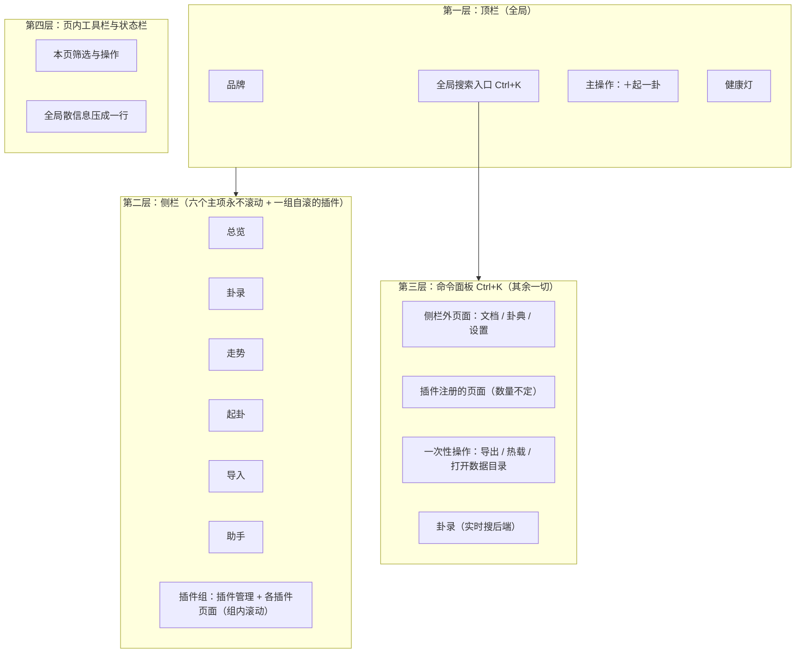
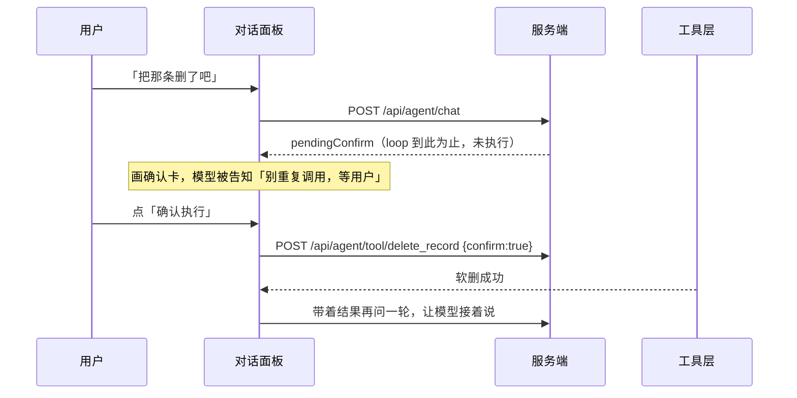

# 前端设计与交互规范

| 项 | 内容 |
|---|---|
| 文档编号 | 08 |
| 标题 | 前端设计与交互规范 |
| 版本 | 1.0 |
| 状态 | 已发布 |
| 适用产品版本 | v1.1.0 |
| 最后更新 | 2026-10-03 |
| 读者 | 前端工程师、界面设计者、维护者 |
| 关联文档 | [系统设计说明书](./01-系统设计说明书.md)　[架构与框图](./02-架构与框图.md)　[接口文档](./03-接口文档.md)　[插件与扩展开发指南](./12-插件与扩展开发指南.md)　[ADR-0012 界面无构建步骤](./adr/ADR-0012-界面无构建步骤.md) |

---

## 一、这份规范要解决的三个具体问题

界面第一版做完之后，暴露出三个问题。这份文档把它们写成硬规则，避免回退。

| 问题 | 症状 | 本规范的答案 |
|---|---|---|
| **信息密度不足** | 一屏看不到几条卦录；卡片内边距过大；字号偏大 | 密度基线一节给出**具体数值**，不是形容词 |
| **侧栏塞太多** | 侧栏堆了 11 项加 2 个插件页面，窗口矮一点就要滚动 | 侧栏常驻**只留六项**，且**永不出现滚动条**（有自动化断言守）；插件单起一组、**组内自己滚**；侧栏外页面临时占一格，切走即撤 |
| **滑动条成了兜底** | 新功能第一反应是「加到侧栏」，装不下就用滚动条解决 | 新入口走**命令面板**（Ctrl+K）与**页内工具栏**；侧栏不是收纳箱 |

一句话：

> **侧栏是「去哪」，不是「有什么」。** 主要去处在侧栏；其余一切——工具页、插件页、一次性操作——都归命令面板。

---

## 二、信息架构

### 2.1 导航的四层模型



### 2.2 入口归属规则

新增任何一个界面入口时，按顺序问自己：

1. **它是「日常必去」的一等去处吗？** 是 → 但侧栏**已经六项了**，必须挤掉一个或证明现有六项里有一个不再重要。**不得**因为「加一项也不多」而扩到七项。
2. **它是一组里的一个（比如第三个插件页面）？** 是 → 归**侧栏底部的插件组**（组内自滚）与命令面板（自动收录）；这一组只装插件相关的东西，别的入口不往这儿塞。
3. **它是一次性动作（导出、热载、打开目录）？** 是 → 归命令面板的「操作」分组。
4. **它是某一页内的筛选或局部操作？** 是 → 归**该页的工具栏**，不往上走。

**为什么插件单独一组、而且自己滚。** 插件页面是**用户数据**——装一个多一个，数量不由我们定。把它们混进那六个常驻主项，等于让第三方代码决定侧栏会不会出滚动条。所以侧栏底部单起一组（分隔线 + 「插件」组标 + 插件管理 + 各插件页面），组内的滚动容器自己滚（`max-height` + `overflow-y:auto`），`.side` 本身仍然 `overflow:hidden`。实现上它必须是**独立于 `.nav`** 的容器（`#nav-extra`）：`.nav a` 是「常驻主项」的几何口径，桌面自检按它数六项、量末项底边，混进去会把断言打成假红。

**另外：临时项。** 上面几条说的是「入口该不该常驻」。但从命令面板钻进一个侧栏外页面（文档／设置／卦典）之后，侧栏会显得「一片安静」——看不出自己在哪，也没有回去的路。所以侧栏会在常驻六项**下方**补一个**临时项**：虚线左边、带一个「临」字、高亮当前页，`title` 写明「离开这一页就消失」。它**不占常驻位**，切走即撤，所以「六项永不滚动」这条前提没被撑破。实现在 `web/app.js` 的 `tempNavEntry()`（`paintNav()` 里渲染），断言在桌面自检。**插件页面不走临时项**——它们在插件组里本来就有自己的一格，再补一个「临」项就是同一页两处入口。

### 2.3 当前归属表

| 入口 | 归属 | 理由 |
|---|---|---|
| 总览 / 卦录 / 走势 / 起卦 / 导入 / 助手 | 侧栏 | 日常六件事 |
| 卦条规范 | 并入「导入」页 + 命令面板 | 同一个解析器写着同样的规范，分开两处必然对不上 |
| 卦典 | 命令面板 + 更多浮层 | 低频参考；也可从卦录详情跳入 |
| 插件管理 | 侧栏插件组 + 命令面板 | 与插件页面同属一组，一眼能看到 |
| 插件注册的页面 | 侧栏插件组（组内自滚） + 命令面板（自动） | 数量不定，不能占常驻位、也不能撑破侧栏 |
| 打开数据目录 / 导出备份到… | 命令面板（桌面版专属） | 一次性动作 |
| 导出的两种格式 | 命令面板 + 总览页按钮 | 一次性动作 |
| 热载插件 | 命令面板 + 插件页按钮 | 一次性动作 |
| 卦录搜索 | 命令面板（后端实时搜） | 全局搜，不该只在卦录页可用 |
| 类别 / 吉凶 / 状态 / 排序筛选 | 卦录页工具栏 | 本页局部 |

---

## 三、布局系统

### 3.1 整体栅格

```text
┌──────────────────────────────────────────────────────────────────────────┐
│  顶栏  44px   問心卦 │ ⌘ 搜页面、操作、卦录… Ctrl K │ ＋起一卦 │ ●本地    │
├──────────┬───────────────────────────────────────────────────────────────┤
│ 侧栏     │  页头：页面标题 19px ＋ 副标题 11.5px                          │
│ 186px    ├───────────────────────────────────────────────────────────────┤
│          │  页内工具栏（sticky，含本页筛选与操作）                         │
│  ▸ 总览  ├───────────────────────────────────────────────────────────────┤
│  ▸ 卦录  │                                                               │
│  ▸ 走势  │  主区（max-width 1560px，padding 14/18/28）                    │
│  ▸ 起卦  │                                                               │
│  ▸ 导入  │  内容以 .grid 多列铺开                                        │
│  ▸ 助手  │                                                               │
│          │                                                               │
│  ⋯ 更多  │                                                               │
│  6卦 64典│                                                               │
├──────────┴───────────────────────────────────────────────────────────────┤
│  状态栏 24px  卦录 6 · 含校勘 5 · 插件 3 · 工具 12 · 助手未配置 │ v1.1.0 … │
└──────────────────────────────────────────────────────────────────────────┘
```

CSS 实现（`web/style.css`）：

```css
.app   { display: grid; grid-template-rows: var(--top-h) 1fr var(--status-h); height: 100vh; }
.shell { display: grid; grid-template-columns: var(--side-w) 1fr; min-height: 0; }
.side  { overflow: hidden; }   /* ← 侧栏永不滚动的实现手段 */
.main  { overflow-y: auto; }
```

**关键**：`body` 与 `.side` 都是 `overflow: hidden`，只有 `.main` 滚动。因此**页面上最多只有一条滚动条**，而且它在主内容区——用户看的是内容，不是导航。

### 3.2 尺寸令牌

改密度只需要改这几个变量：

| 令牌 | 值 | 含义 |
|---|---|---|
| `--top-h` | 42px | 顶栏高度 |
| `--status-h` | 22px | 状态栏高度 |
| `--side-w` | 182px | 侧栏宽度 |
| `--pad` | 9px | 卡片内边距基准 |
| `--gap` | 8px | 网格间距 |
| `--radius` | 9px | 卡片圆角 |
| `--radius-sm` | 6px | 按钮/输入框圆角 |

### 3.3 密度基线

**这张表是硬性下限，改小可以，改大要给出理由。**
（本轮按「一屏尽量多放」整体收紧过一档：字号、行高、内边距、间距同时压了约一成。收紧时只动这些量与 `--pad`／`--gap`，不动结构。）

| 项 | 值 |
|---|---|
| 正文字号 | 13px |
| 行高 | 1.55 |
| 卡片内边距 | `9px 11px`；紧凑卡片 `7px 10px` |
| 卡片下间距 | 8px |
| 网格间距 | 8px |
| 侧栏项内边距 | `5px 9px`；项间距 1px |
| 侧栏目测高度 | 六项约 6×27 = 162px，加上底部「更多」与摘要约 280px |
| 按钮高度 | 常规 26px，小号 22px |
| 输入框高度 | 常规 27px，工具栏内 25px |
| 工具栏内边距 | `5px 8px` |
| 表格单元格 | `2px 6px` |
| 名单单元格 | `2px 7px`（`table.kv-table`） |
| 列表行内边距 | `6px 10px` |
| 文本域最小高度 | 62px |
| 主区最大宽度 | 1560px |

### 3.4 网格列宽

| 类 | 最小列宽 | 用途 |
|---|---|---|
| `.grid.c2` | 300px | 卡片对 |
| `.grid.c3` | 210px | 三联 |
| `.grid.c4` | 140px | 四联分类 |
| `.grid.c5` | 112px | 指标条（总览页顶部八个统计） |
| `.grid.split` | `1.15fr / 1fr` | 主次两栏（最近卦录 + 分布） |

一律用 `grid-template-columns: repeat(auto-fit, minmax(Npx, 1fr))`，让窄窗口自动折行，而不是加横向滚动条。

---

## 四、设计令牌与视觉语言

### 4.1 颜色（两套主题同一批令牌）

设计语言：**宣纸水墨**（默认）／**夜读**（`<html data-theme="night">` 时启用）。
一套语言由四样东西定死：**材质**（纸片靠投影起、不靠描边）、**字体**（题用楷、文用宋、数用等宽）、
**色彩**（墨定调三级 + 朱砂只做点睛 + 吉凶语义色）、**控件**（小圆角签条与印章感）。
换主题只换令牌取值，**不许**在组件里写死颜色——`web/style.css` 里现无一处硬编码色值，自检守这条。

| 令牌 | 宣纸（默认） | 夜读 | 语义 |
|---|---|---|---|
| `--bg` | `#f3eee3` | `#0b0e13` | 页底（生宣／墨底） |
| `--surface` | `#fbf8f1` | `#13171f` | 卡片与面板（熟宣） |
| `--surface-2` | `#efe9db` | `#1a1f29` | 次级面：悬停、浮起、输入框底 |
| `--surface-3` | `#e6dcc7` | `#222835` | 代码块、内嵌块 |
| `--surface-4` | `#dbcfb4` | `#2b3241` | 按下、滚动条、进度槽 |
| `--ink` | `#1f1d19` | `#e9e3d6` | 正文（浓墨） |
| `--ink-2` | `#4b463d` | `#a79e8d` | 次级文字（次墨） |
| `--ink-3` | `#857c6c` | `#6f6759` | 说明文字（淡墨） |
| `--rule` / `--rule-2` | `#dbd1bd` / `#c3b598` | `#242b37` / `#35405280` | 墨线两级 |
| `--accent` / `-2` / `-3` | `#9e2b25` / `#b8433a` / `#7d1f1a` | `#c8553f` / `#e07a5f` / `#a83f2c` | **朱砂（印章）**：唯一的强调色 |
| `--good` / `--bad` / `--warn` / `--info` | `#3f7f63` / `#9e2b25` / `#a8763e` / `#4a6f9c` | `#4f9d78` / `#d8604a` / `#c9a227` / `#5b8cc7` | 吉／凶／平／中性 |
| `--tint-1` / `--tint-2` / `--tint-accent` | 墨与朱砂的极淡面 | 金与朱砂的透光 | 悬停面／选中面／强调底 |
| `--tint-good` `--tint-bad` `--tint-info` `--edge-good` `--edge-bad` | — | — | 语义色的面与描边 |
| `--lift` `--lift-hi` `--shadow-md` `--shadow-lg` | 暖调纸片投影 | 墨底黑投影 | 层次只靠投影，不靠描边 |
| `--mask` / `--on-accent` / `--grain` | `rgba(58,46,26,.32)` / `#fdfaf3` / `.05` | `rgba(6,8,12,.72)` / `#14100a` / `.03` | 遮罩／朱砂底上的字／纸纹强度 |

**颜色有语义，不许混用**——卦象三分法（与引擎的三分口径一致）：

| 角色 | 令牌 | 为什么 |
|---|---|---|
| 体卦／体爻 | `--ink`（墨） | 「自己」——浓墨是这套语言的底色 |
| 用卦／用爻 | `--info`（靛） | 「所问之事」——必须是另一个色相 |
| 动爻 | `--accent`（朱砂） | 「变动」——朱砂记变 |
| 吉／凶／平 | `--good` / `--bad` / `--warn` | 判词语义，与上面三个角色正交 |

> 这条三分法原本写的是「体必用金、用必用石青、动必用朱砂」。改成宣纸语言后金位被朱砂取代，
> 于是**体与动会撞成同一个红**——所以体改用墨。改配色时先看这张表，别只改一个令牌。
>
> 旧令牌名（`--ink-0…4`、`--gold*`、`--text*`、`--line*`、`--cinnabar*`、`--jade`、`--azure`）
> 已全部废弃并替换为语义名：背景类叫 `--bg`/`--surface*`，文字类叫 `--ink*`，线叫 `--rule*`。
> **旧名在代码里零残留**（改的时候用脚本做过校验）。


### 4.2 字体

| 用途 | 字族 | 说明 |
|---|---|---|
| 正文、卦名 | `--serif` | Noto Serif SC → 思源宋体 → 宋体 → Georgia（可读性最优） |
| 题、卡片标题、品牌字 | `--kai` | Kaiti SC → STKaiti → KaiTi 楷体（手写气，只用于「题」） |
| 数字、标签、状态栏 | `--sans` | Noto Sans SC → 微软雅黑 → Segoe UI |
| 代码、卦条、编号 | `--mono` | Cascadia Mono → Consolas；KPI 数字也走它（等宽对齐） |

**中文字距**：标题用 `letter-spacing: 2.2px`，侧栏项 1.2px，卦名 1.8px。字距是「卦象气质」的主要来源之一，不要为了塞更多字把它压到 0。

### 4.3 排版的取舍

- **断语正文用宋体、行高 1.85。** 断语是要「读」的，行高不能压。
- **界面控件用无衬线、行高 1.6。** 控件是要「扫」的。
- **数字一律用 `--sans` 或 `--mono`。** 宋体数字在小字号下发虚。

---

## 五、组件规范

### 5.1 卡片与标题

```html
<div class="card">
  <div class="card-title">最 近 卦 录<span class="sp"><a href="#/records">全部 →</a></span></div>
  …
</div>
```

- `.card-title` 自带 `◆` 前缀（6.5px 金色），标题字号 12px、字距 2.2px。
- 右侧附属内容必须放在 `<span class="sp">` 里——它负责 `margin-left: auto`。**不要**给 `.card-title` 加 `justify-content: space-between`，那会把标题文字挤到中间。
- 紧凑卡片用 `.card.tight`（内边距 9/12）。

### 5.2 指标条（`.stat`）

```html
<div class="stat"><div class="n">6</div><div class="l">卦 录 总 数</div></div>
```

数字 20px 金色，标签 10px 无衬线字距 1.6px。总览页顶部一排八个，用 `.grid.c5`。

**只放「算一算才知道」的指标。** 总数这类状态栏已经显示的信息不重复放——重复就是密度浪费。

### 5.3 卦录行（`.rec`）

三栏栅格 `76px 1fr auto`：左侧卦符与卦名（符号 23px），中间标题/所问/元信息三段，右侧标签。

```html
<div class="rec" data-id="…">
  <div class="viz"><div class="s">䷰</div><div class="n">泽火革</div></div>
  <div class="mid">
    <div class="t">心愿之占：…</div>
    <div class="q">所问原文…</div>
    <div class="m">时间　类别　互→变　体用　动爻　<b>谶…</b></div>
  </div>
  <div class="right"><span class="tag good">中吉</span><span class="tag neutral">待应验</span></div>
</div>
```

**一行卦录要在四个维度上同时可读**：是什么卦、问的什么、卦气怎么走、结论什么等级。这是信息密度的核心，不允许为了「清爽」砍掉其中任何一段。

### 5.4 六爻图（`.liuyao`）

自下而上六行，每行 `爻位 | 爻线 | 爻辞标题`。阳爻一整条、阴爻断开；**动爻用朱砂并有外发光**；体卦爻位标金色「体」、用卦标石青「用」。

### 5.5 体用条（`.tiyong-bar`）

三栏 `1fr auto 1fr`：体卦 / 生克关系 / 用卦；下面一行 `.op.split` 显示分项（如五行、旺衰）。窄屏（≤980px）折叠成单列。

### 5.6 谶语（`.sig`）

```html
<div class="sig">境有重压，暂宜低伏。待彼气衰，我可徐图。</div>
```

16px、字距 4px、居中、行高 1.9，带金红渐变底与左侧 `谶` 字标签。**这是页面上字号最大的一段文字**——它是这一卦的定调，视觉权重必须最高。

### 5.7 断语七段（`.tone-item`）

两栏 `40px 1fr`：左边一个字的标签（主/互/变/断/宜/忌/应期），右边正文。段间用虚线分隔。

- 标签列固定 40px、右侧有竖分隔线——七段的节奏感靠这个建立。
- `warn` 修饰的段落（忌）标签转朱砂色。
- `soft` 修饰的段落（通俗解）用 `--text-2`，与定调段拉开层次。

### 5.8 按钮（`.btn`）

| 修饰 | 用途 | 外观 |
|---|---|---|
| （默认） | 常规次要操作 | 墨底、描边 |
| `.primary` | 每屏**至多一个** | 金渐变、深色字、加粗 |
| `.ghost` | 低优先级、成组出现 | 透明底 |
| `.danger` | 删除类 | hover 才转朱砂 |
| `.sm` | 工具栏内 | 高 22px、字号 11.5px |

### 5.9 芯片（`.chip`）与标签（`.tag`）

- `.chip` 是**可点的筛选器**，`:hover` 变金、`.on` 是选中态（金底金边）。
- `.tag` 是**只读的状态标记**，四种语气：`good`（玉）/ `warn`（金）/ `bad`（朱砂）/ `neutral`。
- **两者不混用**：能点的是 chip，不能点的是 tag。

### 5.10 工具栏（`.toolbar`）

```css
.toolbar { position: sticky; top: -14px; z-index: 40; padding: 7px 10px; }
```

`top: -14px` 抵消 `.main` 的 14px 上内边距，使工具栏**吸顶时紧贴页头下沿**，不留缝。

工具栏内部用 `.tb-label`（11px 无衬线标签）、`.tb-sep`（1px 竖分隔）、`flex: 1` 的弹性空档把「筛选」与「计数/动作」推到两端。

### 5.11 状态栏（`.status`）

一行 10.5px 无衬线，`overflow: hidden` 且 `white-space: nowrap`，条目之间 12px 间距。左半是数据摘要（卦录、校勘、插件、工具、助手状态），右半是版本与数据目录。

**这是散信息的归宿。** 「数据在哪个目录」「结构版本多少」这类话不该占侧栏，也不该做成卡片，压成一行就够。

---

## 六、命令面板

### 6.1 定位

命令面板是**侧栏之外一切入口的家**，也是全局搜索。实现见 `web/palette.js`。

### 6.2 交互

| 操作 | 行为 |
|---|---|
| `Ctrl`/`⌘` + `K` | 开/关 |
| `/` | 在非输入框里按下时打开 |
| `↑` `↓` | 上下移动选中项 |
| `Enter` | 执行选中项 |
| `Esc` | 关闭（**绑在 window 上，焦点在哪都能关**） |
| 点击遮罩 | 关闭 |

### 6.3 结果四类

| 类型 | 来源 | 徽标 |
|---|---|---|
| 页面 | `meta.nav`（侧栏六项 + 侧栏外三项） | 页面 |
| 插件页面 | `meta.plugins.pages`（数量不定） | 插件页面 |
| 操作 | 内置动作表（导出、热载、打开目录…，桌面版多三项） | 操作 |
| 卦录 | `GET /api/records?q=` 实时搜，防抖 220ms | 卦录 |

### 6.4 匹配算法

`fuzzyScore(text, query)`：子序列匹配，连续命中额外加分，起始位置命中再加分，最后除以长度惩罚。

```js
score += 1 + streak * 2 + (at === 0 ? 3 : 0);
return score / (1 + t.length / 24);
```

- 空查询返回 1（全通过），无输入时展示前 9 条常用项。
- 输入后取前 12 条，再追加最多 6 条卦录结果。
- 标签匹配权重是 0.5 倍（标题比副标题重要）。

### 6.5 硬性要求

- **每一项都必须能一键到达**：页面点开就跳，操作点了就执行。
- **搜索必须覆盖插件页面**。否则插件一多，用户就找不到自己的页面了——这是第一版把插件页塞侧栏的根本原因。
- **卦录搜索走接口，不在前端过滤**。卦录可能上千条，前端过滤既慢又不全。

---

## 七、快捷键

| 快捷键 | 作用 | 备注 |
|---|---|---|
| `Ctrl`/`⌘` + `K` | 命令面板 | 全局 |
| `Ctrl`/`⌘` + `J` | 助手面板开/关 | 全局，任何页面都可用 |
| `Esc` | 收起助手面板 | 焦点在对话框里时不抢 |
| `/` | 命令面板 | 非输入框内 |
| `Esc` | 关面板 / 关浮层 | 全局 |
| `↑` `↓` | 面板内选择 | |
| `Enter` | 面板内执行 | |
| `Alt` + `1`…`6` | 直跳侧栏第 N 项 | 全局 |
| `Ctrl`/`⌘` + `N` | 起一卦 | 桌面版菜单 |
| `Ctrl`/`⌘` + `I` | 导入 | 桌面版菜单 |
| `Ctrl`/`⌘` + `T` | 走势 | 桌面版菜单 |
| `Ctrl`/`⌘` + `R` | 重载界面 | 桌面版菜单 |

---

## 八、页面清单与密度分配

| 路由 | 标题 | 主区结构 | 密度要点 |
|---|---|---|---|
| `#/` | 卦 录 总 览 | 指标条(c5, 8项) → split(最近卦录 \| 三个分布) → c3(类别/频次/谶语) → 起手之处 | 一屏内给出全局轮廓 |
| `#/records` | 卦 录 | 两条工具栏（搜索+类别 \| 吉凶+状态+排序） → 卦录行列表 | 筛选不占内容区高度 |
| `#/record/<id>` | 卦 录 · 详 情 | 工具栏 → split(全卦+断语 \| 通俗解+原文+复盘) | 断语七段在首屏 |
| `#/trend` | 走 势 | 模式段 → 领域芯片 → 平滑/横轴选项 → 图表 → 起落表 | 所有开关在一行里 |
| `#/cast` | 起 卦 台 | `分栏 330px \| 右`：左参数表单，右即时预览 | 预览 sticky 跟随；**不预填任何属于用户的值** |
| `#/import` | 导 入 与 格 式 | 粘贴区 → 解析结果块 → 卦条模板 / 字段字典 / 版本迁移 / 命令行与 Agent | **录入与规范的唯一去处**：解析框本身就是校验（每块内联字段编辑） |
| `#/agent` | AI 助 手 | split(模型设置+工具 \| 对话) | 设置与对话同屏 |
| `#/docs` | 文 档 | `左目录 264px \| 右正文`：按组列随包文档，右侧渲染 Markdown | 文档与设置分家；正文不再限高 |
| `#/docs/<id>` | 文 档 · 深链 | 同上，直接翻开某一篇 | 桌面菜单「帮助」指向这里 |
| `#/dian` | 卦 典 | 搜索 + 64 卦网格 | 网格自动折行 |
| `#/dian/<id>` | 卦 典 · 详 情 | 工具栏（上下卦切换）→ 卦德 / 卦辞 / 大象 / 六爻爻辞 | |
| `#/plugins` | 插 件 | 插件卡片列表 + 写插件说明 | |
| `#/plugin/<pid>/<page>` | 插 件 页 面 | 工具栏（返回）→ 插件返回的 HTML | 插件自己决定内部密度 |
| `#/settings` | 设 置 | 权限四档卡 → 模型状态 → 数据 → 文档入口 | 一页把该配的配完 |

---

## 八·B、起卦台与导入页的两条纪律

### 8B.1 起卦台不替用户预填

**报数、本卦、动爻一律留空。** 这三样是「起卦的人」的：

- 预填一个数（哪怕是上一卦的），等于**替人起卦**——卦会算到别人身上，而且用户看不出来。
- `collect()` 缺什么就抛什么，由界面渲染成中性提示（**不是红色报错**），列出缺哪几项。
- 时间与地点不是「用户的选择」而是「他此刻在哪」：`localTime` 默认此刻、地点取设置里的默认值，
  但**设置里没配过就留空**，不写死一个「兰州 103.83」。
- 报数栏旁边必须有一句解释，说明为什么不预填——用户看到空栏会以为是 bug，得告诉他这是有意的。

守这条的断言：报数/本卦/动爻栏的 `value` 必须为空、动爻不得有 `selected`、报数栏旁必须有那句解释。

### 8B.2 录入与规范合成一处

这条规矩本身也返工过一次，两次返工都值得记下来：

1. 第一版：导入页自带一份格式与模板，「格式」页又有一份，帮助里还有第三份（`docs/规范.md`）——**渲染代码两处、改一处忘一处**。当时的答案是「导入页只留一行指路，规范归格式页」。
2. 第二版（现在）：指路也是个多余入口——同一个解析器读的就是这份规范，用户在导入页粘错一次就要跳到另一页去看字段名。于是**「格式」页整页并入导入页**：解析框本身就是校验（它调的就是 `POST /api/validate`），不需要第二个校验框。

| 页 | 职责 |
|---|---|
| `#/import` | **录入与规范的唯一去处**：粘贴 → 解析 → 复核 → 入库；下面依次是卦条模板（复制／载入粘贴框／下载）、全部字段别名字典与必填规则、卦录 JSON 的版本与迁移、命令行与 Agent 用法 |
| `#/spec` | **已撤销**，只在 `parseHash()` 里留一次转发到 `#/import`（桌面菜单、书签与旧文档可能还指着它） |
| `#/docs` | 目录里留一个「格式规范（卦条 v1）」的入口，点它是**跳到 `#/import`**，不再单列一份 Markdown |

另外提供「✦ 让助手来录」：把粘贴框里的整段交给助手，让它整理成卦条、逐条核对、认不准就问。这条走的是与助手面板**同一条通路**。

---

## 八·C、助手面板与轨迹

**范式取自 IDE 里的 agent 面板（Trae／Qoder／Codex）：对话是侧边一栏，主区永远是产物本身**——这里就是卦。所以助手只有**一处**入口：右侧那个常驻面板。它的三条性质：

- **停靠，不是弹层。** 打开时给 `.app` 让出宽度（`padding-right: var(--panel-w)`），主区自适应收窄，而不是被盖住；`< 1080px` 时退回覆盖式，免得主区被挤成一条缝。
- **常驻，切页不消失。** 它挂在 `.app` 之外，`#main` 重绘碰不到它；换页时主区变、对话留着。
- **默认开着**，可收起、可拖宽（`--panel-w` 一个变量贯穿），开合与宽度记在 localStorage。

**为什么不再内嵌在 `#/agent` 页里**：同一份对话有两个入口，「侧栏那个还不够吗」是必然的困惑。「助手」页因此收敛为**纯配置**（模型 / 联网 / 工具 / MCP）。

### 8C.1 面板

| 项 | 约定 |
|---|---|
| 唤起 | 顶栏「✦ 助手」按钮，或 `Ctrl`/`⌘` + `J` |
| 收起 | 再按一次、点 `✕`、或 `Esc` |
| 宽 | `--panel-w`，clamp 300–640px，默认 380；可拖左缘调整，宽度记在 localStorage |
| 停靠 | `body.agent-open` 时 `.app` 补 `padding-right: var(--panel-w)`；`< 1080px` 退回覆盖式 |
| 头部 | 会话下拉（`data/chats/` 里的历史会话）+ 新建 / 重命名 / 删除 + 附件 + 设置 + 收起 |
| 内容 | 对话面板（会话落盘在服务端，见 8C.3）、脚注（会话 id / 权限 / 模型 / 工具数） |
| 开合 | 默认开；顶栏按钮或 `Ctrl`/`⌘`+`J` 切换；`Esc` 收起（焦点在输入框时不抢） |
| 状态 | 模块级，切页不丢；**「助手」页不再内嵌对话**，全应用只有这一处对话框 |

### 8C.1.1 顶栏两枚常驻 chip：上下文占用 / 厂商余额

头部在会话下拉与 `📎`／`设置`／`收起` 之间常驻两枚紧凑 chip（`web/index.html` 的 `#ap-chips`，由 `web/app.js` 的 `paintPanelChips()` 填）。**为什么常驻在这里**：它们回答的是「这一轮还发得出去吗」「这个月还有没有钱」——是**发消息之前**就要看一眼的即时信息，藏进「设置」页等于每次多点两下；而它们又不是设置项，所以不放进设置。

| chip | 文字 | `title`（悬停详情） | 点击 |
|---|---|---|---|
| 上下文占用 | `◔ 19%`；窗口未知（`contextWindow === 0`）时只显示 `◔ 12.3k`，**不显示百分比** | 「上下文 12.3k / 1M · 本轮 prompt 12345 tokens」；超 80% 追加「该开新会话了」 | 只是说明（弹一句 toast 解释口径），不改变任何状态 |
| 厂商余额 | 支持时 `¥110.00`；不支持余额接口的厂商显示 `余额 —` | 支持时列赠金／充值／合计与查询时间；不支持时提示去控制台 | 支持时**点击即刷新**（绕服务端 60 秒缓存）；不支持时 `window.open(console)` 打开控制台 |

**阈值配色**（只用主题令牌，不许写死）：上下文占用超 **80%** 用 `--warn` 着色（`.ap-chip.warn`），超 **95%** 用 `--bad`（`.ap-chip.bad`）；余额不可用（`isAvailable === false`）也走 `--warn`。其余时候是中性面（`--surface-2` / `--rule-2` / `--ink-2`）。

**刷新节律**：打开面板查一次余额，之后**每 5 分钟**自动刷一次；**面板收起或页面隐藏（`visibilitychange`）时停掉定时器**——后台页面不该继续打厂商接口。上下文占用不需要定时器：它随每一轮对话的 `usage` 更新。

**上下文 chip 显示什么（被用户当场问出来的取舍）**：主显**绝对量**（`◔ 31.3k`），占比做副显（`1.2%`，<10% 保留一位小数），完整的「占多少 / 窗口多大」进 `title`。原因是窗口可能很大——1M 窗口下一轮只涨一两千 token，**取整的百分比会连着好几轮停在同一个数**，看起来像"卡住了"，其实是刻度太粗。配色仍按百分比：>80% 转 `--warn` 并附「该开新会话了」，>95% 转 `--bad`。

**用量取哪个数**：取服务端 `usage.contextTokens`（**最后一轮**的 prompt tokens＝真实的当前上下文），读不到才退回 `usage.prompt_tokens`——后者是一个请求内**逐轮累加**的和（带两三个工具调用就会滚成好几倍），只能用于算账，不能当上下文占用。

**换会话／清屏要清零**：`openSession()` / `newSession()` / `deleteSession()` / `resetChat()` 都会把 `state.usage` 置空，chip 回到 `◔ —`，跑完下一轮再有值。否则换到另一段会话后顶栏还挂着上一段的占比（用户看到的是「怎么换了会话还是 3%」）。

### 8C.2 轨迹：让「AI 做了什么」看得见

循环回吐的事件流（`round` / `thinking` / `tool` / `confirm`）在界面上画成三段式：

```text
✻ 思考 · 1.2s            ← 推理模型的思维链（kind=reason），可展开
✻ 说明 · 0.4s            ← 调工具前模型交代的那句话（kind=remark）
⚙ 起卦  cast      184ms  ← 工具卡片，点一下展开「参数 / 结果」
⚠ 需要你确认             ← 破坏性操作停在这里，两个按钮
  ↳ 把卦录「xxx」移入回收目录（可恢复，不是彻底删除）
```

`thinking` 分两种名头：**思考**（`kind: 'reason'`，推理模型自己的思维链）与**说明**（`kind: 'remark'`，调工具前的交代）。混成一个「思考」会让人分不清哪段是模型想的、哪段是它打算做的。

| 组件 | 类名 | 要点 |
|---|---|---|
| 思考块／说明块 | `.trace-think`（思维链另加 `.reason`） | 金色左边框；`.open` 才展开；请求中用 `.pending` 走一条扫光条 |
| 工具卡 | `.trace-tool` | 左边框按结果着色（玉=成功 / 朱砂=失败 / 金=权限不足）；头部可折叠 |
| 待确认卡 | `.trace-confirm` | 金边；必须有两个按钮，不允许只给一个「确定」 |
| 用量脚注 | `.trace-usage` | 右对齐的 token / 轮次 / 模式 |

**为什么用卡片而不是一行摘要**：出错时第一眼要能看到**是哪一步、哪个工具、什么参数**。一行字做不到这件事。

### 8C.2.1 过程是流式的：边跑边显示

早先一轮对话是「一次 POST、跑完一次性返回」：等待期间只有一行静态的「思考中…」，思考卡、工具卡、回答**最后一起蹦出来**——用户看不到「它在想、它在查、它查到了」。现在分两段接：

| 段 | 做法 |
|---|---|
| 服务端 | `POST /api/agent/chat` 带 `stream: true` → 响应用 `application/x-ndjson`，把 `runAgent({ onEvent })` 的每条事件即时 `res.write` 出去；跑完最后一行 `{"type":"done",…}`（载荷与非流式**完全一致**，所以两种模式共用同一套收尾逻辑） |
| 界面 | `fetch` + `response.body.getReader()` 逐块读，`splitNdjson()` 切行（**半行留到下一块**：一个中文字、一行 JSON 都可能被劈开），每条事件交给 `foldEvent()` 折成临时条目 → 重画 |

`foldEvent()` 刻意与 `loop.entriesFromEvents()` 一一对应（思考→thinking、工具→tool、回答→assistant），所以跑完用权威 trace 顶掉临时条目时**画面是连续的**，不会闪一下。

三处「让人看见它在动」的细节：

- **占位行说清在干什么**：`正在唤醒…` → `正在思考…` / `正在调用 cast…` / `正在想下一步…` / `正在收尾…`，右侧是**秒表**（只改那一处文字，不整块重画）。
- **正在调用的工具卡先占一格**：虚线边 + 扫光 + 「调用中…」，回来后**就地**补上耗时与结果（`.trace-tool.run` → `.trace-tool.ok/bad`）。
- **正在想的那条思考自动摊开**：跑的时候把最新一条 `.trace-think` 打开，让人看得见思维链；这一轮结束就回到默认折叠，不会占满一屏。

**降级**：服务端若回的不是 NDJSON（旧服务、被代理改写），`streamChat()` 退回整包解析，行为与从前一致——流式只是把过程提前显示，**不是新的一条数据通路**。

**思维链默认折叠，另给一个「展开全部思考」按钮。** 面板的密度靠折叠撑着：一屏里卦与轨迹都要看得见，所以 `.trace-think` 的正文默认收起，只留一行「✻ 思考 1.2s」。但**回看时必须能一眼铺开**——面板头有 `[data-chat-think]` 按钮，一键展开/收起当前这批条目里的全部思维链（`thinkOpen` 存在面板实例里，重绘后自动重新套上；单个条目仍可单独点开）。

**半句话与空回复必须自己说出来。** 这两类早先是静默的，用户只看到半段话或一行 token 统计，会以为程序坏了：

| 症状 | 数据从哪来 | 界面怎么说 |
|---|---|---|
| 这一轮是半句话 | 服务端 `finish_reason === 'length'` → trace 里那条 assistant 带 `truncated: true` | 回答气泡下面贴一条 `.cut-note`：「被服务商的 max_tokens 截断了……到「助手」页把「单次回复上限」调大或置 0」 |
| 这一轮一个字没写 | `entriesFromEvents` **照样收一条空 assistant**（早先空回复直接不收，整轮只剩用量脚注） | `.msg.empty-reply`：列出三种常见原因（模型名/密钥、只出了思维链没写正文），并指向「助手」页的模型名与上限 |

配套的两处服务端改动：`max_tokens` 只在显式给了**正数**时才发（默认交给服务商），以及 `finish_reason` 从 `hermes/protocols.mjs` 的 `parse()` 一路留到 trace。

### 8C.3 会话

对话不再只是内存里的一段：它落盘在 `data/chats/`，一段会话一个 JSON，可在面板顶上的下拉里切换、重命名、删除（删除进 `data/trash/`）。

| 项 | 约定 |
|---|---|
| id | 与卦录同形（`YYYYMMDDHHmm-序号`），按时间可排序、人一眼认得出是哪天聊的 |
| 落盘位置 | **服务端**。只有它握着未截断的工具结果；界面拿到的事件流是切到 4000 字符的 |
| 双存 | `trace` 给界面画轨迹（沿用 4000 截断）；`messages` 是模型侧消息、**存完整值**（含成对的 `tool_calls` 与 `tool` 结果），按轮追加**增量且含当轮用户消息**——下一轮的历史就由服务端从这份存档重建（`ChatStore.historyFor`），界面只送本轮这一句 |
| 面板脚注的用量行 | 写「共 N tokens · K 轮 · 本轮调了工具（原生）／本轮未调工具 · 协议 openai-native · 历史 存档／由轨迹重塑／仅界面文本 · 权限 全权」。**不写 `plain`、`store` 这种原始枚举**：前者说的是「这一轮没调工具」，会被读成「工具能力被关了」；后者要让人一眼看出模型这轮到底看没看到工具结果 |
| 文档页 | 正文由 `renderMarkdown` 现算。渲染器有一条**硬规矩：任何分支都不许空转**——一行以 `|` 开头但不是表格（表头后缺 `|---|`）曾让段落分支一条不吃、下标不动，于是文档页永远停在「载入中…」并吃满内存，整个窗口卡死。自检里有一项把**每一篇随包文档**都渲染一遍并计时，就守这条 |
| 轨迹卡片不许被压扁 | `.chat-log` 是 flex 竖列 + 滚动的日志，它的**直接子项一律 `flex: none`**。这不是排版洁癖：flex 子项的自动最小高度在它自身 `overflow` 不是 `visible` 时会退化成 0，而 `.trace-think`／`.trace-tool` 都写了 `overflow: hidden`——内容一多，它们就被压成几像素的窄条、正文被裁光，**日志还不再滚动**（`scrollHeight === clientHeight`）。症状正是用户报的「没有思考过程的动画」「点展开全部思考也没反应」。真实几何只有真窗口能量，所以 `check-desktop.mjs` 会往日志里塞一组卡片、量高度与能否滚动 |
| 跑着的时候切会话 | 允许切（下拉不锁），但**本轮结果按会话 id 认领**：`send()` 开头记住 `sid`，收尾时若 `state.sessionId !== sid`，就把当前会话的显示恢复成它自己的存档、不把本轮的思考与工具卡画到别人身上——否则新会话的对话流里会冒出一段别人家的轨迹（「串台」）。报错同理，不进别人的流 |
| 建会话时机 | 真的说了第一句话才建，不在打开面板时建——否则 `data/chats/` 会攒一堆空壳 |
| 附件 | 只存不解析（`data/chats/<id>/files/`）；文本类的发送时读出来内联进提示词 |

### 8C.4 破坏性操作的确认流

确认不是装饰，它有一条完整的往返：



### 8C.4 命令面板兼作自然语言入口

在命令面板里输入任何一句话，**第一条结果永远是「问助手：<原话>」**——搜不到就走对话。这样「像搜索引擎一样」这件事在同一个输入框里完成，不需要用户先想清楚该搜还是该问。

### 8C.5 设置页

| 区块 | 内容 | 交互约定 |
|---|---|---|
| 助手权限 | 四档卡片（只读/可写/可删/全权），每档标出可用工具数 | **点一下即存**，没有「保存」按钮——这一档改的是「助手现在能做什么」，越直接越好。提到「可删」「全权」要过一次确认弹窗 |
| 模型 | 服务商/模型/接口/协议/密钥状态 + 测连通 | 改模型仍回 `#/agent`，不在这儿重复一份表单 |
| 数据 | 数据目录、位置类型、卦录数 + 打开目录/导出/更换/回收站 | 桌面版专属按钮只在桌面版出现 |
| 帮助 | 随包文档直接读（9 篇） | **外链先问再开**：弹一个卡片显示完整 URL，给「用浏览器打开」「只复制网址」两个选择 |

**帮助为什么要内嵌**：文档就在程序里，让人去文件管理器里翻 README 是白费一道手续。但内嵌带来一个新风险——本地文档里的外链会把人带走，所以外链一律先问。

---

## 八·D、走势：横轴落在哪天，线按什么分

这一页的默认值本身就是一条设计决定：**默认「领域运势 + 应验那天」**。

### 8D.1 为什么默认不是「起卦那天」

一批卦里，长期之事和当下之事若都落在起卦那一点上，图是没用的——
实测里六条卦按起卦时间看的跨度是 **0.03 天**（都在同一个凌晨），
切到应验时间就成了 **265 天**。所以默认落在应验那天。

「起卦那天」仍然留着，一键可切。它回答的是另一个问题：**我当时都问了什么**。

| 轴 | 落在 | 回答的问题 |
|---|---|---|
| 起卦那天 | `cast.localTime` | 我当时都问了什么 |
| 应验那天 | `yingqi.to` | 这些事什么时候见分晓 |

缺 `yingqi` 的卦**退回按起卦时间放，不会被丢掉**；退回了几条写在标题右侧，不藏着。

### 8D.2 为什么按领域分别成线

「每次算的卦如果是不同领域，其实就是不同的运势线」——所以 `mode=domain` 一个领域一条线：

- 线名带卦数：`考研学业（3 卦）`——让人一眼知道这条线有几条卦撑着，**一条卦的线不敢信**；
- 同领域多卦用**时间衰减加权的累计均值**综合（半衰期 90 天）：既记得旧事，又跟得上近况；
- 另加一条虚线「全体基准」作对照：某条线在它之上则该领域偏顺；
- 每卦相对本领域基准的**偏离**在返回值 `deviations` 里——同领域内偏得越多的那一卦越值得回头看。

### 8D.3 应期不是一拍脑袋

应期的**量化**与断语里「应期」那一段**同一套规矩**（`core/yingqi.mjs`）：
动爻之位定时段 → 体气得令则提前一档、未得令则**待其得令之月** → 生克与卦数作乘性微调，
**且受「得令之月」这个天花板约束**。

为什么要有天花板：否则同一卦会出现详情页说「须待巳午月」、走势图却画到七月的局面。
`check.mjs` 有一条断言逐条比对「量化上限不越过得令之月」。

界面上要摊开 `reason`（一段人话说明怎么算出来的）。**一个算不出理由的应期，和随口一说没区别。**

---

## 九、状态与空态

| 状态 | 表现 |
|---|---|
| 加载中 | 主区居中显示 `☯ 载入中…`（`.empty`） |
| 服务连不上 | 主区显示红色卡片「无法连接本地服务」，带错误信息 |
| 渲染出错 | 红色卡片「出错了」，带 `err.message` 与一句排查提示 |
| 空列表 | 居中符号 + 一句说明 + 一句下一步建议（如「去起卦台起第一卦」） |
| 空搜索 | 「没有符合条件的卦录。试试清掉几个筛选条件。」 |
| 面板无匹配 | 「没有匹配。试试『起卦』『导出』『卦典』，或直接输卦录标题。」 |

**空态必须给出下一步**，不能只说「暂无数据」。

---

## 十、响应式

| 断点 | 变化 |
|---|---|
| ≤1180px | `.grid.split` 折成单列 |
| ≤980px | 起卦台折成单列、预览不再 sticky、体用条折成单列 |
| ≤820px | 侧栏转为横向顶栏（`overflow-x: auto`）、侧栏摘要隐藏、卦录行折成两行 |

**桌面版最小窗口 900×600**（`desktop/main.mjs` 的 `minWidth`/`minHeight`）。在 900px 宽下，侧栏横排也不该出现滚动条——六项横排在 900px 里绰绰有余。

---

## 十一、键盘可达与可访问性

- 命令面板是完整的键盘通路：`Ctrl+K` → 输入 → `↑↓` → `Enter`。**所有功能都能不开鼠标到达。**
- 交互元素一律用原生 `<button>` / `<a>`，不用 `div` 假装按钮。
- 卡片标题用 `<h1>`（页头）与 `.card-title`（块标题）；页头每页恰一个 `<h1>`。
- 面板有 `role="dialog"` 与 `aria-label`。
- 颜色不是唯一信息载体：吉凶既用颜色也用文字标签。

---

## 十二、反模式（明确禁止）

| 禁止 | 原因 | 正确做法 |
|---|---|---|
| 往侧栏加第七项 | 侧栏一旦开始滚动，导航就退化成列表 | 归命令面板；或挤掉一个现有项 |
| 用侧栏滚动条解决装不下 | 「滑动条不是最终的归宿」 | 收缩为六项 + 溢出到面板 |
| 页面专属筛选放侧栏 | 侧栏是全局的，不该随页面变形 | 放该页工具栏 |
| 卡片内边距大于 14px | 直接吃掉信息密度 | 用令牌 `--pad` |
| 给 `.card-title` 加 `justify-content: space-between` | 会把标题挤到中间 | 用 `.sp { margin-left: auto }` |
| 在总览页重复状态栏已有的数字 | 重复即浪费 | 只放需计算的指标 |
| 主区用横向滚动 | 横向滚动等于丢内容 | 用 `auto-fit` 自动折行 |
| 一屏多个 `.primary` 按钮 | 主次不分 | 一屏至多一个 |
| 把 `.chip` 当只读标记用 | 可点的和只读的必须能一眼区分 | 只读用 `.tag` |
| 空态只写「暂无数据」 | 用户不知道下一步 | 附一句下一步建议 |
| 为塞内容把中文字距压到 0 | 丢掉卦象气质 | 保持 1.2–2.2px |

---

## 十三、验收：怎么判断改坏了

### 13.1 自动化断言（`node tools/check-desktop.mjs`）

这两条直接守着本节开头说的那三个问题，改坏了会立刻红：

| 断言 | 守什么 |
|---|---|
| **侧栏＝六项常驻主项 + 自带滚动的插件组**（临时项不计） | 防止入口膨胀；插件组必须独立于 `.nav`，且组内容器自带 `overflow-y:auto` |
| **侧栏不出现滚动条（`scrollHeight - clientHeight <= 1`，且底部元素底边不越过侧栏底边）** | 防止「用滚动条兜底」；插件再多也只滚组内 |
| 侧栏六项一屏放得下（末项底边在侧栏底边之上） | 同上 |
| 侧栏外页面对应一个临时项且高亮／离开即消失；插件页改在插件组里高亮、不补「临」项 | 临时项不能变成第七个常驻项，同一页也不许两处入口 |
| 顶栏齐备（品牌 / 搜索 / 起卦 / 健康灯） | 防止顶栏被删 |
| 底部状态栏齐备且非空 | 防止散信息回流侧栏 |
| 命令面板能打开并列出结果 | 面板可用 |
| 命令面板搜得到「格式」「文档」「卦典」「插件」 | 侧栏外入口没有丢 |
| 命令面板能搜到卦录 | 全局搜可用 |
| 按 `Esc` 能关掉命令面板 | 键盘可达 |

### 13.2 接口与约定（`node tools/check-web.mjs`）

| 断言 | 说明 |
|---|---|
| 侧栏常驻主项恰好六项（临时项不计） | 结构前提 |
| 侧栏主项都带路径、图标、说明 | 不可残缺 |
| 侧栏主项不含格式/卦典/插件管理（格式已并入导入，插件在侧栏插件组） | 归属规则 |
| 非侧栏入口仍有至少三项 | 没有因收缩而丢功能 |
| `meta.nav` 合并了侧栏与侧栏外入口 | 命令面板数据源完整 |
| 模糊匹配三条行为 | 空查询全通过 / 不相干返回 0 / 连续片段得分更高 |
| 逐条路由渲染无 `undefined` / `NaN` / `[object Object]` | 密度改造不留拼装错误 |

### 13.3 人工检查

发布前用 `desktop/dist/win-unpacked/问心卦.exe --shot=<png>` 截图，逐项确认：

- [ ] 1280×800 窗口下，总览页**无需滚动**即可看到指标条、最近卦录前三条、至少两个分布图
- [ ] 侧栏在 900×600 的最小窗口下**也没有滚动条**
- [ ] 卦录页一屏能看到 **6 条以上**卦录
- [ ] 卦录详情首屏能看到完整的谶语与七段断语的开头
- [ ] `Ctrl+K` 面板里搜「格式」（命中并入后的「导入与格式」）「卦典」「插件」「起卦」都能命中
- [ ] 状态栏在窄窗口下不换行、不溢出
- [ ] 页内工具栏吸顶时与页头之间没有缝隙

---

## 十四、演进

按价值排序，尚未实现：

1. **虚拟滚动**：卦录上千条时列表会变慢，需要窗口化渲染。
2. **工具栏的筛选状态进 URL**：现在刷新页面筛选会丢。
3. **主题**：宣纸（默认）与夜读两套已落地，同一批令牌、两组取值；切主题只切 `<html data-theme>`。**新增组件不许写死颜色**——写死一处，另一套主题就破一处。
4. **命令面板的历史与固定项**：常用的排前面。
5. **高对比度模式**与 `prefers-reduced-motion` 支持。
6. **打印样式**：目前导出靠 Markdown 与卦签，没有 A4 打印版式。

---

## 十五、相关

- [系统设计说明书](./01-系统设计说明书.md) —— 界面层在整体中的位置
- [接口文档](./03-接口文档.md) —— `meta.nav`、`/api/records?q=`、`/api/plugins/*/page/*`
- [插件与扩展开发指南](./12-插件与扩展开发指南.md) —— 插件页面如何进入命令面板
- [ADR-0012 界面无构建步骤](./adr/ADR-0012-界面无构建步骤.md) —— 为什么没有打包器
- [术语表](./13-术语表.md)
