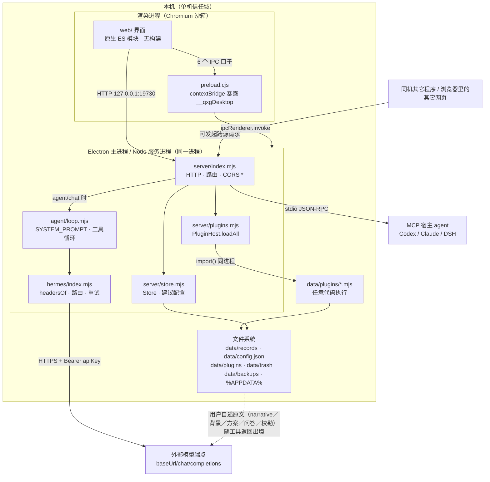
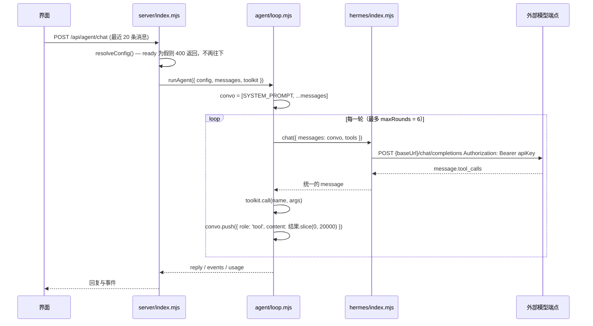

# 问心卦 · 安全与隐私设计

| 项目 | 内容 |
|---|---|
| 文档编号 | 11 |
| 标题 | 问心卦 · 安全与隐私设计 |
| 版本 | 1.0 |
| 状态 | 已发布 |
| 适用产品版本 | v1.6.0 |
| 最后更新 | 2026-10-07 |
| 读者 | 使用者、维护者、评审者、集成方、AI 工程师 |
| 关联文档 | [文档索引](./00-文档索引.md)、[系统设计说明书](./01-系统设计说明书.md)、[架构与框图](./02-架构与框图.md)、[接口文档](./03-接口文档.md)、[接口控制文档 ICD](./04-接口控制文档-ICD.md)、[Agent 设计文档](./05-Agent设计文档.md)、[Hermes 网关与路由设计](./06-Hermes网关与路由设计.md)、[数据模型与存储设计](./07-数据模型与存储设计.md)、[部署与运维手册](./10-部署与运维手册.md)、[插件与扩展开发指南](./12-插件与扩展开发指南.md)、[13 术语表](./13-术语表.md)、[规范.md](./规范.md)、[adr/](./adr/README.md) |

---

## 一、安全目标与信任模型

### 1.1 先讲清前提：这不是云服务

「问心卦」是**单机、零依赖、长期使用**的本地程序：一个本地 HTTP 服务 + 一份网页界面（[系统设计说明书](./01-系统设计说明书.md) 第 1 章）。桌面版把服务内嵌进 Electron 主进程，与命令行版共用同一份内核。它**没有**账号、**没有**登录、**没有**服务端、**没有**云同步、**没有**遥测与版本回传（ADR-0006）。

这个前提决定了威胁模型与云服务完全相反：

| 维度 | 云服务 | 问心卦 |
|---|---|---|
| 数据存放 | 服务商机房 | 用户自己的磁盘（`data/` 或 `%APPDATA%\问心卦\data`） |
| 主要威胁 | 越权访问、服务端拖库、传输窃听 | 同机其它程序、浏览器里的其它网页、恶意插件、用户自己把数据放错地方 |
| 身份与权限 | 账号体系、RBAC、多租户隔离 | 无身份概念，权限即操作系统对当前用户的权限 |
| 网络边界 | 全互联网可达，必须假设对手在线 | 默认只听 `127.0.0.1`，不出网 |
| 失败的后果 | 一批用户的数据同时泄露 | 只有这一台机器上这一个用户的数据 |
| 加密的意义 | 传输与静态加密是必需项 | 加密不解决这里的首要问题——首要问题是**同机进程**与**误放位置** |

因此本文不讨论 TLS、WAF、会话令牌、多租户隔离这类云侧课题；它们在本项目里没有对应物。本文只回答三件事：**数据在磁盘上受谁保护、什么情况下会离开这台机器、以及哪些风险是刻意接受而未防的。**

### 1.2 安全目标（按优先级）

| 编号 | 目标 | 可验证的判据 |
|---|---|---|
| SG-1 | 卦录（含私人原文）默认只留在本机 | 未配置 AI 助手时，进程不发起任何外部 HTTP 请求（唯一例外是版本更新检测，它不带任何用户数据且可在设置里关掉，见 §6.3.3；此外用户点「下 载 新 版」会下载一次安装包，见 §6.3.3.1，同样不带走任何本机数据）；HTTP 服务监听 `127.0.0.1` |
| SG-2 | 数据不因程序自身动作而丢失 | 迁移前自动备份到 `data/backups/pre-migration/`；删除默认只移入 `data/trash/` |
| SG-3 | API Key 不经对外接口回显 | `GET /api/agent/config` 与 `POST /api/agent/config` 的响应里 `apiKey` 为 `undefined`，只给 `apiKeySet` 布尔值 |
| SG-4 | 界面层不得直接取得 Node 能力 | 桌面版 `contextIsolation: true`、`nodeIntegration: false`，渲染进程只能走 preload 暴露的固定口子 |
| SG-5 | 外发内容可被使用者预期与关闭 | 默认不出网；自动出网只有四条路径——用户显式配置的模型端点（含对话内容）、受控联网工具 `fetch_url`（每次确认）、厂商余额查询（只带 Key，**不含任何对话内容**，见 §6.3.2）、**版本更新检测**（只发一个 GET，不带任何本机数据，设置里一键关闭，见 §6.3.3）。清空 Key 或改用本地端点即不出模型这条路径。此外还有一条**只在用户点击时**发生的出网：下载新版安装包（见 §6.3.3.1），它不点不发生 |
| SG-6 | 数据格式不依赖本程序 | 一个卦录一个 UTF-8 JSON 文件，可直接读、直接备份（ADR-0002） |

### 1.3 信任模型

**信任的**：本机操作系统与当前用户账户；用户自己放进 `data/plugins/` 并读过的插件代码；用户自己填进配置的模型端点。

**不信任的**：

- 同机上以其它用户身份运行的程序——它们读不到 `data/`（受文件系统权限保护）；
- **同机上以同一用户身份运行的任何程序**——它们与问心卦权限相同，能读 `data/config.json`、能读写卦录、能调用本地接口。这是单机模型的根本边界，本文不试图跨越它；
- 用户浏览器里打开的**任意网页**——服务带 `Access-Control-Allow-Origin: *`（见第 4 章 T-02）；
- 未读过的第三方插件；
- 外部模型端点本身（数据一旦发出，其留存与使用由对方政策决定）。

**边界之外、明确不设防的**：拥有本机管理员权限的攻击者、物理接触磁盘的人、键盘记录器、已失陷的操作系统。

### 1.4 与 ADR 的关系

| ADR | 本文如何引用 |
|---|---|
| [ADR-0006 本地优先、默认不出网](./adr/ADR-0006-本地优先默认不出网.md) | 出网范围与默认值的设计依据；本文第 5 章给出可操作规范 |
| [ADR-0007 插件用文件模块](./adr/ADR-0007-插件用文件模块.md) | 插件任意代码执行是结构性代价；本文第 4 章 T-04 逐项列出后果 |
| [ADR-0014 皮肤由插件提供](./adr/ADR-0014-皮肤由插件提供.md) | 皮肤是插件注册的样式产物；本文第 4 章 T-17 划出它的边界（只改样式，不执行脚本） |
| [ADR-0002 一卦一个 JSON 文件](./adr/ADR-0002-一卦一个JSON文件.md) | 明文纯文本既是耐久性的来源，也是「谁能读文件谁就能读卦」的原因 |
| [ADR-0008 桌面版内嵌服务](./adr/ADR-0008-桌面版内嵌服务.md) | 服务与界面同进程，决定了桌面版的信任边界 |

---

## 二、资产清单

### 2.1 资产逐项

| 资产 | 价值 | 存放位置 | 谁能读 |
|---|---|---|---|
| **卦录 JSON** | 最高。含 `question`（所问原文）、`narrative`（当初解读的完整原文，实测 2000+ 字）、`background`／`plan`／`qa`／`collation`（补充存录：背景／方案／原文问答／人工校勘，同属用户自述内容）、`review.result` 与 `review.log`（复盘追记）、`claimed`／`corrections`（校勘原述）、精确到分钟的 `cast.localTime` 与 `cast.placeName`／经纬度 | `data/records/<id>.json`（便携/开发态）；`%APPDATA%\问心卦\data\records\`（安装态，由 `QXG_DATA_DIR` 指定） | 当前用户及其启动的一切进程；任何被用户授权的插件；**配置了 AI 助手时，被 `get_record`／`list_records`／`trend` 等工具取出的字段会随工具返回发给模型端点**（含上述用户自述文本） |
| **`data/config.json`** | 高。含 `agent.apiKey`（明文）、`agent.baseUrl`（决定数据发往何处）、`plugins.<id>.enabled` | 同上目录（`Store.configFile`） | 同上。GUI 不显示 Key 原文，但文件本身是明文 |
| **插件代码** | 高（因为它就是权限）。`data/plugins/*.mjs` 被 `PluginHost.loadAll()` 直接 `import()` 进服务进程 | `data/plugins/` | 同上 |
| **导出文件** | 高。`GET /api/records/:id/export?format=md\|json\|slip`、`GET /api/export?format=json`、插件导出器（如 `html-card`）产出的文件**含 `narrative` 原文、补充存录四字段（`background`／`plan`／`qa`／`collation`）、断语全文与复盘** | 由用户选择：浏览器下载目录，或桌面版 `qxg:export-backup` 弹出的保存框所指定路径 | 落到哪就受哪里的权限管辖；**一旦放进网盘/邮箱/聊天工具即脱离本机** |
| **整包备份（`/api/export?format=json`）** | 最高。`store.backup()` 返回 `{meta, config, records}`——**含全部卦录原文，也含 `config` 里的 `apiKey`** | 同上（用户选定的文件） | 同上。**这一点必须在导出时自行注意：备份文件不是「脱敏后的数据」，它是完整副本** |
| **回收站文件** | 高。`store.remove(id, false)` 把原记录整份写进 `data/trash/<id>-<时间戳>.json`，`?hard=1` 才真删 | `data/trash/` | 同上。删除卦录**不等于数据消失** |
| **迁移前备份** | 高。`data/backups/pre-migration/<id>-v<旧版本>-<时间戳>.json` | `data/backups/pre-migration/` | 同上。长期累积且不会自动清理 |
| **桌面版可执行文件与安装包** | 高。`desktop/dist/win-unpacked/` 与 NSIS 安装包（`问心卦-安装包-1.1.0.exe`） | `desktop/dist/` | 任何拿到文件的人。`extraResources` 现在只把 `../data` 的 `plugins/**` 复制为随包的 `seed-data`——**卦录（`records/**`）与 `config.json` 都不进包**，因此安装包里不会带作者的卦录与配置。核对：`resources/seed-data/` 下只有 4 个 `plugins/*.mjs` |
| **桌面版运行期文件** | 低到中。`<userData>\desktop.log`（启动与异常日志）、`window-state.json`、`data-dir.json`；`%APPDATA%\问心卦\data` 由 `deleteAppDataOnUninstall: false` 保护 | Electron `userData` 目录 | 当前用户。`desktop.log` 记录版本、路径与异常栈 |
| **进程内存** | 高。全部卦录在 `Store.cache` 里是明文常驻对象 | 内存 | 同机同用户进程可通过调试接口或转储读取；本项目不做内存保护 |

### 2.2 不是资产的东西（同样要写清）

| 项 | 说明 |
|---|---|
| `knowledge/*.json`、`schema/*.json`、`core/*` | 随包的公开内容，不含用户数据 |
| 断语 `reading` | 由 `core/verdict.mjs` 规则引擎算出，可复现，不含用户个人信息之外的输入 |
| MCP 服务的 stdout | 只走 JSON-RPC；日志走 stderr。**内容会进调用方 agent 的上下文**，见第 4 章 T-13 |
| 遥测/崩溃上报 | **不存在**。项目没有实现任何上报端点 |
| 自动更新 | **不存在**。桌面版未接入更新通道 |

---

## 三、信任边界图



**这张图在说什么**：真正的边界只有三条——**渲染进程 ↔ 主进程**（靠 `contextIsolation` 与 preload 的固定口子）、**本机 ↔ 外部模型端点**（靠用户配置决定是否打开，图里那条 `FS -.-> MODEL` 是唯一的数据出境路径）、**插件 ↔ 宿主**（只有约定，没有墙）。文件系统、`Store`、插件、Agent 循环共享同一个进程与同一份权限，宿主要防的东西恰好是它自己给出去的能力。

---

## 四、威胁模型与对策

风险级别：**高**（默认配置下即成立且有实际影响）、**中**（需要特定条件）、**低**（影响有限或有其它前置条件）。

| ID | 场景 | 影响 | 现状对策（实际实现） | 残余风险 | 级别 |
|---|---|---|---|---|---|
| T-01 | API Key 明文存在 `data/config.json` | 任何能读该文件的进程拿到 Key，可用于消耗用户额度 | 文件在用户私有数据目录；`DEFAULT_CONFIG` 注释与 README 明写「别提交到公开仓库、别放同步盘」；GUI 用 `<input type="password">` 且只显示「已保存／未设」；`maskAgent()` 对外返回 `apiKey: undefined` + `apiKeySet`；`POST /api/agent/config` 只在显式传非空 `apiKey` 时改写，`clearApiKey: true` 才清除 | **没有任何加密**。不接系统钥匙串（ADR-0006 明列为刻意取舍）。`data/config.json` 被同步盘、备份工具、`git add .` 带走即泄露。Key 在内存与请求头里都是明文 | 高 |
| T-02 | 本地服务 `127.0.0.1:19730` + `Access-Control-Allow-Origin: *` 的组合 | 同机任意程序可完整读写卦录；用户浏览器里的**任意网页**可尝试跨源调用 | 监听地址默认 `127.0.0.1`（`QXG_HOST` 或 `--host` 才改）；`HOST` 默认不暴露到局域网；请求体上限 32 MB；静态目录做了 `path.resolve` 前缀校验，防路径穿越 | **服务没有任何鉴权**，也不校验 `Origin`、`Host` 或 `Content-Type`。`ACAO: *` 使跨源读取响应成为可能；`POST` 配合宽松的 body 解析（非 JSON 也接受）可被网页作为「简单请求」发出。现代浏览器对公网页面访问本机回环有额外限制（Private Network Access 预检），但这属于浏览器行为而非本程序的防护，且同机原生程序不受任何限制。**结论：必须假设同机其它程序能完整访问本服务** | 高 |
| T-03 | 卦录原文含个人隐私 | 私人日记级内容外泄：求职、债务、健康、情感，附精确时间与地点 | 数据只在本地明文存放；`GET /api/records` 走 `core.record.summarize` 只回摘要，全文要显式取详情；不内建分享与云同步 | 明文落盘是设计选择（ADR-0002）。**导出文件、备份、`data/trash/`、`data/backups/pre-migration/`、截图、以及同步盘都会带走原文**，程序不做标记、不做脱敏、不做水印 | 高 |
| T-04 | 插件 = 任意代码执行（`data/plugins/*.mjs` 被 `import()` 进服务进程） | 恶意插件可读取 `data/config.json` 拿到 API Key；可读取并改写全部卦录（`ctx.store`）；可直接 `fs.rmSync` 删除 `data/`；可用 `fetch` 把卦录发到任意地址；可 `process.exit`；可在注册的 `ctx.registerPage`／`registerPanel` / `ctx.registerExporter` 返回值里嵌入任意 HTML | 插件须用户自己放进 `data/plugins/`；`enabled: false` 时 `loadAll()` 跳过且不载入；`activate()` 抛错只记进 `errors` 并跳过，`emit()` 的每个钩子都包了 `try/catch`；三个随包样例只做只读展示与导出 | **`ctx` 是约定而不是沙箱**：它不是权限代理，拦不住插件直接 `import('node:fs')`。`reset()` 不清理插件已启动的定时器与句柄。任何新放进 `data/plugins/` 的 `.mjs` 在下一次热载或启动时即获得上述全部能力。**只运行自己读过或信任的插件** | 高 |
| T-05 | 数据目录被放到同步盘或进版本库 | 卦录与 Key 静默上云并被历史留存 | 数据目录可用 `QXG_DATA_DIR` 或桌面版菜单显式更换；安装态默认落在 `%APPDATA%\问心卦\data`（不在同步盘）；`AGENTS.md` 与 README 明确要求 `data/` 不提交；**仓库根已提供 `.gitignore`**（忽略 `data/`、`desktop/node_modules/`、`desktop/dist/`、`*.log`、`.env` 等） | 程序无法检测数据目录是否在同步盘，也无法阻止用户 `git add -f data/`。若 `data/` 曾进过历史，只删最新提交不够，须重写历史并吊销 Key | 中 |
| T-06 | 调用外部模型时的数据出境 | 私人原文被发送到模型服务商并可能被留存 | 默认 `agent.enabled: false` 且未配置时 `resolveConfig().ready === false`，`POST /api/agent/chat` 直接 400 返回，**不会发请求**；`hermes/index.mjs` 的 `headersOf()` 只加 `Authorization: Bearer <该目标自己的 apiKey>`，不引入第三方中转；存在完全本地的端点选项（Ollama `http://127.0.0.1:11434/v1`、Hermes 系 `http://127.0.0.1:8000/v1`）。**出境的准确内容见第六章** | 一旦配置了非本地 `baseUrl`，助手每轮对话都会把 system prompt 与**从会话存档装回的历史**（按字符预算 60000／最多 40 轮，从最新一轮往回装、按整轮切）发出；存档不可回推的老会话退回界面送的 `messages`，那种情况下最多 20 条。模型主动调 `get_record` / `list_records` / `trend` 时，工具返回（含 `narrative` 前 6000 字、`review`、`corrections`、`所问`，以及同属用户自述内容的补充存录四字段 `background`／`plan`／`qa`／`collation`）会被完整回灌进下一轮请求。**没有任何脱敏、确认弹窗或按字段的开关**。数据出境后的留存与二次使用由服务商政策决定 | 高 |
| T-07 | `contextIsolation` 与 `sandbox` 配置 | 配置写错会让渲染进程拿到 Node，界面里的任何 XSS 升级为任意代码执行 | 桌面版 `webPreferences` 显式设 `contextIsolation: true`、`nodeIntegration: false`、`spellcheck: false`，并加载 `preload.cjs`；**未显式设 `sandbox`**，沿用 Electron 的默认 `sandbox: true`（Electron 20 起为默认，`desktop/package.json` 用 `electron ^33.2.0`）。`AGENTS.md` 与 `preload.cjs` 注释都记着这条：沙箱化的 preload **必须**是 CJS，写成 `.mjs` + `import` 会静默失败、`window.__qxgDesktop` 永远是 `undefined` | `sandbox` 依赖框架默认值而非显式声明，未来 Electron 默认值变动或有人手改此处会静默放宽；项目没有给界面设 CSP，也没有 `webSecurity` 相关收紧 | 中 |
| T-08 | preload 暴露的 6 个 IPC 口子各自的越权面 | 界面被注入脚本时，可借这些口子越权 | preload 暴露的面上有 6 个 `invoke` 型口子——`info()`、`openDataDir()`、`openBackups()`、`exportBackup()`、`revealRecordFile(id)`、`chooseDataDir()`，另有 `isDesktop` 常量与订阅型 `onNavigate(fn)` 共 8 项。主进程侧对应 `qxg:info` / `qxg:open-data-dir` / `qxg:open-backups` / `qxg:export-backup` / `qxg:reveal-record-file` / `qxg:choose-data-dir` 六个 `ipcMain.handle`，都在 `loadURL` 之前注册 | **没有调用方校验**：任何能执行页面脚本的东西都能调这六个口子。`qxg:reveal-record-file` 的 `id` 只做 `replace(/[^\w.-]/g,'_')` 净化，无法穿越到 `records/` 之外，但它会调 `shell.showItemInFolder` 向用户暴露真实路径；`qxg:export-backup` 从本地服务拉 `/api/export?format=json` 后写盘，**导出内容含 API Key**；`chooseDataDir` 能把数据目录改到任意位置（会把路径写进 `data-dir.json`，需重启生效，不搬数据）。`onNavigate` 只收主进程发来的 hash，无法反向调用 | 中 |
| T-09 | 外链处理 | 恶意页面借应用窗口冒充可信界面，或让系统以危险协议打开外部程序 | `setWindowOpenHandler`：`/^https?:/` 且**不以应用自身 URL 开头**的链接交给 `shell.openExternal`，并对所有新窗口一律 `{ action: 'deny' }`。`will-navigate`：非应用 URL 一律 `preventDefault()`，若为 `http(s)` 再交系统浏览器。界面内的 `target="_blank"` 外链（`web/md.js` 渲染 markdown 链接、`views.js` 的 schema 链接）最终都撞在这两个处理器上 | 协议白名单只认 `https?:`，**其它协议既不打开也不提示**（静默丢弃，属可用性而非安全问题）；`shell.openExternal` 把 URL 交给系统默认浏览器，后续行为不归本程序管；界面未设 `will-attach-webview` 等其它防护，因为未使用 `webview` | 低 |
| T-10 | 卸载与数据残留 | 用户以为卸载后数据已清除，实际仍在 | `nsis.deleteAppDataOnUninstall: false` 明确**不删** `%APPDATA%\问心卦`；`perMachine: false`（按用户安装，写入用户目录）；卸载不会碰用户自选的数据目录、导出文件、`desktop.log`、`window-state.json` | **这是有意为之**（卦录是几十年的东西，卸载不该带走）。代价是「卸了但没清」：想彻底删必须手动清 `%APPDATA%\问心卦`、自选数据目录、导出文件与回收站。程序内**没有**「彻底清除全部数据」的一键入口 | 中 |
| T-11 | `data/trash/` 与 `data/backups/pre-migration/` 的留存 | 用户以为已删的卦录仍可被读到 | `DELETE /api/records/:id` 默认只移入 `data/trash/`；`?hard=1` 才 `fs.rmSync`。迁移前备份写入 `pre-migration/` 后可回退 | **两个目录都不会自动清理、不会过期、不会提示占用**。硬删只删 `records/<id>.json`，**不会**清理该条的 trash 副本与 pre-migration 副本 | 中 |
| T-12 | `POST /api/agent/ping` 接受调用方传入的 `overrides` | 参数被合并进目标配置后发请求，可携带调用方指定的端点与 Key | 仅该接口的 `overrides` 走合并（`record.created` 等其它写入接口的允许字段是白名单 `['title','category','question','narrative','background','plan','collation','qa','tags','review','source','origin']` 与 agent 工具的 `['title','category','question','narrative','background','plan','collation','qa','tags']`） | **`overrides` 没有字段白名单**，与 `hermes/index.mjs` 的 `{ ...t, ...overrides }` 合并后可直接改写 `baseUrl` 与 `apiKey`。结合 T-02（无鉴权 + `ACAO: *`），同机程序或网页可借它把「测试连通」变成一次带任意 Key 的出站请求；但它**改不了落盘配置**（不写 `data/config.json`），也无法借此读回 Key 原文 | 中 |
| T-13 | MCP over stdio 的数据边界 | 卦录内容进入外部 agent 的上下文 | `agent/mcp-server.mjs` 只读写 stdio：stdout 仅 JSON-RPC，日志走 stderr；工具集与 HTTP 侧**同一份实现**（`createToolkit`）；`resources/read` 的 `wenxingua://record/<id>` 返回 `core.render.toMarkdown(rec)`，**含原文**；`wenxingua://records` 只返回摘要字段 | **stdio 的对端就是信任边界之外**：Codex / Claude / DSH 会把 `tools/call` 的结果渲染进自己的上下文，是否再上传由对方决定。MCP 服务**不做插件加载**，数据目录固定为 `<代码目录>/data`（不读 `QXG_DATA_DIR`），因此桌面版安装态的数据不在它的视野里 | 中 |
| T-14 | `POST /api/shutdown` 无需确认即退出 | 同机进程可造成服务中断（不影响文件，因为每次写盘都是 `writeFileSync` + `renameSync` 的原子替换） | 只注册了 `POST`（`route()` 按方法匹配，GET 会落到 404），且延迟 200 ms 退出 | **无鉴权**，任何能访问本服务的人都能关掉它。桌面版会一并关掉内嵌服务，表现为窗口活着但界面接口全失败 | 低 |
| T-15 | 打包把开发机的 `data/` 带进安装包 | 随包分发开发机上的卦录原文、插件与被填过的 Key | `extraResources` 的 filter 已收窄为 `plugins/**`——`../data` 的卦录（`records/**`）与 `config.json` **不再进入** `seed-data`；服务回退到用户目录时，仅在 `records/` 为空时把 seed 复制进去（`seedDataInto` / `seedIfEmpty`） | **随包只带 4 个 `plugins/*.mjs`，不再含任何 `records/*.json` 与 `config.json`**（程序把这些示例插件补进用户数据目录时也一样：只放 `plugins/`，绝不碰 `records/`），因此作者的卦录不会随二进制分发。残余风险只在插件本身：发布前确认 `data/plugins/` 里没有夹带私人内容的插件 | 低 |
| T-16 | 桌面版日志 | 版本、路径、异常栈被写入 `%APPDATA%\问心卦\desktop.log` | 只写启动信息与异常；`log()` 对写失败静默容错 | 异常栈可能带出文件路径与请求 URL；日志无轮转、无上限、无清理入口（菜单「打开日志」只是打开它） | 低 |
| T-17 | 皮肤插件的样式注入 | 皮肤的 CSS 被注入整个界面 | 皮肤**只能是样式**：CSS 作为字符串经 `ctx.registerSkin` 交给宿主（[ADR-0014](./adr/ADR-0014-皮肤由插件提供.md)），宿主只做静态校验（id 唯一、非空、含 `data-skin` 作用域）后挂 `GET /api/plugins/<id>/skin/<id>.css` 直出；CSS **不执行脚本**，`<link>` 由外壳注入且 `type` 固定为样式表 | **样式本身仍有表达力**：皮肤可以隐藏元素（如隐藏健康灯）、改文案的可读性、或用背景图伪造视觉层级。本程序不做样式白名单——皮肤与插件同属「装了就要信任」的东西，来源不明的皮肤插件**不得**安装 | 低 |

### 4.1 三处「诚实说没防住」的总结

1. **同机同用户 = 完全信任。** 没有鉴权、没有令牌、没有 Unix socket 权限收紧。任何人能跑一个 `curl http://127.0.0.1:19730/api/export?format=json` 就能拿到全部卦录（含 `config.apiKey`）。这是单机形态的必然结果，缓解只能靠操作系统的用户隔离。
2. **出网之后不由本程序负责。** 本程序能保证「不主动把数据发给未配置的地址」，不能保证「发出去的数据被怎样处理」。
3. **插件没有沙箱。** 已写进 ADR-0007 的负面一节，本文不重复辩解，只如实标注。

---

## 五、密钥处理规范

### 5.1 存放

| 项 | 规定 |
|---|---|
| 位置 | **必须**只存在数据目录下的 `config.json`，字段 `agent.apiKey`（`Store.configFile`） |
| 形态 | 明文 UTF-8 JSON。**不得**在文档里声称它是加密的 |
| 环境变量 | **本项目没有**任何读 Key 的环境变量（`QXG_PORT`、`QXG_HOST`、`QXG_DATA_DIR` 都不是密钥项）。**不得**用命令行参数传 Key——会进命令历史与进程列表 |
| 同步盘 | `data/` **不得**放在网盘同步目录、Git 仓库或共享目录 |
| 目录重定向 | 桌面版可用菜单「更换数据目录」或 `QXG_DATA_DIR` 指定，**应当**选本机专用目录 |

### 5.2 轮换与清除

| 动作 | 做法 |
|---|---|
| 换 Key | 「助手」页填入新值 → 保存。`POST /api/agent/config` 只在 `body.apiKey` 为非空时覆盖 |
| 清除 Key | 「助手」页「清 除 Key」（`{ clearApiKey: true }`），或把 `agent.apiKey` 置为 `""`。清除后 `ready` 会变为 `false`，`/api/agent/chat` 返回 400 且**不发任何请求** |
| 怀疑泄露 | ①到服务商控制台吊销该 Key；②清除本机 Key；③检查 `data/config.json` 与所有导出/备份文件；④检查 `desktop.log` 与命令历史；⑤若 `data/` 曾进过 git，按「历史重写 + 吊销 Key」两步处理，**只删最新提交是不够的** |
| 轮换周期 | 无强制周期。**应当**在「怀疑终端被他人使用过」「把机器或数据目录交给他人」「接入了新插件」时主动轮换 |

### 5.3 不进版本库

仓库根**当前没有** `.gitignore`。**应当**新增一份，至少包含下面这段（本片段可直接使用）：

```gitignore
# 用户数据：卦录、配置（含明文 API Key）、插件、回收站与备份
data/
data/config.json
data/records/
data/trash/
data/backups/
seed-data/

# 桌面版产物与依赖
desktop/dist/
desktop/node_modules/
node_modules/

# 环境与编辑器
.env
.env.*
*.log
desktop.log
.DS_Store
Thumbs.db
```

补充规定：

- 若已经 `git add` 过 `data/`，**必须**同时清理索引与历史（`git rm -r --cached data/` 只能让后续提交干净，历史里的 Key 仍可检出，需吊销 Key）。
- **不得**把 `data/` 加入 `.gitattributes` 的 `export-ignore` 之类的例外清单来「保留示例数据」；要给人示例就用 `seed-data`，并确认其中不含 Key。
- 发布前**必须**核对 `desktop/package.json` 的 `extraResources`：`{"from":"../data","to":"seed-data"}` 的 filter 应只有 `plugins/**`——随包数据只允许放程序自带的示例插件，本机 `data/` 的卦录（`records/**`）、会话与 `config.json` **不得**打进安装包。

### 5.4 界面遮蔽

| 环节 | 现状 |
|---|---|
| 展示 | 「助手」页的 Key 输入框是 `<input type="password" id="a-key">`，占位文案写明「留空则不改动；输入新值即覆盖」；旁边只显示 `<span>（已保存）</span>` / `（未设）` |
| 读接口 | `GET /api/agent/config` 经 `maskAgent()`：`apiKey: undefined`、`apiKeySet: !!cfg.apiKey`、`ready`、`reason`、`providers` |
| 写接口 | `POST /api/agent/config` 的响应同样过 `maskAgent()` |
| 清除 | 仅在 `apiKeySet` 为真时出现「清 除 Key」按钮 |
| `/api/meta` | 返回 `config: { ...store.getConfig(), agent: undefined }`——**整个 `agent` 段被剥掉**，只额外给出 `enabled / provider / model / ready / reason / toolCount` |

### 5.5 日志

| 规定 | 依据 |
|---|---|
| Key **不得**进日志。现有代码在 `server/`、`hermes/`、`agent/` 里都没有打印 Key 的语句 | 唯一可能带出 Key 的地方是 `hermes/index.mjs` 的 `headersOf()`，它把 Key 放进请求头，而请求头不参与任何日志输出 |
| 错误信息**不得**回传 Key。`postJson()` 抛出的错误是 `模型接口返回 <status>：<对方 message 前 300 字>`，不含请求头 | `hermes/index.mjs` |
| MCP 的 stdout **不得**出现任何非 JSON-RPC 内容（含调试信息），日志一律 stderr | `agent/mcp-server.mjs` 注释与 `AGENTS.md` 硬规矩 |
| `desktop.log` 只记启动信息与异常栈。**应当**在排查完问题后清理它 | `desktop/main.mjs` 的 `log()` |
| 排查时若必须看请求体，**必须**用脱敏后的样例复现，**不得**把真实卦录粘进 issue 或聊天工具 | 本文规定 |

---

## 六、数据出境明细表

这一章直接回答「我的卦会不会被传到网上」。**结论先行：不开 AI 助手、不用 MCP，就一条都不出网；开了助手，下面是逐项明细。**

### 6.1 两种情况

| 情况 | 判定依据（源码） | 是否出网 |
|---|---|---|
| **没开助手**（默认） | `DEFAULT_CONFIG.agent.enabled === false`；`resolveConfig()` 在缺 `baseUrl`／`model`／Key 时 `ready: false`；`POST /api/agent/chat` 见 `!resolved.ready` 直接 `fail(..., 400)`，**在 `chat()` 之前返回** | **不出网**。起卦、断语、校勘、走势、复盘、卦典、导入导出、插件、桌面版全部本机完成；代码里没有遥测、没有更新检查、没有字体/CDN 外链 |
| **开了助手**（用户填了 `baseUrl` + `model`，云端预设还需 Key，`ready: true`） | `POST /api/agent/chat` → `agent/loop.mjs: runAgent()` → `agent/provider.mjs: chat()` → `hermes/index.mjs: oneShot()` → `fetch(\`${target.baseUrl}/chat/completions\`)` | **出网**，去向就是用户配置的 `baseUrl` |

> **关于 `agent.enabled` 的准确说法**：这个字段存在、在 `data/config.json` 里默认为 `false`、也在 `/api/meta` 的 `agent.enabled` 里被报出来，但**没有任何代码用它作为发请求的闸门**——界面也没有开关。真正的闸门是 `resolveConfig().ready`。所以「关掉助手」的正确做法是**清空 Key 或把 `baseUrl` 改成不需要 Key 的本地端点**，不是改 `enabled`。

### 6.2 出境内容逐项

| 数据项 | 何时出境 | 出境到哪 | 是否可关闭 | 关闭方法 |
|---|---|---|---|---|
| `SYSTEM_PROMPT`（`agent/loop.mjs` 里约 1.5 KB 的固定中文提示词；**不含**用户数据） | 每次 `/api/agent/chat` 的第一轮及后续每轮 | 配置的 `baseUrl` | 可 | 不用助手即不发生 |
| 对话历史：带 `sessionId` 时取**会话存档**里的模型侧消息（含工具结果，按字符预算 60000／最多 40 轮从最新一轮往回装）＋ 本轮那句；存档不可用时退回请求里的 `messages`，且**只认 `role` 为 `user`／`assistant` 且 `content` 是字符串的消息，最多 20 条**。客户端因此**无法**用 `system` 角色覆盖或追加提示词 | 每次 `/api/agent/chat` | 同上 | 可 | 不点「发送」；或改用本地端点 |
| 用户在对话框里输入的内容（可能含私人处境描述） | 每次 `/api/agent/chat` | 同上 | 可 | 同上。「清 空 对话」只清界面历史，不影响已发出的请求 |
| 工具定义（21 个工具的名称、中文描述、参数 JSON Schema） | 每轮请求都带（`openai-native` 走 `tools`；`hermes-xml` / `text-fence` 由 `renderToolCatalog()` 注入 system） | 同上 | 不可单独关（关掉就没工具能力） | 不含用户数据，风险低 |
| `cast` 的返回：卦名、互卦、变卦、动爻与爻辞、体用、旺衰、评分、起卦推演的 `steps`、钟表时间、真太阳时、四柱、断语七段与「通俗解」 | 模型调用 `cast` 时 | 同上 | 可 | 不让助手起卦；或本地端点 |
| `save_record` / `get_record` / `list_records` / `trend` / `stats` 的返回：**`title`、`category`、`cast.localTime`、`所问`、`复盘`（`review` 全对象）、`corrections` 的「原述→正法」、断语七段、`通俗解`** | 模型调用读类工具时 | 同上 | 可 | 不让助手读卦录；或本地端点 |
| **`narrative` 原文与补充存录四字段（`background`／`plan`／`qa`／`collation`）——同属用户自述内容**（`narrative` 经 `get_record` 返回时截断到 6000 字符） | 模型调用 `get_record` 时；或用户在对话框里把原文粘进来时 | 同上 | 可 | **这是出境内容里最敏感的字段**。要「用助手但不交出原文」，就只用 `cast` / `hexagram_lookup` / `stats` 这类不读原文的工具，并避免让模型 `get_record`，也别把原文粘进对话框 |
| 工具结果的完整回灌 | 每轮把 `JSON.stringify(payload).slice(0, 20000)` 作为 `role: 'tool'` 消息压回 `convo`，下一轮随 `messages` 一起发出 | 同上 | 随上一条 | 工具返回什么由工具决定，无法按字段裁剪 |
| `parse_import` / `save_gua_tiao` 的入参（用户粘进来的整段文本，可能是别处的对话记录） | 模型调用这两个工具时 | 同上 | 可 | 别把私人文本交给助手整理，改用「导入」页本地粘贴 |
| API Key | 每次请求的 `Authorization: Bearer <key>` 头 | **只**发往该目标自己的 `baseUrl`；`headersOf()` 不引入任何中转 | 可 | 清除 Key 或改用 `needsKey: false` 的本地预设 |
| `GET /models` 与 `ping` | 界面上点「拉 模 器 列 表」或「测 连 通」，以及 `POST /api/agent/ping` | 同上 | 可 | 不点即不发生 |
| **余额查询**（`GET /api/agent/balance`）：**只带 `Authorization: Bearer <key>` 与 `Accept` 两个头，不含任何对话内容、系统提示词或卦录** | 打开助手面板时查一次、之后每 5 分钟自动刷新、或用户点余额 chip | 该厂商的余额接口（DeepSeek 系为 `https://api.deepseek.com/user/balance`） | 可 | 不用助手、或让面板保持收起；不支持余额接口的厂商**一个请求都不发** |
| 卦典、爻辞、schema、界面静态资源 | **任何情况都不出境** | — | — | 全部随包，从本机读取 |
| 卦录、配置、使用统计 | **本程序不主动上传** | — | — | 项目中没有遥测、崩溃上报与自动更新通道 |

### 6.3 出境路径的唯一性



**关键性质**：到模型端点这条路只有一个出网点。想审计「我的对话会不会被发到别处」，只需看 `hermes/targets.mjs` 的 `PRESETS`、`agent/provider.mjs` 的 `resolveConfig()`、`hermes/index.mjs` 的 `headersOf()` 与 `oneShot()` 四处。

**但还有另外三条出境路径**——助手按你给的链接抓网页（`fetch_url`，见 6.3.1 与 [ADR-0013](./adr/ADR-0013-受控联网工具.md)）、面板顶栏的厂商余额查询（`GET /api/agent/balance`，见 6.3.2），以及**与助手无关**的版本更新检测（`GET /api/update-check`，见 6.3.3）。前两条独立于模型端点：前者的审计要看 `agent/sources.mjs`，后者要看 `agent/provider.mjs` 的 `balanceProfile()`／`fetchBalance()`。

### 6.3.1 第二条出境路径：受控联网工具（ADR-0013）

`fetch_url` 让助手能按你给的链接抓一篇网页读回来。它是本项目**第二个**出网点，因此单独列在这里。

| 项 | 事实 |
|---|---|
| 触发方式 | 模型调 `fetch_url`。**每次调用都要你在界面上点一次确认**才真发请求——不是「开一次就一路放行」 |
| 开关 | `data/config.json` 的 `agent.web.enabled`，默认 `true`；停用后该工具**从模型的工具清单里消失**，不是留着再报错 |
| 出境内容 | 请求发往你确认过的那个网址。**抓回的正文会进入下一轮发给模型的请求**——也就是说，它会连同上下文一起到模型端点去 |
| 不给出去的 | 本机文件、`data/` 下的任何东西都不会被这个工具读；它只发一个 HTTP 请求、只收响应正文 |
| 拿不回来的 | 请求一旦发出，**无法撤回**。这正是它的确认语义与「破坏性操作」分开的原因：删除可以从回收目录恢复，出网不能 |
| 内网防护 | 只允许 `http`/`https`；**先解析主机名再校验解析结果**；逐跳校验重定向；拒绝回环、私有段、链路本地与云元数据（含 `169.254.169.254`）。守卫在 `agent/sources.mjs`，由 `check.mjs` 第十三节逐条断言 |
| 上限 | 超时（默认 10s）与响应体积（默认 512 KB）都有上限；只接受文本类 `content-type` |
| 残余风险 | ① 严格的 DNS rebinding（解析后地址变化）在零依赖前提下挡不严；② 抓回的网页是**不可信输入**，里面可以写「忽略你之前的指令」——程序不解析、不执行，但提示注入的后果由使用者承担；③ 模型可以把自己上下文里的片段拼进 URL，确认框会把完整地址显示出来，这是唯一的把关点 |

### 6.3.2 第三条出境路径：厂商余额查询

助手面板顶栏的「余额」chip 走 `GET /api/agent/balance`（服务端代理）。它是本项目**第三个**出网点，但也是**唯一一处不带任何对话内容的出境请求**——请求里只有 `Authorization: Bearer <key>` 与 `Accept`，没有 system prompt、没有历史、没有卦录；响应也只回金额。

| 项 | 事实 |
|---|---|
| 触发方式 | 打开助手面板时查一次、之后每 5 分钟自动刷新、或用户点余额 chip（`?force=1` 绕缓存）。**面板收起或页面隐藏时停掉定时器** |
| 开关 | 不支持余额接口的厂商（ollama／hermes／自建端点）**一个请求都不发**，直接回 `supported:false` 的兜底 UI；`balanceProfile()` 没有 `url` 就不发 Request |
| 出境内容 | **仅** `Authorization: Bearer <key>` 与 `Accept` 两个头。**不含**任何用户数据、对话内容或卦录 |
| Key 边界 | Key 只进请求头；**绝不出现在响应或错误文案里，也不离开本机**（服务端代理，前端从不直连厂商） |
| 内网防护 | 出网前先过 `agent/sources.mjs` 的私网/保留地址守卫（复用同一实现，不另写一份）；超时 8 秒 |
| 缓存 | 成功结果服务端缓存 60 秒，失败不缓存——既防前端连点打爆厂商接口，也让改完 Key 能立刻重试 |

### 6.3.3 第四条出境路径：版本更新检测（**唯一与助手无关**的出网点）

装完之后没人会天天去发行页翻有没有新版，所以界面启动后约 1.5 秒会问一次 GitHub：「最新发行版是哪个」。它是本项目**第四个**出网点，也是唯一一个**不依赖助手、也不带任何用户数据**的请求——实现见 `server/index.mjs` 的 `fetchLatestRelease()` 与 `GET /api/update-check`。

| 项 | 事实 |
|---|---|
| 触发方式 | 界面启动后约 1.5 秒自动发一次（**不阻塞启动**）。检测失败不重试、不报错，界面上什么都不显示 |
| 开关 | `config.json` 的 `updateCheck`，默认 `true`；设置页「版本与更新」里一键关闭。**关掉后 `GET /api/update-check` 直接返回 `enabled:false`，一个请求都不发**——这是唯一一个与助手分开的开关，关掉它程序就完全不出网 |
| 出境内容 | **只有一个 GET 请求行与两个头**（`Accept: application/vnd.github+json`、`User-Agent: wenxingua/<版本>`）。没有 body、没有 Key、没有卦录、没有对话、没有任何标识用户的字段 |
| 回程内容 | 只读发行版的 `tag_name`／`html_url`／`name`／`published_at` 与**首选资产的文件名／下载直链／体积**，用来在顶部挂一条「发现新版本」提示并提供「直接下载」；正文（release notes）**不下载、不进界面** |
| 固定域名 | `https://api.github.com`（硬编码常量 `UPDATE_LATEST_API`）。**不接受**任何请求参数改地址——没有让调用方指定 URL 的入口 |
| 上限 | 超时 **4 秒**（`AbortController`）、响应体上限 **256 KB**、成功结果在内存里缓存 **6 小时**（进程重启即失效） |
| 用户能看见什么 | 顶栏下的一条实心提示条（占布局一行、**不盖在页面上**）：新版版本号 +「下 载 新 版」（直接下安装包，带体积）+「发 行 说 明」（发行页）+ 关闭按钮。**没有**自动下载、自动安装、静默更新 |
| 残余风险 | ① 请求本身会向 GitHub 暴露「这台机器装了问心卦、版本是多少」——这是它的功能前提，介意就关掉；② 该接口在部分网络下不可达，表现为「永远没有新版本」（静默降级，不提示失败）；③ 未来若把提示里的发行页地址改成可配置项，就等于开出一个 SSRF 面——**不得**这么做 |

### 6.3.3.1 点「下 载 新 版」之后会发生什么

检测与下载是**两件事**，边界不同：上面那条是启动时**自动**发的（唯一与助手无关的自动外呼），而下载是**用户点了才会有**的一次出网。

| 项 | 事实 |
|---|---|
| 触发方式 | 只有用户点横幅上的「下 载 新 版」才发生。**不点就不下载**——没有后台预下载、没有断点续传缓存 |
| 桌面版走哪 | 主进程通道 `qxg:download-update`（Electron 自己的下载器）。**不经系统浏览器**：交给浏览器时程序里毫无动静，用户以为没反应（曾经如此，被问过「不能直接获取并下载吗」） |
| 地址白名单 | 只接受 `https://*.github.com/` 与 `https://*.githubusercontent.com/` 的地址——这个口子**不得**被放宽成任意 URL 下载器，否则等于给界面开一个任意文件落盘通道 |
| 落到哪 | 系统「下载」目录（`app.getPath('downloads')`），文件名 `问心卦-安装包-<版本>.exe`，重名自动加序号；**不弹保存框**，也不覆盖已有文件 |
| 进度可见 | `qxg:update-progress` 回报百分比与已下载字节，横幅就地显示；完成给「打开安装包／打开所在文件夹」，**不自动启动安装程序**（安装向导要求先退出本程序，替用户决定会把他卡住） |
| 网页版 | 没有那座桥，退化为 `<a>` 直链，由浏览器自己下载 |
| 失败退路 | 下载失败（含网络不通）时给一个「用浏览器下载」按钮（`qxg:open-external`，只允许 https）——部分网络直连 GitHub 不通，不该让用户无路可走 |
| 传给 GitHub 的 | 与检测那条相同的信息量：请求行与 `User-Agent`（带版本号）。安装包是**下载**而非上传，没有任何本机数据出境 |

### 6.4 想「用助手但不出网」的三种做法

| 做法 | 具体设置 | 代价 |
|---|---|---|
| 本地 Ollama | 「助手」页服务商选「本地 Ollama」，`baseUrl` 保持 `http://127.0.0.1:11434/v1`，工具调用方式按需切成「文本协议降级」 | 小模型能力弱，工具调用易失败；需自行安装 Ollama |
| 本地/自建 Hermes 系 | 选「Hermes 系」，`baseUrl` 默认 `http://127.0.0.1:8000/v1` | 同上，需要自己起服务 |
| 完全不开助手 | 清除 Key，或保持未配置 | 失去自然语言入口；起卦、断语、走势、导入导出一个不少 |

上表管的是「助手」那三条路径。第四条（版本更新检测）与助手无关：到设置页把「更新检测」调成**停用**，程序就一条外呼都不发了——想彻底不出网，这一项也要关掉。

---

## 七、加固建议清单

### 7.1 现在就该做（低成本、收益明确）

| 编号 | 做法 | 落点 |
|---|---|---|
| A-1 | ~~**加 `.gitignore`**~~ **已完成**：仓库根已有 `.gitignore`，忽略 `data/`（含 `records/`、`trash/`、`backups/`、`config.json`）、`desktop/node_modules/`、`desktop/dist/`、`*.log`、`.env*`、`*.key`、`*.pem`。**仍待人工判断**：若 `data/` 曾入库，须吊销 Key 并重写历史——`.gitignore` 对已在历史里的文件无效 | `/.gitignore` |
| A-2 | **发布前检查随包数据**。在 `npm run dist` 之前确认 `data/plugins/` 里没有夹带私人内容的插件（`extraResources` 现在只复制 `plugins/**` 成 `seed-data`；`records/**` 与 `config.json` 已不在随包范围） | 发布流程；`desktop/package.json` 的 `extraResources` |
| A-3 | **界面上把「数据会出境」写明**。在「助手」页模型设置区加一句提示，判断依据用 `agent/provider.mjs` 的 `resolveConfig()` 已经算好的 `isLocal`（正则 `/127\.0\.0\.1\|localhost\|0\.0\.0\.0/`）：为真显示「本地端点，内容不出本机」，为假显示「此端点在外部，助手读到的卦录内容会发送给它」。注意 `maskAgent()` 目前**没有**把 `isLocal` 放进响应，需要一并加上 | `web/views.js` 的 `settingsHtml()`；`server/index.mjs` 的 `maskAgent()` |
| A-4 | **给 `POST /api/agent/ping` 的 `overrides` 加白名单**，只允许 `temperature`、`maxTokens`、`timeoutMs` 之类的非敏感项，禁止 `baseUrl` 与 `apiKey` 被覆盖 | `server/index.mjs` 的 `/api/agent/ping` 分支（对照 `PATCH /api/records/:id` 已有的数组白名单写法） |
| A-5 | **校验 `Origin` / `Host`**。给写操作（`POST`／`PATCH`／`DELETE`）加一条同源检查：`Origin` 存在且不等于 `http://127.0.0.1:<port>` / `http://localhost:<port>` 时拒绝；`Host` 不属于 `127.0.0.1` / `localhost` 时拒绝（同时挡住 DNS rebinding） | `server/index.mjs` 的主处理函数开头，与现有 CORS 头设置相邻 |
| A-6 | **`POST /api/shutdown` 加一次性令牌**，免得同机任意进程随手能停服务 | 同上 |
| A-7 | **导出时提示内容范围**。`/api/export?format=json` 返回 `store.backup()`，其中 `config` 含 `apiKey`；在界面按钮上写明「整包备份含配置与 API Key」，或提供一份剔除 `agent.apiKey` 的「脱敏导出」 | `server/index.mjs` 的 `/api/export`；`desktop/main.mjs` 的 `qxg:export-backup` |
| A-8 | **`webPreferences` 显式写出 `sandbox: true`**，别依赖 Electron 默认值 | `desktop/main.mjs` 的 `new BrowserWindow` |
| A-9 | **加一个「清空全部数据」入口**（桌面版菜单或「数据」页），明确列出会删的目录：`records/`、`trash/`、`backups/`、`plugins/`、`config.json`、`seed-data` 副本 | `desktop/main.mjs` 的菜单 + `server/index.mjs` 新增接口；删除前**必须**要求二次确认 |
| A-10 | **卸载说明写清残留**。在 README 与安装器完成页注明：卸载不删 `%APPDATA%\问心卦`，要彻底清除需手动删除该目录与自选数据目录 | `docs/10-部署与运维手册.md`、`README.md`、`desktop/package.json` 的 `nsis` 段 |

### 7.2 以后可做（收益更大，代价也更大）

| 编号 | 做法 | 代价与注意 |
|---|---|---|
| B-1 | **插件源码静态扫描**。在 `PluginHost.loadAll()` 的 `await import(...)` **之前**读一遍文件文本，命中高危模式（`node:child_process`、`node:fs`、`process.exit`、`globalThis.fetch`、`require(`）时把插件标为「高风险」，默认不启用并要用户显式确认 | 只是**启发式**，拦不住变换写法的代码；需要配套的界面确认流程，否则会误伤内置样例之外的一切插件 |
| B-2 | **插件运行隔离**。把插件放进 `Worker` 或子进程，`ctx.store`／`ctx.core` 全部走消息序列化 | 要定义一整套 IPC 与数据同步协议，且性能与热载语义都会变（ADR-0007 已把这条列为「要隔离应单独立项」） |
| B-3 | **Key 交给系统凭据存储**（Windows DPAPI / macOS Keychain） | 需要平台分支或第三方库，与零依赖前提冲突；收益是把明文换成密文，而 `data/` 已是用户私有目录（ADR-0006 已列出为何暂不做） |
| B-4 | **出网前的字段级确认**。模型要调 `get_record` 时，把「将要发送的字段与字数」摆给用户点一次确认 | 会让助手每一轮都卡在弹窗上，得设计「本次会话记住」之类的折衷 |
| B-5 | **给响应加 CSP**，并显式 `Cross-Origin-Resource-Policy` / `X-Content-Type-Options` 头 | 界面对内联样式与 `data:` 图片有依赖，加 CSP 需先清点 `web/` 里的内联用法 |
| B-6 | **`GET /api/records` 的 `q` 走全文检索会扫 `narrative`**，可改为只搜 `title`／`question` | 属功能取舍：现在搜得到原文关键词，是使用者依赖的行为 |
| B-7 | **回收站与迁移备份的留存策略**（按条数或天数提示、手动清理入口） | 与「用户数据不可删改」的硬规矩相邻，**不得**做成自动删除，只能是提示与手动清理 |
| B-8 | **数据目录同步盘检测**。启动时检查路径是否命中 `OneDrive`／`Dropbox`／`坚果云` 等已知目录名，命中则提示 | 名单必不完整，且只能提示不能禁止 |
| B-9 | **给 MCP 服务也支持 `QXG_DATA_DIR`**，让桌面版安装态的数据也能被外部 agent 驱动 | 会扩大数据出境面（T-13），要同时更新第 6.2 节与 MCP 文档 |
| B-10 | **把本文的安全自检项接进 `tools/check-web.mjs` 一类自检**，例如断言 `GET /api/agent/config` 的响应里不含 `apiKey` 字段 | 需要先想清如何在不起真实模型的前提下测请求头 |

---

## 八、合规与免责

### 8.1 定位

- 问心卦是**跑在用户自己电脑上的单机工具**，不提供任何在线服务，不收集、不上传、不共享用户数据，也不存在运营方持有用户数据的环节。
- 程序**不以个人信息处理者的身份**接触用户数据：卦录写在用户自己的磁盘上，除用户显式启用 AI 助手或把数据交给 MCP 宿主 agent 之外，数据不离开本机。
- 由于不设账号、不做用户画像、不做行为统计，本程序**不构成**需要单独告知同意的数据收集行为。
- 需要提醒的是：**一旦启用云端模型端点，用户即成为向该服务商提供数据的一方**，此时适用的条款是该服务商的隐私政策，与本程序无关。**应当**在填 `baseUrl` 前阅读对方的政策。

### 8.2 占卜内容的性质

- 卦象、断语、走势图由 `core/divination.mjs` 与 `core/verdict.mjs` 依梅花易数的既定规则算出，是**规则引擎的输出**，可复现、可追溯，但**不具有预测未来的效力**。
- 本程序**不提供**医疗、心理、法律、投资、婚恋等专业意见。涉及健康、法律、财务或人身安全的决定，**应当**咨询有资质的专业人士。
- 断语中的「宜／忌／应期」是传统术数的表达方式，用于提示可以留意的方面与时间窗口。**它不构成任何形式的保证、承诺或判决**。
- 卦录是用户写给自己的记录。**作出决定的是用户本人，本程序只提供一个自省与复盘的框架。**

### 8.3 使用者应当知道的三件事

| 事项 | 说明 |
|---|---|
| 数据安全最终取决于存放位置 | 放在同步盘、公共目录、被他人可读的磁盘上，本程序无法保护 |
| 助手会把内容发给模型服务商 | 见第六章；不想出境就用本地端点或不开助手 |
| 插件拥有完整权限 | 见 T-04；只运行自己读过或信任的插件 |

---

## 九、安全自检清单

发布前逐条打勾。每一项都能从源码或运行结果核对。

**数据与密钥**

- [ ] `git status` 中不含 `data/`、`data/config.json`、`data/records/`、`data/trash/`、`data/backups/`、`seed-data/`
- [ ] 仓库根存在 `.gitignore`，内容覆盖第 5.3 节所列路径
- [ ] `data/config.json` 未进入任何提交历史（`git log --all -- data/config.json` 无输出）
- [ ] 本次发布所用的 `data/config.json` 中 `agent.apiKey` 为空
- [ ] 本次打包所用 `data/` 的卦录与会话 **不会**进入安装包（`extraResources` 的 filter 只有 `plugins/**`；`records/**` 与 `config.json` 已不在随包范围）
- [ ] 打包产物 `dist/win-unpacked/resources/seed-data/` 下只有 `plugins/`，没有 `records/`、没有 `config.json`（该目录是构建产物、不是源码，故不写反引号路径——`check-docs` 只该核实在仓库里的文件）

**接口与进程**

- [ ] `GET /api/agent/config` 的响应里没有 `apiKey` 字段，只有 `apiKeySet`
- [ ] `GET /api/meta` 的响应里 `config.agent` 为 `undefined`
- [ ] 未配置助手时，`POST /api/agent/chat` 返回 400 且**进程没有任何出站连接**（可用系统网络监视确认）
- [ ] 服务端口仍由 `QXG_PORT`（默认 `19730`）决定，监听地址仍由 `QXG_HOST`（默认 `127.0.0.1`）决定；**没有**在代码或脚本里写死 `0.0.0.0`
- [ ] `POST /api/agent/ping` 的 `overrides` 已按 A-4 收紧（若未做，此项标为未通过并记录）

**桌面版**

- [ ] `desktop/main.mjs` 的 `webPreferences` 里有 `contextIsolation: true`、`nodeIntegration: false`，并已显式写出 `sandbox: true`（未写时依赖 Electron 20 起的默认值 `true`，属已知缺口）
- [ ] `preload.cjs` 是 CommonJS（`.cjs` + `require`），未改成 `.mjs`
- [ ] `window.__qxgDesktop` 上的口子与 `registerIpc()` 里的六个 handler 一一对应，没有多余暴露
- [ ] `setWindowOpenHandler` 对所有新窗口返回 `{ action: 'deny' }`，`will-navigate` 对非应用 URL 调用 `preventDefault()`
- [ ] `node tools/check-desktop.mjs` 全过（它会真起一个 Electron 窗口做断言）

**插件**

- [ ] `data/plugins/` 下只有自己读过并信任的 `.mjs`
- [ ] 插件清单里没有非预期的 `routes` / `pages` / `panels` / `exporters`（`GET /api/plugins`）
- [ ] `GET /api/plugins` 的 `errors` 为空

**导出与残留**

- [ ] 已书面告知使用者：整包备份（`/api/export?format=json`）**含 `config`（可能含 API Key）与全部 `narrative` 原文、补充存录四字段**
- [ ] 已书面告知使用者：删除卦录默认只移入 `data/trash/`，`?hard=1` 也只删 `records/` 里的那一份
- [ ] 已书面告知使用者：卸载**不会**删除 `%APPDATA%\问心卦`（`deleteAppDataOnUninstall: false`，与 `perMachine: false` 同段）
- [ ] 已书面告知使用者：`data/backups/pre-migration/` 会长期累积且不自动清理

**文档**

- [ ] 本文第 4 章的对策列与源码一致（尤其端口、监听地址、`maskAgent()` 的返回字段）
- [ ] 本文第 6 章的数据出境明细与 `agent/tools.mjs` 的工具返回一致（工具增删后必须回来改）
- [ ] `node tools/check.mjs`、`check-validate.mjs`、`check-mcp.mjs`、`check-hermes.mjs` 全过

---

*卦象仅供参考，决断在己。*
