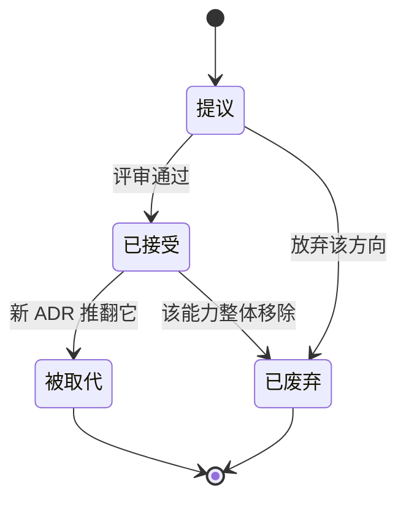

# 问心卦 · 架构决策记录（ADR）索引

| 项目 | 内容 |
|---|---|
| 标题 | 问心卦 · 架构决策记录集 |
| 状态 | 已发布 |
| 最后更新 | 2026-10-07 |
| 适用产品版本 | v1.4.0 |
| 读者 | 维护者、评审者、接手项目的工程师、AI 助手 |

架构决策记录（Architecture Decision Record，ADR）只回答一个问题：**当初为什么这么定，以及这么定的代价是什么。** 本文档集里其他文档描述「现在是什么样」；ADR 描述「为什么是这个样，别的样子为什么不行」。

---

## 一、索引

| 编号 | 标题 | 状态 | 日期 | 一句话摘要 |
|---|---|---|---|---|
| ADR-0001 | [零第三方依赖](./ADR-0001-零第三方依赖.md) | 已接受 | 2026-10-03 | `dependencies` 永远为空，校验器、图表、Markdown 渲染、历法全部自写，用开发速度换十年可运行。 |
| ADR-0002 | [一卦一个 JSON 文件而不是数据库](./ADR-0002-一卦一个JSON文件.md) | 已接受 | 2026-10-03 | 纯文本最耐久、可 git、可手改、不依赖程序；代价是全量载入且没有索引与事务。 |
| ADR-0003 | [断语用规则引擎而不是让 LLM 写](./ADR-0003-断语用规则引擎.md) | 已接受 | 2026-10-03 | 可复现、可追溯、可校准，并避免「模型记错卦」；代价是文采上限固定、有模板感。 |
| ADR-0004 | [cast / chart / reading 三段式与「cast 是唯一真源」](./ADR-0004-cast是唯一真源.md) | 已接受 | 2026-10-03 | 引擎升级不改已存的卦，快照冻结历史，重算是一次显式操作。 |
| ADR-0005 | [卦条 v1 作为稳定导入契约](./ADR-0005-卦条v1导入契约.md) | 已接受 | 2026-10-03 | 一份纯文本格式让人、脚本、AI 三方都能产出，并与粘贴对话文本长期并存。 |
| ADR-0006 | [本地优先、默认不出网](./ADR-0006-本地优先默认不出网.md) | 已接受 | 2026-10-03 | 无账号、无云同步，唯一外发路径是用户显式启用的 AI 助手或 MCP。 |
| ADR-0007 | [插件用文件模块而不是 npm 包](./ADR-0007-插件用文件模块.md) | 已接受 | 2026-10-03 | 一个 `.mjs` 一个插件，放进数据目录即装、热载即生效；代价是任意代码执行风险。 |
| ADR-0008 | [桌面版把服务内嵌进 Electron 主进程](./ADR-0008-桌面版内嵌服务.md) | 已接受 | 2026-10-03 | 不 spawn 子进程、不弹控制台、不要求用户装 Node；代价是主进程同时承担服务负载。 |
| ADR-0009 | [用 MCP 作为外部 agent 的接入面](./ADR-0009-MCP接入面.md) | 已接受 | 2026-10-03 | JSON-RPC 2.0 over stdio，与 Codex／Claude／DSH 直接互通；stdout 必须保持纯净。 |
| ADR-0010 | [吉凶评分用加权归一而非简单加减](./ADR-0010-吉凶评分加权归一.md) | 已接受 | 2026-10-03 | 八项量纲不同，先归一再按权重平均；权重经校准，使泽火革落中吉、雷泽归妹落小凶。 |
| ADR-0011 | [校勘存而不改](./ADR-0011-校勘存而不改.md) | 已接受 | 2026-10-03 | `claimed` 记原述、`corrections` 记差异、`narrative` 留原文；程序不替用户抹掉历史。 |
| ADR-0012 | [界面不做构建步骤（原生 ES 模块）](./ADR-0012-界面无构建步骤.md) | 已接受 | 2026-10-03 | 浏览器直接执行源码，可读可改、十年后还能开；代价是无类型、无打包优化。 |
| ADR-0013 | [助手受控联网工具](./ADR-0013-受控联网工具.md) | 已接受 | 2026-10-03 | 助手可抓网页，但每次调用都要确认；确认语义与「破坏性」分开；SSRF 在内核挡。**作用域取代** ADR-0006 的「唯一出网路径」一条表述。 |

**当前状态分布**：13 篇全部为「已接受」，没有「提议」中的决策，也没有被整篇取代或废弃的决策。ADR-0013 对 ADR-0006 只作**作用域取代**（仅「唯一出网路径」一条表述），ADR-0006 的正文与其余决策继续有效。

---

## 二、什么时候该写 ADR

ADDR 的成本不低（要写背景、理由、负面与备选），所以只在满足下面任意一条时**应当**新写一篇：

1. **决定难以回头。** 例如存储形态、协议、依赖策略——改起来要动数据或动多重实现。
2. **存在多个都说得通的方案，且团队/维护者之间会有分歧。** ADR 的价值在于把「为什么不选另一个」固定下来，避免后来者重新争论一遍。
3. **决定会约束未来的实现。** 例如「卦象只能由引擎算」会约束所有新增入口；新加一个入口就要照这条走。
4. **代价需要被明确记录。** 例如明文存 API Key、插件可执行任意代码、exe 不带图标——这些是刻意接受的代价，不写下来就会被当成 bug 反复「修复」。
5. **推翻旧决策。** 这时不修改旧 ADR，而是新写一篇并把旧篇状态改为「已被 ADR-XXXX 取代」。

反过来，下列情况**不必**写 ADR：

| 不必写 | 应当写在哪 |
|---|---|
| 界面文案、样式调整 | 提交信息 |
| 新增一个走势领域、新增一个起卦法 | [规范.md](./../规范.md) 与 `AGENTS.md` 的扩展点速查 |
| 字段增删导致结构变化 | 先写 ADR（涉及迁移与兼容承诺），再改 `schema/record.schema.json`、`core/migrate.mjs`、`docs/规范.md` |
| 一次性的排障、性能调优 | 对应模块的注释（解释**为什么**，不复述代码在做什么） |
| 纯实现细节（函数怎么拆、变量怎么命名） | 代码本身 |

写之前**应当**先确认三件事：这个决定影响的真实模块路径是什么；现有的哪一篇 ADR 与它相邻或冲突；它的代价是什么（写不出代价，通常说明还没想清楚）。

---

## 三、模板

每一篇 ADR **必须**是这个结构，一个文件一篇：

````markdown
# ADR-00XX：标题

| 项 | 内容 |
|---|---|
| 状态 | 已接受 |
| 日期 | YYYY-MM-DD |
| 决策者 | 项目维护者 |
| 影响的模块 | `core/xxx.mjs`、`server/xxx.mjs` …（写真实路径） |

## 背景

## 决策

## 理由

## 后果

### 正面

### 负面

## 备选方案与为何不选

## 相关
````

各节的要求：

| 节 | 必须写成什么样 |
|---|---|
| 元信息表 | 四行，缺一不可。`影响的模块` **必须**是真实存在的路径（相对仓库根），**不得**写「各处」「若干模块」这类含糊说法。 |
| 背景 | 只写从代码与既有文档里能核对的**事实**：常量取值、函数名、文件路径、真实数据（例如某条卦录的分数构成）。**不得**编造历史、会议、人物或时间线。事实要能被 `grep` 出来。 |
| 决策 | 用中文 RFC 2119 的词写清强制程度（**必须**／**应当**／**可以**／**不得**）。一条决策只讲一件事。 |
| 理由 | 讲清「为什么是它」，能给出真实例证就给出（例如用 `data/records/` 里的实际卦录演算）。 |
| 后果 · 正面 | 说清这个决定换来了什么，尽量具体到可验证的现象。 |
| 后果 · 负面 | **不得**省略。写不出负面，说明决策还没被认真审视。负面要写到「这些代价我们接受，因为……」。 |
| 备选方案与为何不选 | 至少两个备选，用表格逐条写「为什么没选」。不许写「没想到别的方案」。 |
| 相关 | 相对链接到相邻 ADR 与文档集内的文档，**不得**写外部链接与绝对路径。 |

篇幅：每篇 60–140 行。写不到 60 行通常意味着背景或备选写得太薄；超过 140 行通常意味着该拆成两篇。

---

## 四、编号规则

- 文件名形如 `ADR-0001-零第三方依赖.md`：`ADR-` ＋ 四位十进制编号 ＋ 半角连字符 ＋ 中文短标题。
- 编号**必须**四位补零，便于按文件名排序；标题不加空格，尽量控制在 12 字以内。
- 编号一经分配**不得**改动，**不得**回收。删除一篇 ADR 时编号作废而不复用（与 [文档索引](../00-文档索引.md) 第 5.1 节的编号约定一致）。
- 一个 ADR **必须**只讲一个决策，**不得**把多个决策塞进一篇。
- 一篇 ADR 一旦进入「已接受」，**不得**改写其正文。要改就新写一篇，并把旧篇状态改为「已被 ADR-XXXX 取代」，在两篇的「相关」一节互相指认。
- 正文中的交叉引用**必须**用相对链接，且只引用本文档集、[规范.md](./../规范.md)、`schema/*.json`、`README.md`、`AGENTS.md`。指向源码的引用写相对仓库根的路径（如 `core/divination.mjs`），**不得**写绝对路径。
- 文档中**不得**出现「待补充」「TODO」「略」这类占位。

---

## 五、状态流转



| 状态 | 含义 | 允许的动作 |
|---|---|---|
| 提议 | 已写成文件、正在评审，**不得**据以实施。 | 修改正文；转「已接受」或「已废弃」。 |
| 已接受 | 是当前有效的约束，所有相关实现**必须**遵守。 | 只能改状态与「相关」里的指认，**不得**改正文；转「被取代」或「已废弃」。 |
| 被取代 | 曾经有效，现在由另一篇 ADR 接管。 | 只读；**必须**在状态行写明取代它的编号（`已被 ADR-XXXX 取代`）。 |
| 已废弃 | 曾经有效，对应的能力已整体移除，没有接替者。 | 只读；**应当**在「相关」里说明移除原因 |

**状态行写法**（元信息表的 `状态` 行）：

- `提议`
- `已接受`
- `已被 ADR-00XX 取代`
- `已废弃`

**流转的三条规矩**：

1. **已接受的 ADR 只增不改。** 这是 ADR 与普通设计文档的根本区别：设计文档描述现状，随时可以改；ADR 记录当时的判断，改了就不再是记录。
2. **取代要走完整流程。** 新写一篇 ADR 说明「旧决策在什么条件下失效、新决策是什么、代价如何变化」，再回头把旧篇的状态行改掉。**不得**直接删掉旧篇。
3. **废弃要给理由。** 能力被移除时，旧篇保留并把状态改为「已废弃」，在「相关」一节写明移除的原因与影响面（例如哪些数据、哪些接口、哪些插件受影响）。

---

## 六、与本文档集其他文档的关系

| 文档 | 与 ADR 的分工 |
|---|---|
| [文档索引](../00-文档索引.md) | 文档编号、写作规范与规范强度用词的总约定；ADR 遵守它，但独立编号。 |
| [系统设计说明书](../01-系统设计说明书.md) | 描述系统**现在**是什么样；其中的「关键设计决策摘要」指向 ADR。 |
| [架构与框图](../02-架构与框图.md) | 用图描述分层与依赖；ADR-0001 与 ADR-0012 解释了这些边界为何存在。 |
| [接口文档](../03-接口文档.md)、[接口控制文档 ICD](../04-接口控制文档-ICD.md) | 契约的现状；ADR-0005 与 ADR-0009 解释了契约的选取。 |
| [数据模型与存储设计](../07-数据模型与存储设计.md) | 字段与文件的现状；ADR-0002、ADR-0004、ADR-0011 解释了形态的选取。 |
| [Agent 设计文档](../05-Agent设计文档.md)、[Hermes 网关与路由设计](../06-Hermes网关与路由设计.md) | Agent 与模型接入的现状；ADR-0003 与 ADR-0009 解释了硬约束与接入面。 |
| [前端设计与交互规范](../08-前端设计与交互规范.md) | 界面的现状；ADR-0012 解释了为何不做构建。 |
| [测试与质量保证](../09-测试与质量保证.md) | 384 项自检的清单；多篇 ADR 的「正面」直接引用它作为可验证的收益。 |
| [部署与运维手册](../10-部署与运维手册.md) | 三种形态的启动与打包；ADR-0008 解释了桌面形态的实现方式。 |
| [安全与隐私设计](../11-安全与隐私设计.md) | 隐私边界的现状；ADR-0006 与 ADR-0007 解释了边界的位置与代价。 |
| [插件与扩展开发指南](../12-插件与扩展开发指南.md) | 插件 API 的现状；ADR-0007 解释了插件形态的选取。 |
| [术语表](../13-术语表.md) | 术语的唯一定义；ADR 里的专有名词以它为准。 |
| [规范.md](./../规范.md) | 数据格式的规范文本（normative）；ADR 解释规范为何如此，**不得**与规范冲突。 |

**冲突处理**：若 ADR 与源码冲突，**以源码为准**并应当按缺陷修正 ADR 的「背景」一节所述事实；若 ADR 与 [规范.md](./../规范.md) 冲突，**以规范为准**（规范是对外承诺，ADR 是内部记录）。

---

*本索引自身遵守文档集的写作规范；新增 ADR 时应当同步更新第一节的索引表与状态分布。*
